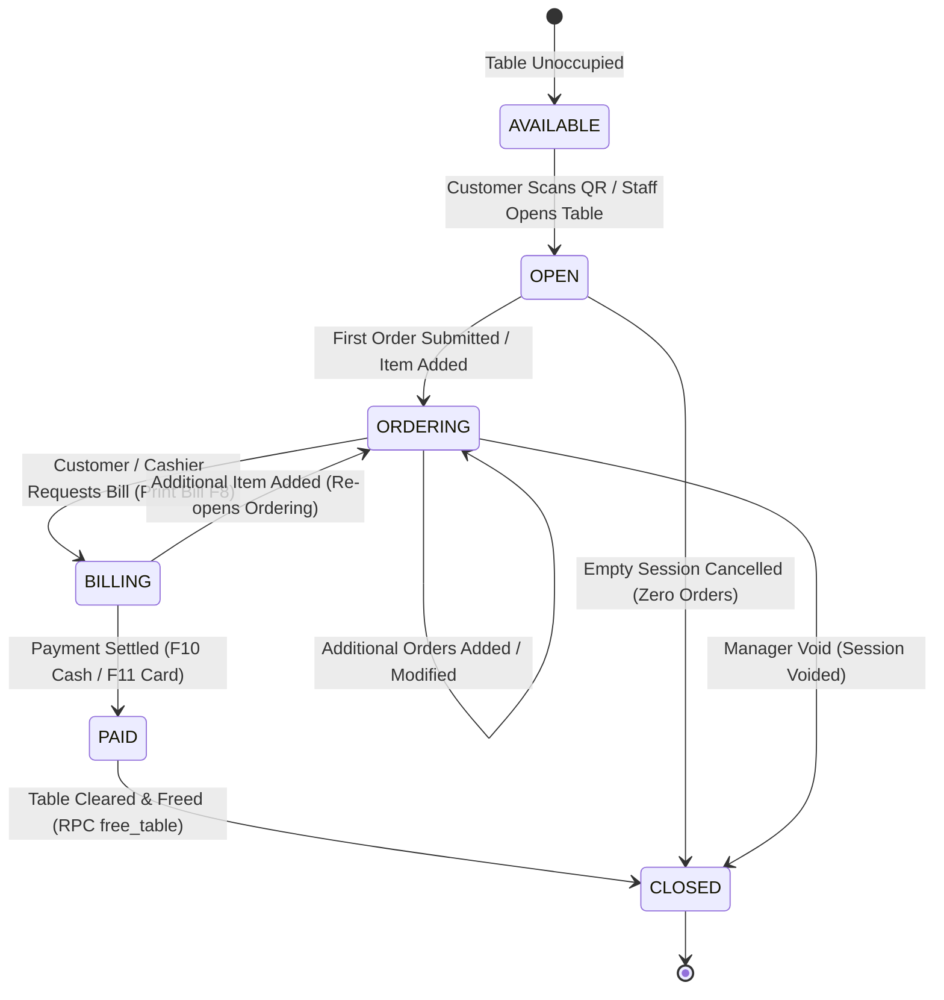
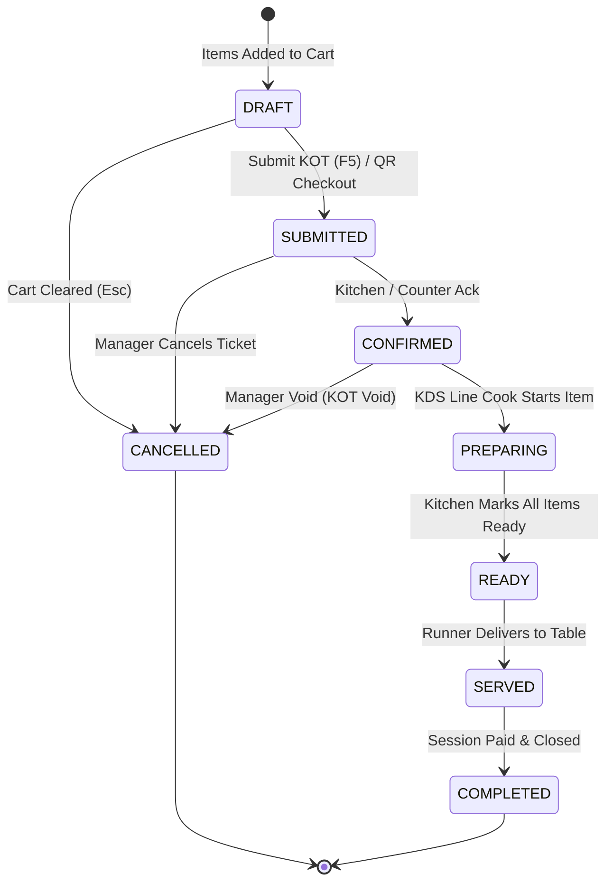
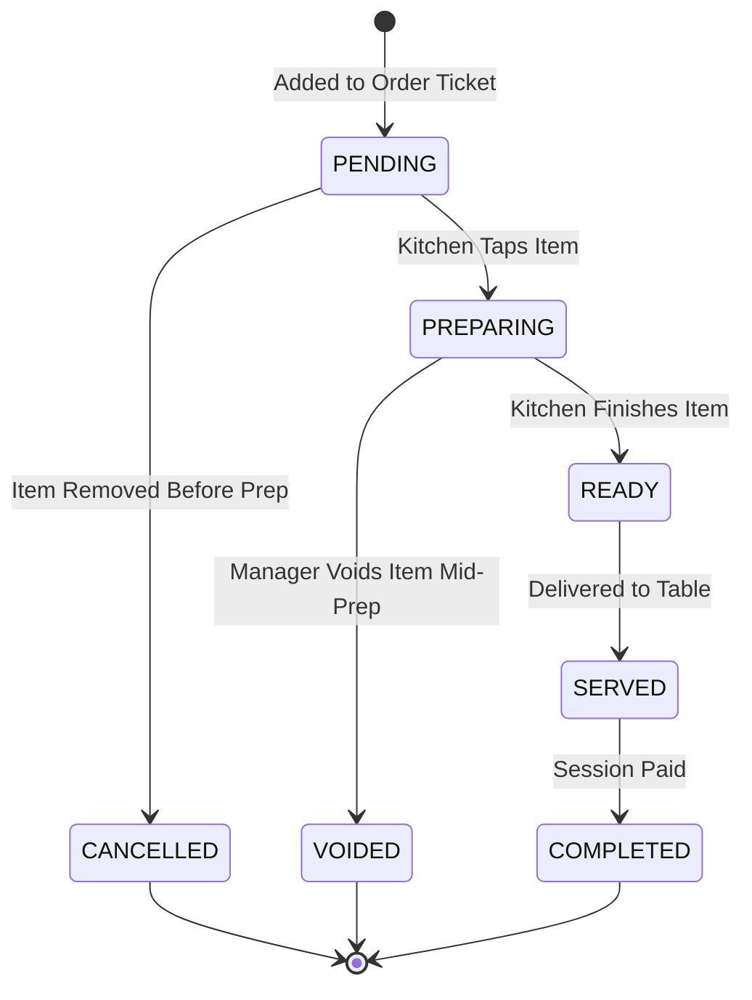
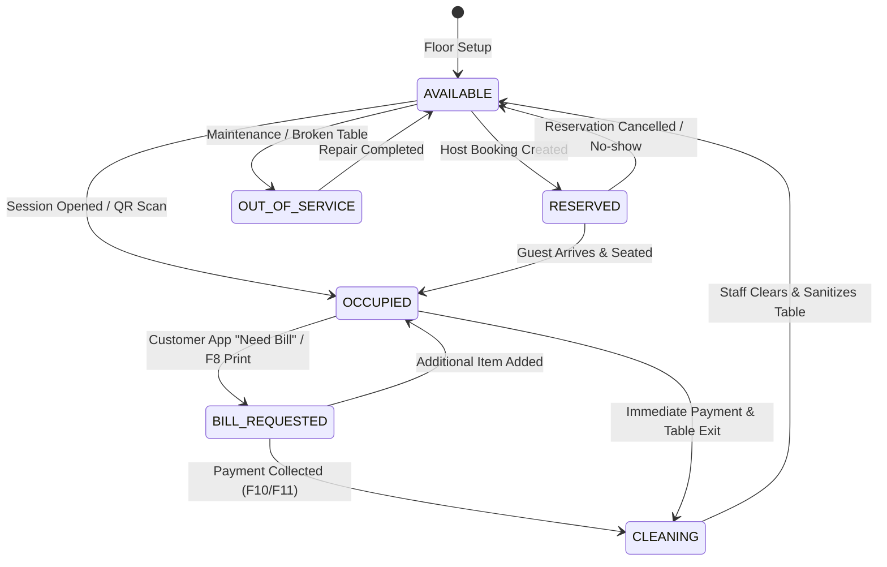
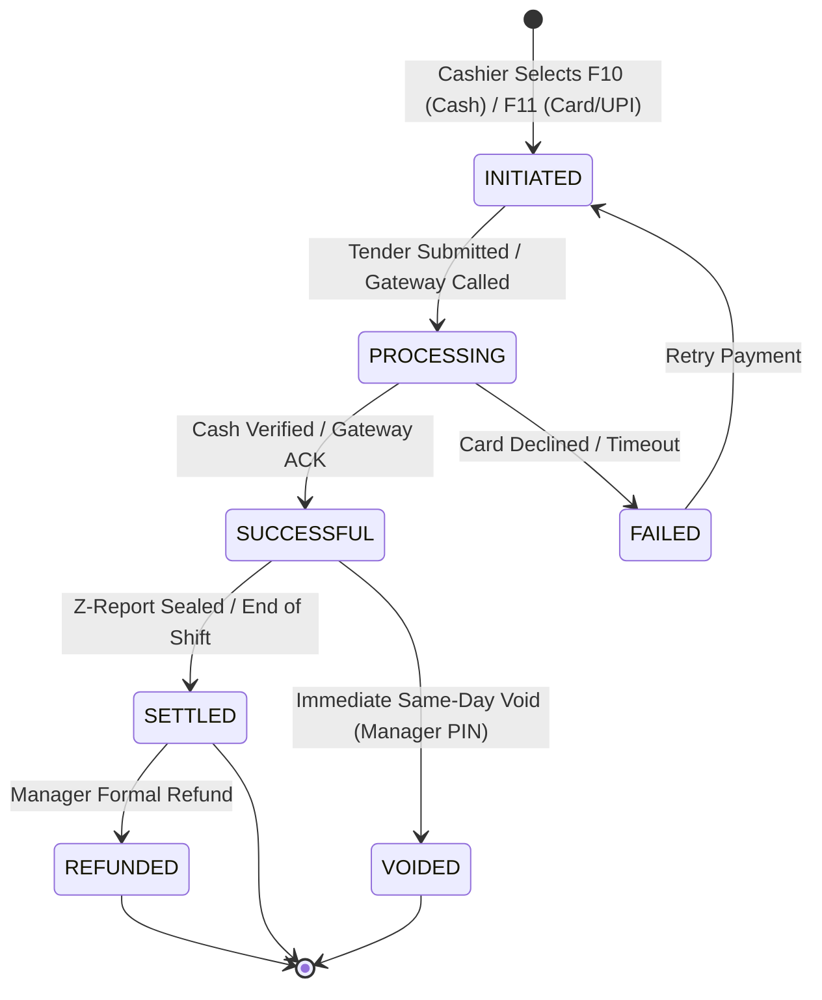
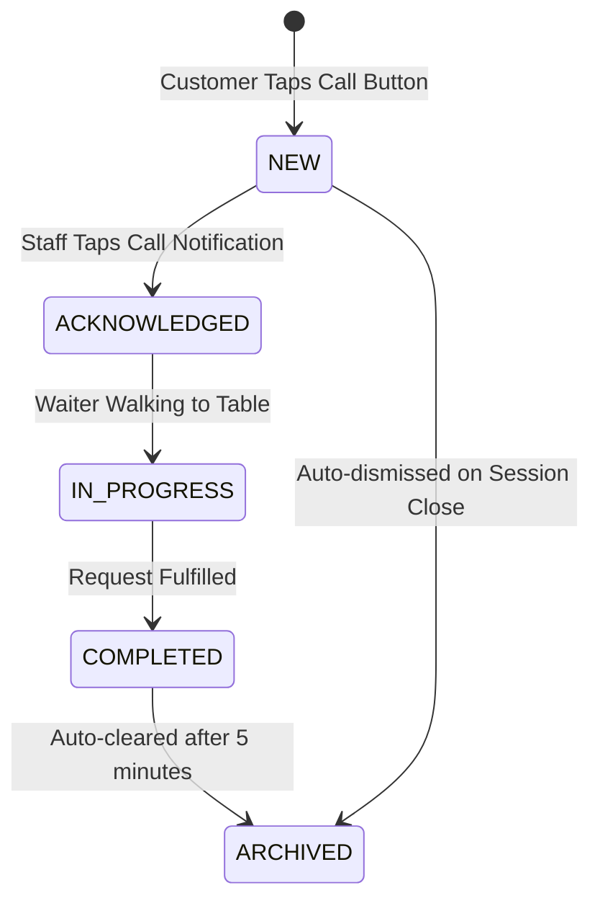
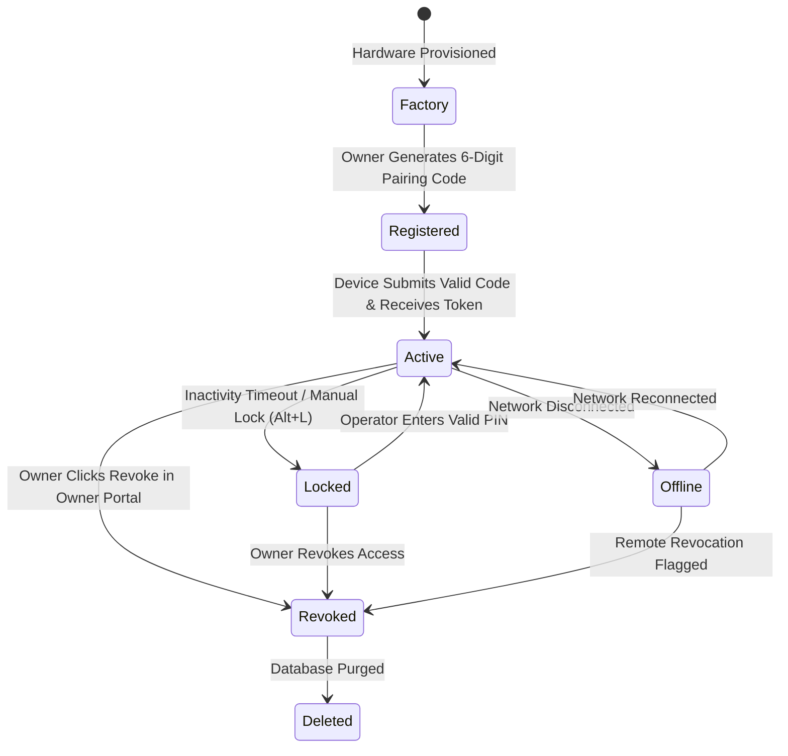
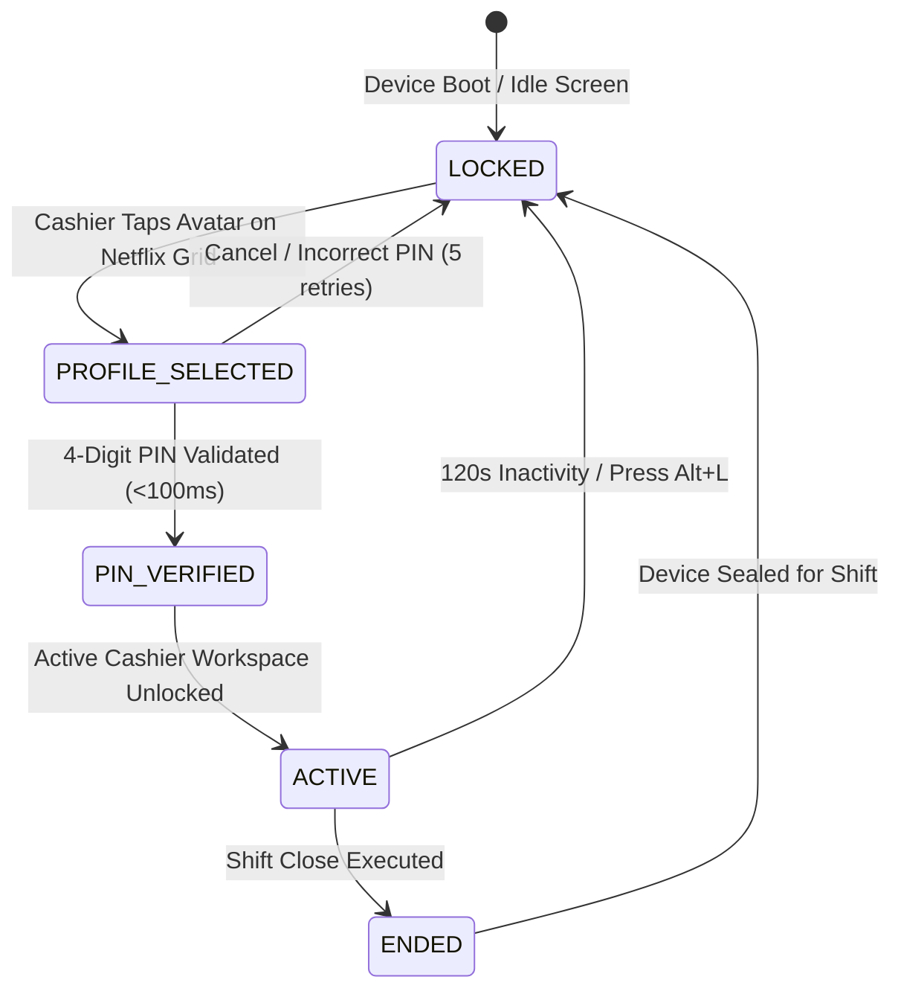

# OrderRail — Core State Machine Specification (CORE_STATE_MACHINES.md)

> **Definitive Lifecycle Specification & State Transition Manual** for every operational entity in OrderRail. Establishes the authoritative state machine contracts for Dining Sessions, Orders, Order Items, Tables, Payments, Service Requests, Devices, and Operator Sessions.

---

## Executive Summary

OrderRail operates as a high-availability, offline-first restaurant execution ecosystem. To eliminate runtime ambiguity, prevent illegal mutations, and guarantee sub-second cashier speed, every operational entity operates under a strictly defined **Finite State Machine (FSM)**.

```
┌─────────────────────────────────────────────────────────────────────────────────────────┐
│                                CORE STATE MACHINE SCOPE                                 │
├──────────────────────┬──────────────────────┬────────────────────┬──────────────────────┤
│ 1. DINING SESSION    │ 2. ORDER             │ 3. ORDER ITEM      │ 4. TABLE             │
│ (Customer Session)   │ (Submitted Ticket)   │ (Line Item Unit)   │ (Physical Occupancy) │
├──────────────────────┼──────────────────────┼────────────────────┼──────────────────────┤
│ 5. PAYMENT           │ 6. SERVICE REQUEST   │ 7. DEVICE          │ 8. OPERATOR SESSION  │
│ (Financial Settlement│ (Customer Call)      │ (Hardware Terminal)│ (Cashier PIN Shift)  │
└──────────────────────┴──────────────────────┴────────────────────┴──────────────────────┘
```

**Rule 0:** State transitions are atomic, auditable, and unidirectional unless an explicit rollback transition is defined.

---

## Table of Contents

- [1. Entity 1: Dining Session State Machine](#1-entity-1-dining-session-state-machine)
- [2. Entity 2: Order State Machine](#2-entity-2-order-state-machine)
- [3. Entity 3: Order Item State Machine](#3-entity-3-order-item-state-machine)
- [4. Entity 4: Table State Machine](#4-entity-4-table-state-machine)
- [5. Entity 5: Payment State Machine](#5-entity-5-payment-state-machine)
- [6. Entity 6: Service Request State Machine](#6-entity-6-service-request-state-machine)
- [7. Entity 7: Device State Machine](#7-entity-7-device-state-machine)
- [8. Entity 8: Operator Session State Machine](#8-entity-8-operator-session-state-machine)
- [9. Cross-State Rules & Entity Dependencies](#9-cross-state-rules--entity-dependencies)
- [10. Offline Synchronization & Conflict Resolution](#10-offline-synchronization--conflict-resolution)
- [11. Failure Recovery Protocols](#11-failure-recovery-protocols)

---

## 1. Entity 1: Dining Session State Machine

### 1.1 Purpose
Represents one customer visit to a physical table or takeaway session. It acts as the umbrella container linking all customer QR orders, staff POS entries, service calls, and financial billing settlements.

### 1.2 State Specification



### 1.3 State Descriptions & Allowed Transitions

| State Name | Allowed Next States | Trigger Event | Responsible Actor | Side Effects & Audit Log |
|------------|---------------------|---------------|-------------------|--------------------------|
| **`AVAILABLE`** | `OPEN` | QR Scan or "+ Open Table" tap | Customer / Cashier | Binds new `dining_session_id` to `tables.id`. Sets `tables.status = 'occupied'`. |
| **`OPEN`** | `ORDERING`, `CLOSED` | First item added or session cancelled | Customer / Cashier | Initializes session timer. Audit: `SESSION_OPENED`. |
| **`ORDERING`** | `BILLING`, `CLOSED` | Order submitted or Manager Void | Customer / Cashier / Manager | Dispatches KOT tickets. Submits to IndexedDB/Cloud. Audit: `ORDER_SUBMITTED`. |
| **`BILLING`** | `PAID`, `ORDERING` | Bill Printed (`F8`) or Customer Requests Bill | Cashier / Customer | Sets `tables.status = 'bill_requested'`. Prints invoice ticket. Audit: `BILL_PRINTED`. |
| **`PAID`** | `CLOSED` | Payment Settled (`F10`/`F11`) | Cashier / System | Marks `payment_status = 'paid'`. Cash drawer kick. Audit: `PAYMENT_SETTLED`. |
| **`CLOSED`** | None (Terminal) | `free_table` RPC executed | Cashier | Sets `tables.status = 'available'`. Seals session record. Audit: `SESSION_CLOSED`. |

### 1.4 Invalid Transitions & Prohibited Mutations

- ❌ `PAID` → `ORDERING`: **STRICTLY INVALID.** Once a session is fully paid, no new items can be added to the same session. A new session must be opened.
- ❌ `AVAILABLE` → `BILLING`: **INVALID.** Cannot request a bill for an un-opened session.
- ❌ `CLOSED` → `PAID`: **INVALID.** Closed sessions cannot undergo payment modifications without a Manager Re-open Audit.

### 1.5 Offline & Recovery Behavior
- **Offline:** Session creation and order adding occur locally in IndexedDB. Session status updates immediately in POS layout.
- **Recovery:** Upon reconnection, session sequence numbers reconcile via `upsert_dining_session` RPC.

---

## 2. Entity 2: Order State Machine

### 2.1 Purpose
Represents a specific ticket submitted within a dining session (e.g. initial food order, round 2 drinks order).

### 2.2 State Specification



### 2.3 State Descriptions & Allowed Transitions

| State Name | Allowed Next States | Trigger Event | Responsible Actor | Side Effects & Audit Log |
|------------|---------------------|---------------|-------------------|--------------------------|
| **`DRAFT`** | `SUBMITTED`, `CANCELLED` | Cashier selects items / QR cart build | Customer / Cashier | Transient cart state in React memory / IndexedDB draft. |
| **`SUBMITTED`** | `CONFIRMED`, `CANCELLED` | "Submit KOT" (`F5`) or QR order post | Customer / Cashier | Dispatches Realtime event to Kitchen KDS. Spools ESC/POS KOT print. Audit: `ORDER_SUBMITTED`. |
| **`CONFIRMED`** | `PREPARING`, `CANCELLED` | KDS screen tap / POS auto-ack | Kitchen Staff | Updates order status on KDS board. Audit: `ORDER_CONFIRMED`. |
| **`PREPARING`** | `READY`, `CANCELLED` | Kitchen starts preparation | Line Cook | Flashes timer badge on KDS. |
| **`READY`** | `SERVED` | All items marked ready | Head Chef / KDS | Audio alert chime at Counter. Runner notification. Audit: `ORDER_READY`. |
| **`SERVED`** | `COMPLETED` | Floor server delivers to table | Waiter / Cashier | Item badge marked served in POS. Audit: `ORDER_SERVED`. |
| **`COMPLETED`** | None (Terminal) | Billing settlement & session close | Cashier / System | Locked order record. Audit: `ORDER_COMPLETED`. |
| **`CANCELLED`** | None (Terminal) | Manager cancellation / cart clear | Manager / Cashier | Requires Manager PIN if post-submission. Spools Void KOT ticket. Audit: `ORDER_CANCELLED`. |

### 2.4 Invalid Transitions & Prohibited Mutations

- ❌ `SERVED` → `PREPARING`: **INVALID.** Food cannot return to kitchen prep after being served.
- ❌ `COMPLETED` → `CANCELLED`: **INVALID.** Settled orders cannot be cancelled; requires formal refund flow.

---

## 3. Entity 3: Order Item State Machine

### 3.1 Purpose
Tracks the micro-lifecycle of an individual dish or beverage line item inside an order ticket (e.g. 1x "Double Espresso" within Order #22).

### 3.2 State Specification



### 3.3 State Descriptions & Allowed Transitions

| State Name | Allowed Next States | Trigger Event | Responsible Actor | Side Effects & Audit Log |
|------------|---------------------|---------------|-------------------|--------------------------|
| **`PENDING`** | `PREPARING`, `CANCELLED` | KOT Submitted | Customer / Cashier | Appears on Kitchen KDS in yellow card background. |
| **`PREPARING`** | `READY`, `VOIDED` | Kitchen starts cook | Line Cook | Turns blue on KDS screen. |
| **`READY`** | `SERVED` | Cook marks ready | Line Cook | Turns green on KDS screen. Audio chime. |
| **`SERVED`** | `COMPLETED` | Runner delivers | Floor Server | Crossed out on KDS. Marked served in POS cart. |
| **`CANCELLED`** | None (Terminal) | Removed prior to prep | Cashier | No KOT void printed if not sent to kitchen yet. |
| **`VOIDED`** | None (Terminal) | Manager voids active item | Manager (PIN) | Spools "VOID ITEM" ticket to Kitchen Printer. Audit: `ITEM_VOIDED`. |

---

## 4. Entity 4: Table State Machine

### 4.1 Purpose
Represents physical floor layout tables and occupancy states.

### 4.2 State Specification



### 4.3 State Descriptions

- **`AVAILABLE` (Green):** Free for new seating.
- **`OCCUPIED` (Amber):** Guest seated; active `dining_session_id` bound.
- **`BILL_REQUESTED` (Orange Flashing):** Customer requested bill or cashier printed pre-check invoice.
- **`CLEANING` (Blue):** Payment collected; staff clearing table for next guest.
- **`RESERVED` (Purple):** Reserved for upcoming time slot.
- **`OUT_OF_SERVICE` (Gray):** Hardware or table repair.

---

## 5. Entity 5: Payment State Machine

### 5.1 Purpose
Governs financial transactions, payment tender collection, and ledger settlement.

### 5.2 State Specification



### 5.3 State Descriptions & Audit Requirements

- **`INITIATED`:** Cashier selects payment method (`Cash`, `Credit Card`, `UPI`).
- **`PROCESSING`:** Awaiting cash drawer verification or EMV card terminal response.
- **`SUCCESSFUL`:** Funds received. Triggers cash drawer open pulse and receipt print. Audit: `PAYMENT_SUCCESS`.
- **`SETTLED`:** Financial record sealed during End-of-Day Z-Report reconciliation.
- **`FAILED`:** Declined transaction. Allows tender mode switch. Audit: `PAYMENT_FAILED`.
- **`VOIDED`:** Same-day transaction void. Reverses session total. Requires Manager PIN. Audit: `PAYMENT_VOIDED`.
- **`REFUNDED`:** Post-settlement ledger reversal. Requires Manager PIN + reason text. Audit: `PAYMENT_REFUNDED`.

---

## 6. Entity 6: Service Request State Machine

### 6.1 Purpose
Manages customer call button requests submitted from mobile QR apps ("Need Water", "Call Waiter", "Need Bill").

### 6.2 State Specification



### 6.3 SLA & Chime Escalation Matrix

- **0 - 30s (`NEW`):** Soft chime alert on POS header. Yellow badge.
- **30s - 120s (`ACKNOWLEDGED`):** Steady chime. Orange badge.
- **> 120s (`OVERDUE`):** Continuous double chime. Flashing red badge on POS header.

---

## 7. Entity 7: Device State Machine

### 7.1 Purpose
Manages hardware terminal registration, authentication tokens, and remote access.

### 7.2 State Specification



*Refer to [`DEVICE_ARCHITECTURE.md`](./DEVICE_ARCHITECTURE.md) for detailed device token specs.*

---

## 8. Entity 8: Operator Session State Machine

### 8.1 Purpose
Governs cashier PIN logins, lock timeouts, shift changes, and atomic permission checks.

### 8.2 State Specification



*Refer to [`COUNTER_AUTH_SPEC.md`](./COUNTER_AUTH_SPEC.md) for detailed atomic permission bundles.*

---

## 9. Cross-State Rules & Entity Dependencies

To guarantee systemic consistency, state transitions enforce strict cross-entity invariants:

```
┌─────────────────────────────────────────────────────────────────────────────────────────┐
│                                CROSS-ENTITY INVARIANTS                                  │
├──────────────────────────┬──────────────────────────┬───────────────────────────────────┤
│ TARGET ACTION            │ REQUIRED ENTITY STATE    │ ENFORCEMENT MECHANISM             │
├──────────────────────────┼──────────────────────────┼───────────────────────────────────┤
│ Close Dining Session     │ Payment = `SETTLED`      │ Blocked by `free_table` RPC       │
│ Serve Order              │ Order = `READY`          │ Blocked on Waiter UI              │
│ Print Bill               │ Operator Session =`ACTIVE│ Requires Cashier PIN              │
│ Modify Cart              │ Device = `Active` &      │ Blocked if Device = `Locked`      │
│                          │ Operator = `ACTIVE`      │                                   │
│ Open Cash Drawer         │ Permission =             │ Requires Cashier/Manager bundle   │
│                          │ `cash_drawer.trigger`    │                                   │
└──────────────────────────┴──────────────────────────┴───────────────────────────────────┘
```

1. **Dining Session Closure:** A `dining_session` CANNOT transition to `CLOSED` unless its associated `payment` is in `SUCCESSFUL` or `SETTLED` state (or explicit Manager Zero-Total Void).
2. **Order Completion:** An `order` CANNOT transition to `COMPLETED` while any of its constituent `order_items` are in `PENDING` or `PREPARING` state.
3. **Table Clearing:** A `table` CANNOT transition from `OCCUPIED` to `AVAILABLE` until its bound `dining_session` reaches `CLOSED`.

---

## 10. Offline Synchronization & Conflict Resolution

In offline mode, state transitions operate against local IndexedDB storage:

1. **Local State Transitions:** Devices execute state changes (`DRAFT` → `SUBMITTED`, `OPEN` → `BILLING`) immediately in local memory.
2. **Deterministic Sequence Tokens:** Every local state mutation appends a client timestamp and UUID vector sequence token.
3. **Reconnection Drain:** Upon network restoration, the background sync worker drains the local queue sequentially into PostgreSQL RPCs.
4. **Conflict Resolution:** 
   - Concurrent table modifications resolve using **Optimistic Locking with Server Timestamp Wins**.
   - Idempotent order submit RPCs (`submit_order_idempotent`) ensure duplicate network retries do not create double orders.

---

## 11. Failure Recovery Protocols

| Failure Scenario | Entity Affected | Recovery Protocol |
|------------------|-----------------|-------------------|
| **Power Loss / Sudden Shutdown** | `Dining Session`, `Order` | Device reboots to `Locked` state. IndexedDB restores open cart and active session without data loss upon PIN entry. |
| **Browser Page Refresh (`F5`)** | `Operator Session` | Operator Context clears in memory (`React Context`). System prompts for Cashier PIN. Active cart remains preserved. |
| **Double Click on "Submit KOT"** | `Order` | Frontend debounces button for 1000ms; backend uses `idempotency_key` (UUID) to ignore duplicate submissions. |
| **Concurrent Operator Edit** | `Dining Session` | Database checks version sequence. If stale, server returns updated cart and prompts cashier to merge. |
| **Kitchen Printer Offline** | `Order Item` | Items transition to `SUBMITTED` on KDS screen; print spooler buffers ESC/POS job locally and retries every 5 seconds. |

---

## 12. Engineering & Testing Notes

1. **Testing Strategy:** State machines should be validated via unit tests verifying that all invalid transitions throw explicit `INVALID_STATE_TRANSITION` exceptions.
2. **Audit Requirement:** Every state transition must emit an immutable event payload to `public.audit_logs` including `operator_id`, `device_id`, `old_state`, and `new_state`.
