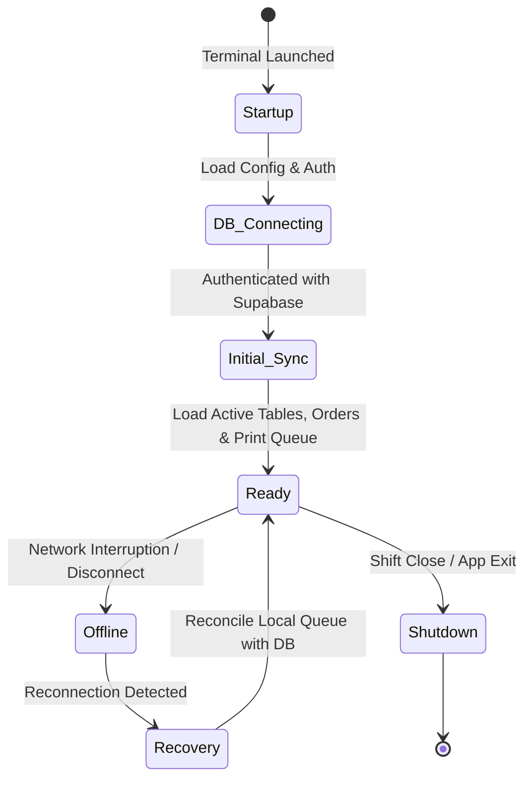
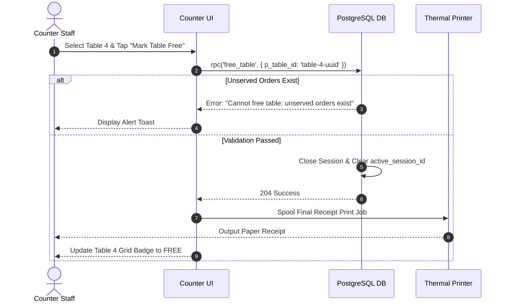
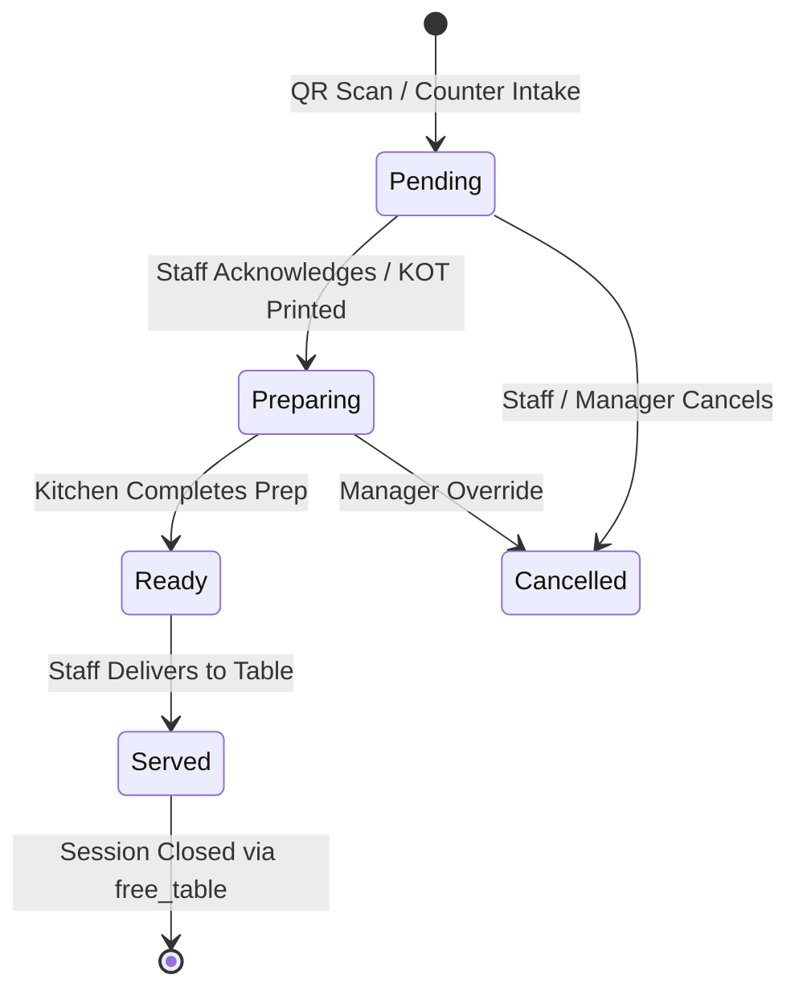

# OrderRail — Counter Operational Architecture & Governance Handbook

> **Definitive Operational Architecture Document** for the OrderRail Counter application, detailing point-of-sale workflows, dining session orchestration, kitchen coordination, billing engines, shift management, exception handling, printing pipelines, and multi-counter synchronization.

---

## Table of Contents
- [1. Purpose & System Role](#1-purpose--system-role)
- [2. Design Philosophy](#2-design-philosophy)
- [3. Core Responsibilities](#3-core-responsibilities)
- [4. Operational Modes](#4-operational-modes)
- [5. Counter Workspace Architecture](#5-counter-workspace-architecture)
- [6. Counter Application State Machine](#6-counter-application-state-machine)
- [7. Shift Management & Cash Control](#7-shift-management--cash-control)
- [8. Dining Session Management](#8-dining-session-management)
- [9. Order Workflow & Lifecycle](#9-order-workflow--lifecycle)
- [10. Billing & Payment Workflow](#10-billing--payment-workflow)
- [11. Exception Handling & Edge Cases](#11-exception-handling--edge-cases)
- [12. Operational Metrics & Key Performance Indicators](#12-operational-metrics--key-performance-indicators)
- [13. Table Management & Occupancy Control](#13-table-management--occupancy-control)
- [14. Kitchen Coordination (KOT & KDS)](#14-kitchen-coordination-kot--kds)
- [15. Printing Architecture](#15-printing-architecture)
- [16. Hardware Integration](#16-hardware-integration)
- [17. Offline Strategy & Synchronization](#17-offline-strategy--synchronization)
- [18. Multi-Counter Synchronization & Conflict Resolution](#18-multi-counter-synchronization--conflict-resolution)
- [19. Role-Based Permissions & Security](#19-role-based-permissions--security)
- [20. Performance Goals & SLAs](#20-performance-goals--slas)
- [21. Appendix: Daily Operations Checklist](#21-appendix-daily-operations-checklist)
- [22. Cross-References & Related Documentation](#22-cross-references--related-documentation)

---

## 1. Purpose & System Role

### 1.1 Why the Counter Exists
The OrderRail Counter acts as the **operational control center** of the cafe or restaurant. While customer mobile devices handle self-service QR ordering and the Owner Portal manages high-level administrative configurations, the Counter serves as the real-time command station where staff process orders, manage floor occupancy, coordinate kitchen dispatch, settle bills, print receipts, and resolve customer requests.

```
                   ┌─────────────────────────────────────────┐
                   │           CUSTOMER MOBILE QR            │
                   └────────────────────┬────────────────────┘
                                        │ (Submits Orders / Calls Staff)
                                        ▼
┌──────────────────┐           ┌──────────────────┐           ┌──────────────────┐
│   OWNER PORTAL   │ ◄───────► │  POSTGRESQL DB   │ ◄───────► │ COUNTER TERMINAL │
│ (Admin Configs)  │           │(Source of Truth) │           │ (Operational Hub)│
└──────────────────┘           └──────────────────┘           └─────────┬────────┘
                                                                        │
                                                                        ▼
                                                              ┌──────────────────┐
                                                              │ KITCHEN / PRINTER│
                                                              └──────────────────┘
```

### 1.2 Role Within the OrderRail Ecosystem
1. **Fulfillment Authority:** Converts incoming customer QR orders and counter walk-in requests into actionable kitchen preparation tasks.
2. **Session Coordinator:** Owns the lifecycle of `dining_sessions`, linking physical tables to customer billing contexts.
3. **Cashier & Settlement Terminal:** Generates itemized bills, applies discounts, collects payments, and closes dining sessions.
4. **Hardware Gateway:** Interfaces with thermal receipt printers, Kitchen Order Ticket (KOT) spoolers, cash drawers, and barcode scanners.

---

## 2. Design Philosophy

### 2.1 The Counter as the Operational Hub
The Counter application is designed around **zero-latency operational clarity**. Staff working at the counter require immediate situational awareness of every table's status, pending kitchen tickets, unread service calls, and pending payment bills without navigating complex menus.

### 2.2 Dining Session-Centric Workflow
Rather than treating orders as disconnected transactions, the Counter anchors all dine-in operations around the **`dining_session_id`** (as defined in [`DATABASE.md`](./DATABASE.md)). 
- Multiple orders placed by different guests at Table 4 accumulate under Table 4's active `dining_session_id`.
- The Counter staff views, modifies, and bills the entire dining session as a unified customer visit.

### 2.3 Separation of Operational and Administrative Concerns
- **Counter Terminal (Operational):** Fast execution of order intake, status updates, table clearing, KOT printing, and payment collection.
- **Owner Portal (Administrative):** Menu item creation, category management, analytics, tax rate setup, and staff invitation management.

---

## 3. Core Responsibilities

| Responsibility | Description | Key System Output |
|----------------|-------------|-------------------|
| **Dine-In Management** | Monitors active table sessions, accepts QR orders, adds manual staff orders to tables. | `orders`, `dining_sessions` state updates |
| **Takeaway / Express** | Intake and billing for walk-in takeaway orders without physical table binding. | Express `orders` with `table_id: null` |
| **Occupancy Monitoring** | Real-time floor plan visualization showing occupied, free, and overdue tables. | `tables.status` and `active_session_id` binding |
| **Kitchen Coordination** | Dispatches KOTs to kitchen printers, updates preparation states (`pending` → `preparing` → `ready` → `served`). | Real-time Kanban board updates |
| **Billing & Settlement** | Generates bills, applies promo discounts, processes cash/card/UPI payments, closes sessions. | Sealed `dining_sessions` with `total_amount` |
| **Service Call Dispatch** | Displays and acknowledges customer assistance calls ("Water", "Bill", "Waiter"). | `service_requests` status updates |
| **Hardware Printing** | Spools automated KOT prints on order placement and itemized receipts on payment. | Thermal ESC/POS print jobs |

---

## 4. Operational Modes

### 4.1 Dine-In Mode
- **Workflow:** Customer scans QR code or staff opens a table at the counter.
- **Binding:** Orders are linked to `tables.id` and a mandatory `dining_session_id`.
- **Settlement:** Post-pay workflow. Table remains `occupied` until staff prints the final bill, collects payment, and executes `free_table` RPC.

### 4.2 Takeaway / Express Mode
- **Workflow:** Walk-in customer orders directly at the counter for takeaway.
- **Binding:** `table_id` is `null` or bound to a virtual `'TAKEAWAY'` virtual table.
- **Settlement:** Pre-pay workflow. Payment is collected immediately upon order intake. Kitchen receives a KOT flagged as `TAKEAWAY`.

### 4.3 Future Delivery & Pre-Order Mode
- **Workflow:** External delivery or advance customer pickup orders.
- **Binding:** Linked to `customer_profile_id` and assigned a scheduled dispatch time.

---

## 5. Counter Workspace Architecture

The Counter application layout is divided into four functional workspaces:

```
┌───────────────────────────────────────────────────────────────────────────────────────────┐
│                                 COUNTER MAIN NAVIGATION                                   │
├───────────────────────────────┬───────────────────────────────┬───────────────────────────┤
│    ACTIVE TABLES GRID         │     KITCHEN KANBAN QUEUE      │   BILLING & CASHIER SIDE   │
│                               │                               │                           │
│ ┌─────────┐     ┌─────────┐   │ ┌───────────┐   ┌───────────┐ │  Session: Table 4 (#402)  │
│ │ Table 1 │     │ Table 2 │   │ │ Pending   │   │ Preparing │ │  Total: $42.50            │
│ │ FREE    │     │ OCCUPIED│   │ │ Order #21 │   │ Order #20 │ │                           │
│ └─────────┘     └─────────┘   │ └───────────┘   └───────────┘ │  [Print Bill] [Collect]   │
├───────────────────────────────┴───────────────────────────────┴───────────────────────────┤
│                        SERVICE REQUEST NOTIFICATION BAR (Water / Bill)                     │
└───────────────────────────────────────────────────────────────────────────────────────────┘
```

1. **Active Tables Grid:** Visual representation of physical tables showing occupancy badges, active session duration, and unserved item counts.
2. **Kitchen Kanban Queue:** Real-time columns (`Pending`, `Preparing`, `Ready`, `Served`) allowing staff to drag-and-drop or tap order cards to advance status.
3. **Billing & Cashier Sidebar:** Slide-over panel for inspecting session itemization, applying discounts, selecting payment methods, and executing `free_table`.
4. **Service Request Notification Bar:** Persistent bottom strip alerting staff to pending calls (`water`, `bill`, `waiter`) with sound notifications.

---

## 6. Counter Application State Machine



### 6.1 Application State Transitions
1. **Startup:** Loads local environment configuration, initializes hardware printing agents, and authenticates counter staff session.
2. **Database Connection:** Establishes secure WebSocket connection to Supabase Realtime engine (`WAL LSN`).
3. **Initial Synchronization:** Fetches active `tables`, open `dining_sessions`, pending `orders`, and active `service_requests` for the cafe tenant.
4. **Ready State:** Operational state handling live order intake, kitchen dispatch, billing, and real-time updates.
5. **Offline State:** Network failure fallback. Switches writes to local IndexedDB via `orderQueue.ts` and presents visual warning banner.
6. **Recovery State:** Drains queued offline orders sequentially upon network restoration, resolving conflicts.
7. **Shutdown:** Verifies zero un-synced offline orders exist, closes printer connections, and logs out counter shift session.

---

## 7. Shift Management & Cash Control

Shift management guarantees accountability, cash drawer auditing, and smooth handovers between cashier shifts:

```
┌─────────────┐   Input Cash Float   ┌─────────────┐   Mid-Day Transactions   ┌─────────────┐
│ Open Shift  │ ───────────────────► │ Shift Active│ ───────────────────────► │ Close Shift │
└─────────────┘                      └─────────────┘                          └──────┬──────┘
                                                                                     │
                                                                         Reconcile Cash vs POS Total
                                                                                     │
                                                                                     ▼
                                                                              ┌──────────────┐
                                                                              │ Shift Report │
                                                                              └──────────────┘
```

### 7.1 Open Shift & Opening Cash Float
- When a cashier starts a shift, they log into the Counter terminal and enter the **Opening Cash Float** (e.g. `$200.00` in change).
- The system logs an `open_shift` event recording `cashier_id`, timestamp, and initial float amount.

### 7.2 Shift Handover
- Mid-day shift handovers trigger a **Shift Handover Report**.
- System calculates total cash collected during the shift: `Expected Cash = Opening Float + Cash Payments - Cash Refunds`.
- Incoming cashier counts drawer cash and accepts the handover.

### 7.3 Close Shift & Cash Reconciliation
- At the end of the operating shift, the cashier performs **Cash Reconciliation**.
- Staff enters actual physical cash counted. Discrepancies (`Over / Short`) are flagged automatically.
- A **Z-Report Summary** is printed detailing: `Gross Sales`, `Net Sales`, `Cash Total`, `Card Total`, `UPI Total`, `Discounts Applied`, and `Voided Transactions`.

---

## 8. Dining Session Management

### 8.1 Creating a Session
- **Automatic (QR Scan):** Customer scans QR code; `getOrCreateDiningSession()` creates a `dining_sessions` record (`status: 'browsing'`) and updates `tables.active_session_id`.
- **Manual (Counter Intake):** Staff taps a `free` table in the Counter grid and selects "Open Table", creating a new `dining_sessions` record (`status: 'active'`).

### 8.2 Continuing a Session
- Subsequent orders placed by any diner at the table auto-attach to the existing `active_session_id`.
- The Counter displays cumulative orders grouped chronologically.

### 8.3 Merging Sessions (Future)
- Staff selects two active tables (e.g. Table 3 and Table 4) and invokes `merge_dining_sessions(source_session_id, target_session_id)`.
- All orders under Table 3 are re-parented to Table 4's `dining_session_id`, and Table 3 is set to `free`.

### 8.4 Closing & Table Release
- Staff taps "Mark Table Free".
- The Counter invokes `free_table(p_table_id)` RPC as detailed in [`DATABASE.md`](./DATABASE.md).
- The RPC verifies zero unserved orders remain, updates `dining_sessions.status = 'closed'`, records `closed_at`, and clears `tables.active_session_id`.



---

## 9. Order Workflow & Lifecycle



### 9.1 QR Orders vs Walk-In Counter Orders
- **QR Orders:** Created by customer mobile web app (`anon` role). Placed directly into `orders` with `status: 'pending'`. Real-time WAL triggers counter chime.
- **Walk-In Counter Orders:** Staff selects items on the Counter POS menu grid and submits. Order is saved with `status: 'pending'` or automatically advanced to `'preparing'`.

### 9.2 Order Cancellation Rules
- **`pending` Orders:** Counter staff can cancel immediately.
- **`preparing` / `ready` Orders:** Requires Manager/Owner PIN override to prevent food wastage fraud.

---

## 10. Billing & Payment Workflow

### 10.1 Generating the Bill
1. Staff opens the billing panel for an active table.
2. The Counter calculates the subtotal from all `served` orders in the session.
3. Applicable taxes (e.g. GST, VAT) and service charges are computed.
4. Staff taps "Print Bill" to generate a pre-payment invoice receipt for the customer.

### 10.2 Payment Recording
- Supported payment channels: `Cash`, `Credit/Debit Card`, `UPI / QR Code`, `Staff Comp / Wallet`.
- Once payment is confirmed, the staff records the payment method, prints the final fiscal receipt, and the system executes `free_table`.

---

## 11. Exception Handling & Edge Cases

| Exception Event | Immediate System Behavior | Recovery / Operational Procedure |
|-----------------|---------------------------|----------------------------------|
| **Thermal Printer Offline** | Print spooler catches socket timeout; logs `PRINT_FAILED`. | Counter UI displays red "Printer Offline" badge. Spooler retries job automatically every 5 seconds. Staff can re-trigger manually. |
| **Printer Out of Paper** | Hardware error sensor triggers print buffer pause. | Paper roll replaced by staff; spooler detects paper feed and resumes job without loss of KOT data. |
| **Duplicate KOT Ticket** | Re-sending or re-printing existing order. | Counter stamps header with **`*** REPRINT / DUPLICATE KOT ***`** to prevent kitchen double-cooking. |
| **Failed Digital Payment** | UPI / Card transaction declined. | Counter keeps table `occupied` and session `active`. Staff prompts customer for alternative cash/card payment. |
| **Customer Refund / Item Void** | Customer returns dish post-payment. | Manager inputs PIN override. System creates negative line-item adjustment and logs audit trail in `audit_logs`. |
| **Customer Walkout / Unpaid Table** | Guests leave without settling bill. | Manager selects table, marks session as `closed_unpaid`, logs reason, and executes table release. Session total flagged in analytics. |
| **Counter App Crash** | Terminal browser reboots or power cycles. | Upon relaunch, system restores state directly from PostgreSQL. Zero active session data lost. |

---

## 12. Operational Metrics & Key Performance Indicators

The Counter tracks seven core operational metrics to optimize service speed and throughput:

1. **Orders per Hour (OPH):** Total completed kitchen orders processed per hour.
2. **Table Turnover Rate:** Average time (minutes) a table remains occupied per session.
3. **Average Preparation Time:** Duration from order `pending` → `ready` in kitchen.
4. **Billing Settlement Time:** Duration from customer "Bill Request" to `free_table` execution.
5. **Pending Kitchen Queue Depth:** Count of unfulfilled orders currently in `pending` or `preparing`.
6. **Pending Service Request Response Time:** Seconds elapsed between customer call and staff `resolved` action.
7. **Staff Response SLA:** Target < 60 seconds for service requests; < 10 minutes for order preparation.

---

## 13. Table Management & Occupancy Control

### 13.1 Real-Time Occupancy Engine
The Counter relies on the shared occupancy engine in `src/lib/tables/occupancy.ts`:
```typescript
isOccupied = (table.active_session_id !== null) || (table.status === 'occupied')
```
- **Occupied Table:** Rendered with an Amber/Red badge, session duration timer, and order count.
- **Free Table:** Rendered with a Green badge, ready for new session binding.

### 13.2 Table Reassignment (Transfer Table)
If guests move from Table 2 to Table 5:
1. Staff selects Table 2 and taps "Transfer Table".
2. Staff selects destination Table 5.
3. System executes atomic update:
   - Sets `tables(Table 5).active_session_id = session_id` and `status = 'occupied'`.
   - Sets `tables(Table 2).active_session_id = null` and `status = 'free'`.
   - Updates `orders.table_id = Table 5` for active session orders.

---

## 14. Kitchen Coordination (KOT & KDS)

### 14.1 Kitchen Order Ticket (KOT) Generation
When an order transitions to `preparing`:
1. The Counter extracts unprinted line items from `order_items`.
2. Generates a KOT payload containing: `Table Label`, `Daily Order Number`, `Timestamp`, `Item Names`, `Quantities`, and `Special Notes`.
3. Sends the payload to the local printing spooler.

### 14.2 KDS (Kitchen Display System) Integration (Future)
Future KDS tablets running in the kitchen will replace paper KOTs:
- Real-time WebSockets stream new orders directly to station screens.
- Kitchen staff tap items as "Done", automatically updating order status to `ready` on the Counter terminal.

---

## 15. Printing Architecture

```
┌──────────────────┐      WebSockets / HTTP      ┌──────────────────┐
│ COUNTER TERMINAL │ ──────────────────────────► │ PRINT SPOOLER    │
│ (React Web App)  │                             │ (Node / Agent)   │
└──────────────────┘                             └────────┬─────────┘
                                                          │ ESC/POS Raw Commands
                                                          ▼
                                                 ┌──────────────────┐
                                                 │ THERMAL PRINTER  │
                                                 │ (USB / LAN / IP) │
                                                 └──────────────────┘
```

- **Print Spooler Agent:** Lightweight local background service (Node.js/Go) running on the counter PC or network bridge.
- **Protocol:** RAW ESC/POS byte streams sent via USB, Ethernet (TCP 9100), or Bluetooth.
- **Print Types:**
  1. **KOT (Kitchen Order Ticket):** 80mm/58mm thermal paper, large font, itemized notes.
  2. **Customer Invoice (Pre-Payment):** Itemized breakdown with taxes and total.
  3. **Final Receipt (Post-Payment):** Fiscal receipt with payment method and QR feedback link.

---

## 16. Hardware Integration

| Hardware Device | Connection Protocol | Counter Functionality |
|-----------------|---------------------|-----------------------|
| **Thermal Printers** | Ethernet (LAN / TCP), USB, Serial | Automated KOT and receipt printing. |
| **Cash Drawer** | RJ12 (connected to receipt printer) | Triggers 24V pulse to open drawer on cash payment. |
| **Barcode / QR Scanner** | USB HID (Keyboard Emulation) | Scans customer bill QR codes for instant lookup. |
| **Secondary Customer Display** | HDMI / Dual-Screen Browser Window | Displays real-time itemized order total to walk-in customer. |

---

## 17. Offline Strategy & Synchronization

1. **IndexedDB Local Storage:** If internet connectivity fails, counter intake orders are stored locally in IndexedDB via `orderQueue.ts`.
2. **Visual Offline Banner:** Counter displays a yellow "Offline Mode — Orders Queued Locally" warning.
3. **Auto-Reconnection Sync:** When network connectivity is restored, the queue worker sequentially posts stored orders to Supabase and reconciles state.

---

## 18. Multi-Counter Synchronization & Conflict Resolution

In large restaurant venues operating multiple counter terminals simultaneously (e.g. Counter Terminal 1 at Front Bar, Counter Terminal 2 at Main Cashier):

1. **Shared Order Ownership:** All terminals subscribe to the same Supabase Realtime channel (`cafes:id`). Any state change on Terminal 1 broadcasts to Terminal 2 in < 150ms.
2. **Optimistic Locking:** When updating order statuses or freeing tables, PostgreSQL checks `updated_at` timestamps. If Terminal 2 tries to update a table modified by Terminal 1 a millisecond prior, PostgreSQL rejects the stale write.
3. **Cross-Terminal Sound Notifications:** When a new QR order arrives, all active Counter terminals emit an audio chime until acknowledged by any staff member.

---

## 19. Role-Based Permissions & Security

| Counter Action | Counter Staff | Shift Manager | Cafe Owner |
|----------------|---------------|---------------|------------|
| View Tables & Orders | Yes | Yes | Yes |
| Place Order / Add Items | Yes | Yes | Yes |
| Mark Order Served | Yes | Yes | Yes |
| Print KOT & Receipts | Yes | Yes | Yes |
| Cancel Pending Order | Yes | Yes | Yes |
| Cancel Preparing/Ready Order | Requires Manager PIN | Yes | Yes |
| Apply Custom Discount (>10%) | Requires Manager PIN | Yes | Yes |
| Void Paid Session | No | Requires Manager PIN | Yes |
| Edit Menu Prices | No | No | Yes |

---

## 20. Performance Goals & SLAs

- **Order Intake Latency:** < 200ms from button tap to local UI confirmation.
- **KOT Print Spool Time:** < 1.0 second from order submission to paper output start.
- **Realtime Table Synchronization:** < 150ms WAL broadcast latency to update table grid state.
- **Capacity:** Supports up to **100 concurrent active tables** and **500 active orders per hour** per counter terminal.

---

## 21. Appendix: Daily Operations Checklist

### A. Opening Checklist (Morning Shift)
- [ ] Power on Counter Terminal, POS display, and Thermal Printers.
- [ ] Verify thermal printer paper roll levels (KOT + Receipt printers).
- [ ] Log into OrderRail Counter Terminal; verify Supabase WebSocket connection status (Green indicator).
- [ ] Count cash drawer float and perform **Open Shift** entry.
- [ ] Verify physical table layout matches Active Tables Grid layout.

### B. During-Service Checklist (Operational)
- [ ] Monitor Kitchen Kanban columns for aging pending orders (> 10 mins).
- [ ] Respond to floating Service Request alerts (`water`, `bill`, `waiter`) within 60 seconds.
- [ ] Inspect paper receipts for clear print rendering; clear paper jams immediately.
- [ ] Execute table transfers if guests move tables.

### C. Closing Checklist (Night Shift)
- [ ] Verify all physical tables are cleared and marked `free` (`free_table` RPC executed).
- [ ] Ensure zero pending/preparing orders remain in Kitchen Kanban.
- [ ] Perform Cash Drawer count and execute **Close Shift & Cash Reconciliation**.
- [ ] Print Z-Report End-of-Day sales summary.
- [ ] Log out Counter session and power off secondary hardware displays.

### D. Emergency Procedures
- **Internet Down:** Verify local offline banner; continue taking orders via local queue; do NOT clear browser local storage.
- **Printer Failure:** Switch print destination to backup terminal printer in Settings; notify kitchen via backup display screen.
- **Power Loss:** Re-open terminal on battery backup; state will restore automatically from PostgreSQL database upon reboot.

---

## 22. Cross-References & Related Documentation

- [`./DATABASE.md`](./DATABASE.md) — Comprehensive PostgreSQL database design, schema, RLS policies, and RPC specifications.
- [`./ARCHITECTURE.md`](./ARCHITECTURE.md) — System Architecture, Component Hierarchy, and Realtime Engine.
- [`./PRODUCT.md`](./PRODUCT.md) — Product Requirements & Feature Specifications.
- [`./DEVELOPMENT_WORKFLOW.md`](./DEVELOPMENT_WORKFLOW.md) — Engineering standards and testing guidelines.
