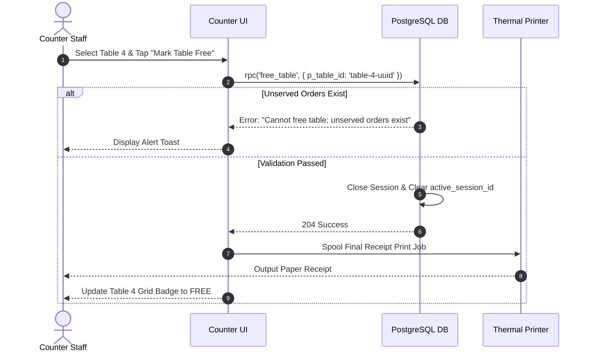
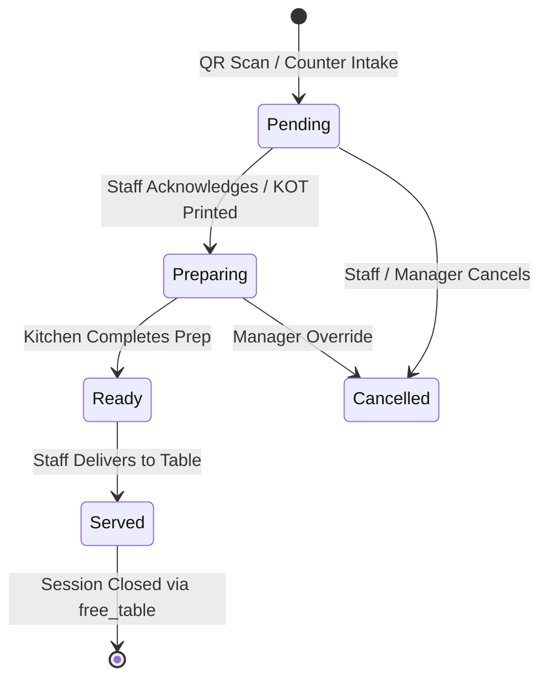

# OrderRail — Counter Operational Architecture

> **Definitive Operational Architecture Document** for the OrderRail Counter application, detailing point-of-sale workflows, dining session orchestration, kitchen coordination, billing engines, printing pipelines, and hardware integration.

---

## Table of Contents
- [1. Purpose & System Role](#1-purpose--system-role)
- [2. Design Philosophy](#2-design-philosophy)
- [3. Core Responsibilities](#3-core-responsibilities)
- [4. Operational Modes](#4-operational-modes)
- [5. Counter Workspace Architecture](#5-counter-workspace-architecture)
- [6. Dining Session Management](#6-dining-session-management)
- [7. Order Workflow & Lifecycle](#7-order-workflow--lifecycle)
- [8. Billing & Payment Workflow](#8-billing--payment-workflow)
- [9. Table Management & Occupancy Control](#9-table-management--occupancy-control)
- [10. Kitchen Coordination (KOT & KDS)](#10-kitchen-coordination-kot--kds)
- [11. Printing Architecture](#11-printing-architecture)
- [12. Hardware Integration](#12-hardware-integration)
- [13. Offline Strategy & Synchronization](#13-offline-strategy--synchronization)
- [14. Role-Based Permissions & Security](#14-role-based-permissions--security)
- [15. Performance Goals & SLAs](#15-performance-goals--slas)
- [16. Future Expansion & Roadmap](#16-future-expansion--roadmap)
- [17. Cross-References & Related Documentation](#17-cross-references--related-documentation)

---

## 1. Purpose & System Role

### 1.1 Why the Counter Exists
The OrderRail Counter acts as the **operational control center** of the cafe or restaurant. While customer mobile devices handle self-service QR ordering and the Owner Portal manages high-level administrative configurations, the Counter serves as the real-time command station where staff process orders, manage floor occupancy, coordinate kitchen dispatch, settle bills, print receipts, and resolve customer requests.

```
                   ┌─────────────────────────────────────────┐
                   │           CUSTOMER MOBILE QR            │
                   └────────────────────┬────────────────────┘
                                        │ (Submits Orders / Calls Staff)
                                        ▼
┌──────────────────┐           ┌──────────────────┐           ┌──────────────────┐
│   OWNER PORTAL   │ ◄───────► │  POSTGRESQL DB   │ ◄───────► │ COUNTER TERMINAL │
│ (Admin Configs)  │           │(Source of Truth) │           │ (Operational Hub)│
└──────────────────┘           └──────────────────┘           └─────────┬────────┘
                                                                        │
                                                                        ▼
                                                              ┌──────────────────┐
                                                              │ KITCHEN / PRINTER│
                                                              └──────────────────┘
```

### 1.2 Role Within the OrderRail Ecosystem
1. **Fulfillment Authority:** Converts incoming customer QR orders and counter walk-in requests into actionable kitchen preparation tasks.
2. **Session Coordinator:** Owns the lifecycle of `dining_sessions`, linking physical tables to customer billing contexts.
3. **Cashier & Settlement Terminal:** Generates itemized bills, applies discounts, collects payments, and closes dining sessions.
4. **Hardware Gateway:** Interfaces with thermal receipt printers, Kitchen Order Ticket (KOT) spoolers, cash drawers, and barcode scanners.

---

## 2. Design Philosophy

### 2.1 The Counter as the Operational Hub
The Counter application is designed around **zero-latency operational clarity**. Staff working at the counter require immediate situational awareness of every table's status, pending kitchen tickets, unread service calls, and pending payment bills without navigating complex menus.

### 2.2 Dining Session-Centric Workflow
Rather than treating orders as disconnected transactions, the Counter anchors all dine-in operations around the **`dining_session_id`** (as defined in [`DATABASE.md`](./DATABASE.md)). 
- Multiple orders placed by different guests at Table 4 accumulate under Table 4's active `dining_session_id`.
- The Counter staff views, modifies, and bills the entire dining session as a unified customer visit.

### 2.3 Separation of Operational and Administrative Concerns
- **Counter Terminal (Operational):** Fast execution of order intake, status updates, table clearing, KOT printing, and payment collection.
- **Owner Portal (Administrative):** Menu item creation, category management, analytics, tax rate setup, and staff invitation management.

---

## 3. Core Responsibilities

| Responsibility | Description | Key System Output |
|----------------|-------------|-------------------|
| **Dine-In Management** | Monitors active table sessions, accepts QR orders, adds manual staff orders to tables. | `orders`, `dining_sessions` state updates |
| **Takeaway / Express** | Intake and billing for walk-in takeaway orders without physical table binding. | Express `orders` with `table_id: null` |
| **Occupancy Monitoring** | Real-time floor plan visualization showing occupied, free, and overdue tables. | `tables.status` and `active_session_id` binding |
| **Kitchen Coordination** | Dispatches KOTs to kitchen printers, updates preparation states (`pending` → `preparing` → `ready` → `served`). | Real-time Kanban board updates |
| **Billing & Settlement** | Generates bills, applies promo discounts, processes cash/card/UPI payments, closes sessions. | Sealed `dining_sessions` with `total_amount` |
| **Service Call Dispatch** | Displays and acknowledges customer assistance calls ("Water", "Bill", "Waiter"). | `service_requests` status updates |
| **Hardware Printing** | Spools automated KOT prints on order placement and itemized receipts on payment. | Thermal ESC/POS print jobs |

---

## 4. Operational Modes

### 4.1 Dine-In Mode
- **Workflow:** Customer scans QR code or staff opens a table at the counter.
- **Binding:** Orders are linked to `tables.id` and a mandatory `dining_session_id`.
- **Settlement:** Post-pay workflow. Table remains `occupied` until staff prints the final bill, collects payment, and executes `free_table` RPC.

### 4.2 Takeaway / Express Mode
- **Workflow:** Walk-in customer orders directly at the counter for takeaway.
- **Binding:** `table_id` is `null` or bound to a virtual `'TAKEAWAY'` virtual table.
- **Settlement:** Pre-pay workflow. Payment is collected immediately upon order intake. Kitchen receives a KOT flagged as `TAKEAWAY`.

### 4.3 Future Delivery & Pre-Order Mode
- **Workflow:** External delivery or advance customer pickup orders.
- **Binding:** Linked to `customer_profile_id` and assigned a scheduled dispatch time.

---

## 5. Counter Workspace Architecture

The Counter application layout is divided into four functional workspaces:

```
┌───────────────────────────────────────────────────────────────────────────────────────────┐
│                                 COUNTER MAIN NAVIGATION                                   │
├───────────────────────────────┬───────────────────────────────┬───────────────────────────┤
│    ACTIVE TABLES GRID         │     KITCHEN KANBAN QUEUE      │   BILLING & CASHIER SIDE   │
│                               │                               │                           │
│ ┌─────────┐     ┌─────────┐   │ ┌───────────┐   ┌───────────┐ │  Session: Table 4 (#402)  │
│ │ Table 1 │     │ Table 2 │   │ │ Pending   │   │ Preparing │ │  Total: $42.50            │
│ │ FREE    │     │ OCCUPIED│   │ │ Order #21 │   │ Order #20 │ │                           │
│ └─────────┘     └─────────┘   │ └───────────┘   └───────────┘ │  [Print Bill] [Collect]   │
├───────────────────────────────┴───────────────────────────────┴───────────────────────────┤
│                        SERVICE REQUEST NOTIFICATION BAR (Water / Bill)                     │
└───────────────────────────────────────────────────────────────────────────────────────────┘
```

1. **Active Tables Grid:** Visual representation of physical tables showing occupancy badges, active session duration, and unserved item counts.
2. **Kitchen Kanban Queue:** Real-time columns (`Pending`, `Preparing`, `Ready`, `Served`) allowing staff to drag-and-drop or tap order cards to advance status.
3. **Billing & Cashier Sidebar:** Slide-over panel for inspecting session itemization, applying discounts, selecting payment methods, and executing `free_table`.
4. **Service Request Notification Bar:** Persistent bottom strip alerting staff to pending calls (`water`, `bill`, `waiter`) with sound notifications.

---

## 6. Dining Session Management

### 6.1 Creating a Session
- **Automatic (QR Scan):** Customer scans QR code; `getOrCreateDiningSession()` creates a `dining_sessions` record (`status: 'browsing'`) and updates `tables.active_session_id`.
- **Manual (Counter Intake):** Staff taps a `free` table in the Counter grid and selects "Open Table", creating a new `dining_sessions` record (`status: 'active'`).

### 6.2 Continuing a Session
- Subsequent orders placed by any diner at the table auto-attach to the existing `active_session_id`.
- The Counter displays cumulative orders grouped chronologically.

### 6.3 Merging Sessions (Future)
- Staff selects two active tables (e.g. Table 3 and Table 4) and invokes `merge_dining_sessions(source_session_id, target_session_id)`.
- All orders under Table 3 are re-parented to Table 4's `dining_session_id`, and Table 3 is set to `free`.

### 6.4 Closing & Table Release
- Staff taps "Mark Table Free".
- The Counter invokes `free_table(p_table_id)` RPC as detailed in [`DATABASE.md`](./DATABASE.md).
- The RPC verifies zero unserved orders remain, updates `dining_sessions.status = 'closed'`, records `closed_at`, and clears `tables.active_session_id`.



---

## 7. Order Workflow & Lifecycle



### 7.1 QR Orders vs Walk-In Counter Orders
- **QR Orders:** Created by customer mobile web app (`anon` role). Placed directly into `orders` with `status: 'pending'`. Real-time WAL triggers counter chime.
- **Walk-In Counter Orders:** Staff selects items on the Counter POS menu grid and submits. Order is saved with `status: 'pending'` or automatically advanced to `'preparing'`.

### 7.2 Order Cancellation Rules
- **`pending` Orders:** Counter staff can cancel immediately.
- **`preparing` / `ready` Orders:** Requires Manager/Owner PIN override to prevent food wastage fraud.

---

## 8. Billing & Payment Workflow

### 8.1 Generating the Bill
1. Staff opens the billing panel for an active table.
2. The Counter calculates the subtotal from all `served` orders in the session.
3. Applicable taxes (e.g. GST, VAT) and service charges are computed.
4. Staff taps "Print Bill" to generate a pre-payment invoice receipt for the customer.

### 8.2 Payment Recording
- Supported payment channels: `Cash`, `Credit/Debit Card`, `UPI / QR Code`, `Staff Comp / Wallet`.
- Once payment is confirmed, the staff records the payment method, prints the final fiscal receipt, and the system executes `free_table`.

---

## 9. Table Management & Occupancy Control

### 9.1 Real-Time Occupancy Engine
The Counter relies on the shared occupancy engine in `src/lib/tables/occupancy.ts`:
```typescript
isOccupied = (table.active_session_id !== null) || (table.status === 'occupied')
```
- **Occupied Table:** Rendered with an Amber/Red badge, session duration timer, and order count.
- **Free Table:** Rendered with a Green badge, ready for new session binding.

### 9.2 Table Reassignment (Transfer Table)
If guests move from Table 2 to Table 5:
1. Staff selects Table 2 and taps "Transfer Table".
2. Staff selects destination Table 5.
3. System executes atomic update:
   - Sets `tables(Table 5).active_session_id = session_id` and `status = 'occupied'`.
   - Sets `tables(Table 2).active_session_id = null` and `status = 'free'`.
   - Updates `orders.table_id = Table 5` for active session orders.

---

## 10. Kitchen Coordination (KOT & KDS)

### 10.1 Kitchen Order Ticket (KOT) Generation
When an order transitions to `preparing`:
1. The Counter extracts unprinted line items from `order_items`.
2. Generates a KOT payload containing: `Table Label`, `Daily Order Number`, `Timestamp`, `Item Names`, `Quantities`, and `Special Notes`.
3. Sends the payload to the local printing spooler.

### 10.2 KDS (Kitchen Display System) Integration (Future)
Future KDS tablets running in the kitchen will replace paper KOTs:
- Real-time WebSockets stream new orders directly to station screens.
- Kitchen staff tap items as "Done", automatically updating order status to `ready` on the Counter terminal.

---

## 11. Printing Architecture

```
┌──────────────────┐      WebSockets / HTTP      ┌──────────────────┐
│ COUNTER TERMINAL │ ──────────────────────────► │ PRINT SPOOLER    │
│ (React Web App)  │                             │ (Node / Agent)   │
└──────────────────┘                             └────────┬─────────┘
                                                          │ ESC/POS Raw Commands
                                                          ▼
                                                 ┌──────────────────┐
                                                 │ THERMAL PRINTER  │
                                                 │ (USB / LAN / IP) │
                                                 └──────────────────┘
```

- **Print Spooler Agent:** Lightweight local background service (Node.js/Go) running on the counter PC or network bridge.
- **Protocol:** RAW ESC/POS byte streams sent via USB, Ethernet (TCP 9100), or Bluetooth.
- **Print Types:**
  1. **KOT (Kitchen Order Ticket):** 80mm/58mm thermal paper, large font, itemized notes.
  2. **Customer Invoice (Pre-Payment):** Itemized breakdown with taxes and total.
  3. **Final Receipt (Post-Payment):** Fiscal receipt with payment method and QR feedback link.

---

## 12. Hardware Integration

| Hardware Device | Connection Protocol | Counter Functionality |
|-----------------|---------------------|-----------------------|
| **Thermal Printers** | Ethernet (LAN / TCP), USB, Serial | Automated KOT and receipt printing. |
| **Cash Drawer** | RJ12 (connected to receipt printer) | Triggers 24V pulse to open drawer on cash payment. |
| **Barcode / QR Scanner** | USB HID (Keyboard Emulation) | Scans customer bill QR codes for instant lookup. |
| **Secondary Customer Display** | HDMI / Dual-Screen Browser Window | Displays real-time itemized order total to walk-in customer. |

---

## 13. Offline Strategy & Synchronization

1. **IndexedDB Local Storage:** If internet connectivity fails, counter intake orders are stored locally in IndexedDB via `orderQueue.ts`.
2. **Visual Offline Banner:** Counter displays a yellow "Offline Mode — Orders Queued Locally" warning.
3. **Auto-Reconnection Sync:** When network connectivity is restored, the queue worker sequentially posts stored orders to Supabase and reconciles state.

---

## 14. Role-Based Permissions & Security

| Counter Action | Counter Staff | Shift Manager | Cafe Owner |
|----------------|---------------|---------------|------------|
| View Tables & Orders | Yes | Yes | Yes |
| Place Order / Add Items | Yes | Yes | Yes |
| Mark Order Served | Yes | Yes | Yes |
| Print KOT & Receipts | Yes | Yes | Yes |
| Cancel Pending Order | Yes | Yes | Yes |
| Cancel Preparing/Ready Order | Requires Manager PIN | Yes | Yes |
| Apply Custom Discount (>10%) | Requires Manager PIN | Yes | Yes |
| Void Paid Session | No | Requires Manager PIN | Yes |
| Edit Menu Prices | No | No | Yes |

---

## 15. Performance Goals & SLAs

- **Order Intake Latency:** < 200ms from button tap to local UI confirmation.
- **KOT Print Spool Time:** < 1.0 second from order submission to paper output start.
- **Realtime Table Synchronization:** < 150ms WAL broadcast latency to update table grid state.
- **Capacity:** Supports up to **100 concurrent active tables** and **500 active orders per hour** per counter terminal.

---

## 16. Future Expansion & Roadmap

1. **Multi-Counter Synchronization:** Support for large venues operating multiple counter terminals (e.g., Bar Counter + Main Dining Counter) with optimistic locking.
2. **Multi-Outlet Aggregation:** Centralized manager view for chain cafes operating across multiple physical branches.
3. **Table Reservations & Pre-Booking:** Integrating reservation calendars directly into the table grid.
4. **Customer Loyalty & Wallet Redemption:** Scanning customer phone numbers at the counter to auto-apply reward points.
5. **Real-Time Inventory Deduction:** Automated ingredient stock reduction as KOTs are printed.

---

## 17. Cross-References & Related Documentation

- [`./DATABASE.md`](./DATABASE.md) — Comprehensive PostgreSQL database design, schema, RLS policies, and RPC specifications.
- [`./ARCHITECTURE.md`](./ARCHITECTURE.md) — System Architecture, Component Hierarchy, and Realtime Engine.
- [`./PRODUCT.md`](./PRODUCT.md) — Product Requirements & Feature Specifications.
- [`./DEVELOPMENT_WORKFLOW.md`](./DEVELOPMENT_WORKFLOW.md) — Engineering standards and testing guidelines.
