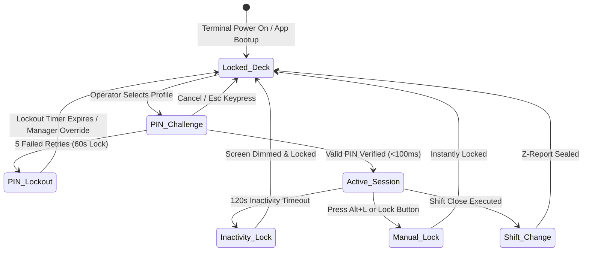

# OrderRail — Counter Authentication & Operator Governance Specification (COUNTER_AUTH_SPEC.md)

> **Definitive Functional & Security Specification** for Counter Terminal Authentication, Netflix-Style Operator Profile Selection, PIN Security, Role Permission Governance, Transaction Audit Attribution, and Shift Lifecycle Workflows.

---

## Executive Summary

On dedicated OrderRail terminals, **devices are authenticated permanently to the café location, while human operators switch continuously throughout the operational day.**

A cashier should never log into a POS terminal using an owner's master email and password. Instead:

```
┌─────────────────────────────────────────────────────────────────────────────────────────┐
│                               OPERATOR AUTHENTICATION FLOW                              │
│                                                                                         │
│  ┌───────────────────────┐       ┌───────────────────────┐       ┌───────────────────┐  │
│  │   DEDICATED DEVICE    │ ───►  │   OPERATOR SELECTION  │ ───►  │  4-DIGIT PIN PAD  │  │
│  │  (Permanently Paired) │       │   (Netflix Profile)   │       │  (Sub-Second Auth)│  │
│  └───────────────────────┘       └───────────────────────┘       └─────────┬─────────┘  │
│                                                                            │            │
│                                                                            ▼            │
│                                                                  ┌───────────────────┐  │
│                                                                  │ OPERATIONAL POS   │  │
│                                                                  │ (Attributed Audit)│  │
│                                                                  └───────────────────┘  │
└─────────────────────────────────────────────────────────────────────────────────────────┘
```

This specification details the end-to-end operator authentication mechanics, permission boundaries, audit logging schema, and shift workflows.

---

## Table of Contents

- [1. Operator Selection Screen ("Netflix-Style Profile Grid")](#1-operator-selection-screen-netflix-style-profile-grid)
- [2. PIN Authentication Mechanics & Security](#2-pin-authentication-mechanics--security)
- [3. Operator Session Lifecycle](#3-operator-session-lifecycle)
- [4. Role & Permission Governance Architecture](#4-role--permission-governance-architecture)
- [5. Audit Logging & Transaction Attribution Schema](#5-audit-logging--transaction-attribution-schema)
- [6. Shift Workflows & Cash Control Mechanics](#6-shift-workflows--cash-control-mechanics)
- [7. Failure Cases & Edge Protocols](#7-failure-cases--edge-protocols)
- [8. Native Desktop & Hardware Transition Blueprint](#8-native-desktop--hardware-transition-blueprint)

---

## 1. Operator Selection Screen ("Netflix-Style Profile Grid")

When a paired Counter terminal is idle, locked, or powering on, it presents the **Operator Selection Deck**. Cashiers tap their profile card to open the fast PIN entry modal.

### 1.1 ASCII Layout Blueprint

```
┌─────────────────────────────────────────────────────────────────────────────────────────────────────────────────────────┐
│ OrderRail POS v2 │ Cafe Central │ TERMINAL: Counter POS #1 │ STATUS: ● ONLINE │ SHIFT: ACTIVE (Open 08:00) │ 14:32:05   │
├─────────────────────────────────────────────────────────────────────────────────────────────────────────────────────────┤
│                                                                                                                         │
│                                           WHO IS OPERATING THIS COUNTER?                                                │
│                                          Select your profile to unlock POS                                              │
│                                                                                                                         │
│     ┌───────────────────────┐   ┌───────────────────────┐   ┌───────────────────────┐   ┌───────────────────────┐     │
│     │      [ AVATAR ]       │   │      [ AVATAR ]       │   │      [ AVATAR ]       │   │      [ AVATAR ]       │     │
│     │       SARAH M.        │   │       MARCUS K.       │   │       DAVID L.        │   │       ELENA R.        │     │
│     │    [ CASHIER #402 ]   │   │    [ SHIFT MANAGER ]  │   │    [ CAFE OWNER ]     │   │    [ CASHIER #405 ]   │     │
│     │   ● Shift Active      │   │   ● Shift Active      │   │   ○ Away              │   │   ○ Shift Ended       │     │
│     └───────────────────────┘   └───────────────────────┘   └───────────────────────┘   └───────────────────────┘     │
│                                                                                                                         │
│     ┌───────────────────────┐                                                                                           │
│     │      [ AVATAR ]       │                                                                                           │
│     │      SUPPORT TECH     │                                                                                           │
│     │   [ MAINTENANCE ]     │                                                                                           │
│     └───────────────────────┘                                                                                           │
│                                                                                                                         │
├─────────────────────────────────────────────────────────────────────────────────────────────────────────────────────────┤
│ QUICK KEYS: [Alt+L: Lock Terminal] [F12: Emergency Manager PIN Challenge] │ DEVICE ID: dev_88392019-4b2a                │
└─────────────────────────────────────────────────────────────────────────────────────────────────────────────────────────┘
```

### 1.2 Profile Card Attributes

Each profile card renders:
1. **Avatar / Photo:** Custom staff photo or high-contrast initial badge.
2. **Display Name:** Full name and staff ID badge (`Sarah M. #402`).
3. **Role Tag:** Distinct visual color pill:
   - `Cashier`: Blue badge (`bg-blue-500/10 text-blue-600`)
   - `Shift Manager`: Amber badge (`bg-amber-500/10 text-amber-600`)
   - `Owner`: Purple badge (`bg-purple-500/10 text-purple-600`)
   - `Support Tech`: Gray badge (`bg-slate-500/10 text-slate-600`)
4. **Shift Status Dot:** `● Shift Active` (Green), `○ Away` (Gray).

---

## 2. PIN Authentication Mechanics & Security

Tapping an operator card triggers an instant modal popover with a high-contrast 4 to 6-digit numeric keypad.

```
┌──────────────────────────────────────────────────┐
│ UNLOCK TERMINAL                                  │
├──────────────────────────────────────────────────┤
│ Operator: Sarah M. (Cashier #402)                │
│                                                  │
│          [  ●  ]  [  ●  ]  [  ●  ]  [  ●  ]      │
│                                                  │
│          ┌─────────┐ ┌─────────┐ ┌─────────┐     │
│          │    1    │ │    2    │ │    3    │     │
│          └─────────┘ └─────────┘ └─────────┘     │
│          ┌─────────┐ ┌─────────┐ ┌─────────┐     │
│          │    4    │ │    5    │ │    6    │     │
│          └─────────┘ └─────────┘ └─────────┘     │
│          ┌─────────┐ ┌─────────┐ ┌─────────┐     │
│          │    7    │ │    8    │ │    9    │     │
│          └─────────┘ └─────────┘ └─────────┘     │
│          ┌─────────┐ ┌─────────┐ ┌─────────┐     │
│          │  CLEAR  │ │    0    │ │   DEL   │     │
│          └─────────┘ └─────────┘ └─────────┘     │
│                                                  │
│ [ CANCEL (Esc) ]            [ UNLOCK (Enter) ]   │
└──────────────────────────────────────────────────┘
```

### 2.1 Sub-Second Performance SLA

- PIN entry verification completes in **< 100ms** by matching against salted Bcrypt hashes stored in the terminal's secure local IndexedDB cache (`staff_pin_hashes`).
- Full POS layout un-blurs instantly without triggering network page reloads.

### 2.2 Inactivity Lock & Lockout Policy

- **Inactivity Lock Timeout:** Configurable in Owner Portal (Default: **120 seconds** of zero mouse/touch/keyboard activity). Automatically dims POS layout and locks to the Operator Selection deck.
- **Max Retry Threshold:** **5 consecutive failed PIN attempts**.
- **Lockout Penalty:** 
  - 5 failed attempts locks the specific operator profile for **60 seconds**.
  - Triggers an automated high-priority audit event (`AUDIT_FAILED_PIN_LOCKOUT`).
  - Allows immediate Manager PIN override to un-lock ahead of timer.

### 2.3 Manager PIN Challenge & Override Protocol

When a cashier attempts a restricted action (e.g. applying a 20% discount or voiding a kitchen ticket):

1. POS displays inline modal: *"Manager Authorization Required for 20% Discount"*.
2. Prompts for a **Manager PIN**.
3. Manager taps/inputs PIN directly over the cashier's active transaction screen.
4. Transaction executes under the cashier's cart, but records `approved_by_operator_id: manager_id` in `audit_logs`.
5. Interface immediately returns control to cashier without logging cashier out.

---

## 3. Operator Session Lifecycle



### 3.1 Session Persistence Rules

- Active operator session context exists purely in memory (`React Context`).
- Closing or refreshing browser preserves the underlying **Device Registration** and **Active Cart**, but enforces PIN re-entry to unlock operator context.

---

## 4. Role & Permission Governance Architecture

OrderRail strictly separates **Device Capabilities** from **Operator Permissions**.

### 4.1 Access Control Matrix

| POS Action / Operation | Cashier | Shift Manager | Cafe Owner | Support Tech |
|------------------------|:-------:|:-------------:|:----------:|:------------:|
| Intake Walk-in Order | ✅ | ✅ | ✅ | ❌ |
| Modify Active Cart Items | ✅ | ✅ | ✅ | ❌ |
| Apply Discount <= 10% | ✅ | ✅ | ✅ | ❌ |
| Apply Discount > 10% | 🔑 PIN Required | ✅ | ✅ | ❌ |
| Void Kitchen Ticket (KOT) | 🔑 PIN Required | ✅ | ✅ | ❌ |
| Void Active Session / Table | 🔑 PIN Required | ✅ | ✅ | ❌ |
| Manual Cash Drawer Open | 🔑 PIN Required | ✅ | ✅ | ❌ |
| Settle Cash / Card Payment | ✅ | ✅ | ✅ | ❌ |
| Reprint Receipt / Invoice | ✅ | ✅ | ✅ | ❌ |
| View Daily Revenue Summary | ❌ | ✅ | ✅ | ❌ |
| Execute Shift Close (Z-Report) | ✅ | ✅ | ✅ | ❌ |
| Manage Today's Specials | ✅ | ✅ | ✅ | ❌ |
| Calibrate Printers & Hardware | ❌ | 🔑 PIN Required | ✅ | ✅ |
| Revoke Terminal / Unpair | ❌ | ❌ | ✅ | ❌ |

---

## 5. Audit Logging & Transaction Attribution Schema

Every mutation, payment, print, or security event on a Counter terminal generates an immutable record in `public.audit_logs`.

### 5.1 Database Table: `public.audit_logs`

```sql
CREATE TABLE IF NOT EXISTS public.audit_logs (
  id                  UUID PRIMARY KEY DEFAULT gen_random_uuid(),
  cafe_id             UUID NOT NULL REFERENCES public.cafes(id) ON DELETE CASCADE,
  device_id           UUID NOT NULL REFERENCES public.devices(id) ON DELETE CASCADE,
  operator_id         UUID REFERENCES auth.users(id) ON DELETE SET NULL,
  operator_name       TEXT NOT NULL, -- Snapshot of operator name at event time
  operator_role       TEXT NOT NULL, -- Snapshot of operator role
  
  action_type         TEXT NOT NULL, -- e.g. 'OPERATOR_LOGIN', 'DISCOUNT_APPLIED', 'SESSION_VOIDED'
  resource_type       TEXT,          -- e.g. 'dining_session', 'order', 'cash_drawer'
  resource_id         TEXT,          -- e.g. session UUID or order label
  
  approved_by_id      UUID REFERENCES auth.users(id) ON DELETE SET NULL, -- Manager PIN override ID
  approved_by_name    TEXT,
  
  details             JSONB NOT NULL DEFAULT '{}'::jsonb, -- Context payload (amounts, reasons)
  created_at          TIMESTAMPTZ NOT NULL DEFAULT now()
);

-- Indices for rapid compliance searches & shift reconciliation
CREATE INDEX IF NOT EXISTS idx_audit_logs_cafe_device ON public.audit_logs(cafe_id, device_id, created_at DESC);
CREATE INDEX IF NOT EXISTS idx_audit_logs_operator ON public.audit_logs(operator_id, created_at DESC);
CREATE INDEX IF NOT EXISTS idx_audit_logs_action ON public.audit_logs(action_type);
```

---

## 6. Shift Workflows & Cash Control Mechanics

```
┌─────────────────────────────────────────────────────────────────────────────────────────┐
│                                SHIFT LIFECYCLE WORKFLOW                                 │
├─────────────────────────┬─────────────────────────┬─────────────────────────────────────┤
│      1. MORNING OPEN    │    2. MID-SHIFT SWITCH  │          3. NIGHT CLOSE             │
│                         │                         │                                     │
│ • Device bootup         │ • Cashier A locks       │ • Cashier executes Shift Close      │
│ • Owner/Manager PIN     │   terminal (`Alt+L`)    │ • Physical cash drawer counted      │
│ • Enter Opening Cash    │ • Cashier B inputs PIN  │ • System calculates over/short      │
│   Float ($200.00)       │ • Active cart & tables  │ • Z-Report printed on thermal paper │
│ • Shift X-Report reset  │   remain untouched      │ • Terminal locked for night         │
└─────────────────────────┴─────────────────────────┴─────────────────────────────────────┘
```

### 6.1 Shift Opening Sequence
1. First cashier selects profile and inputs PIN.
2. If no shift is active for terminal, POS prompts: *"Open Shift for Counter #1"*.
3. Cashier enters physical **Opening Cash Float** (e.g. `$200.00`).
4. System records `SHIFT_STARTED` audit entry with timestamp and opening float.

### 6.2 Mid-Shift Switch Sequence
1. Sarah finishes 4-hour cashier block. Press `Alt+L`.
2. POS locks to Operator Picker screen in `< 50ms`. Active dining sessions remain untouched.
3. Marcus taps profile, inputs PIN.
4. Active workspace immediately loads; subsequent orders record Marcus as the active cashier in `audit_logs`.

### 6.3 Shift Closing Sequence (Z-Report)
1. Cashier selects **Shift Close** (`F12` menu).
2. POS displays expected cash total based on recorded transactions:
   - Opening Float: `$200.00`
   - Cash Net Collected: `$840.50`
   - **Expected Drawer Total: `$1,040.50`**
3. Cashier counts physical cash and inputs **Actual Drawer Count**.
4. System computes variance (`Over / Short`).
5. Triggers automated thermal print of official **Z-Report**.
6. Closes shift record in database and locks device.

---

## 7. Failure Cases & Edge Protocols

| Failure Scenario | System Behavior | Recovery Protocol |
|------------------|-----------------|-------------------|
| **Incorrect PIN** | Displays shaking red error animation; records attempt. | 5 failures triggers 60s lockout or Manager Override. |
| **Offline Authentication** | Device checks cached Argon2/Bcrypt PIN hash in IndexedDB. | Offline login proceeds seamlessly; syncs audit log when re-connected. |
| **Operator Account Deleted** | Supabase Realtime notifies device; profile removed from picker deck. | If operator is currently logged in, session instantly terminates and locks to deck. |
| **Device Revoked by Owner** | Remote RLS rejects tokens; returns HTTP 403 `DEVICE_REVOKED`. | Client purges local DB/keys and reverts to Factory Unpaired state. |
| **Browser Crash / Power Loss** | Terminal reboots to paired state. Active cart saved in IndexedDB. | POS prompts for Cashier PIN, restores open cart without order loss. |

---

## 8. Native Desktop & Hardware Transition Blueprint

OrderRail's Device Architecture is explicitly designed to wrap seamlessly into native desktop containers (**Electron**, **Tauri**) or **Android POS tablets**:

```
┌─────────────────────────────────────────────────────────────────────────────────────────┐
│                              NATIVE WRAPPER ARCHITECTURE                                │
│                                                                                         │
│  ┌───────────────────────────────────────────────────────────────────────────────────┐  │
│  │ NATIVE CONTAINER (Electron / Tauri / Android POS App)                             │  │
│  │                                                                                   │  │
│  │  ┌─────────────────────────────────────────────────────────────────────────────┐  │  │
│  │  │ SHARED WEB CORE (React + Vite + Tailwind + WebCrypto)                         │  │  │
│  │  │ - Counter V2 Workspace Shell                                                │  │  │
│  │  │ - Device Token Manager & PIN Auth Engine                                    │  │  │
│  │  └─────────────────────────────────────────────────────────────────────────────┘  │  │
│  │                                          │                                        │  │
│  │                                          ▼                                        │  │
│  │  ┌─────────────────────────────────────────────────────────────────────────────┐  │  │
│  │  │ NATIVE HARDWARE BRIDGES (Node.js / Rust / Java Native)                        │  │  │
│  │  │ - Direct ESC/POS Thermal Printing (USB / RS232 Serial Port 9100)           │  │  │
│  │  │ - Physical Cash Drawer Kick (RJ11 Pulse Signal)                             │  │  │
│  │  │ - OS Hardware Serial Fingerprint Binding                                    │  │  │
│  │  └─────────────────────────────────────────────────────────────────────────────┘  │  │
│  └───────────────────────────────────────────────────────────────────────────────────┘  │
└─────────────────────────────────────────────────────────────────────────────────────────┘
```

1. **Zero Auth Architecture Changes:** The dual-token device pairing (`device_id`) and operator PIN auth engine function identically inside Electron/Tauri WebViews as in standard browsers.
2. **Direct Hardware I/O:** Native wrappers replace IP web sockets with direct USB/RS232 serial printer drivers and physical RJ11 cash drawer pulses.
3. **Hardware Storage Upgrades:** Web Crypto and IndexedDB bridge to native SQLite encryption wrappers (SQLCipher) for zero-latency local operations.
