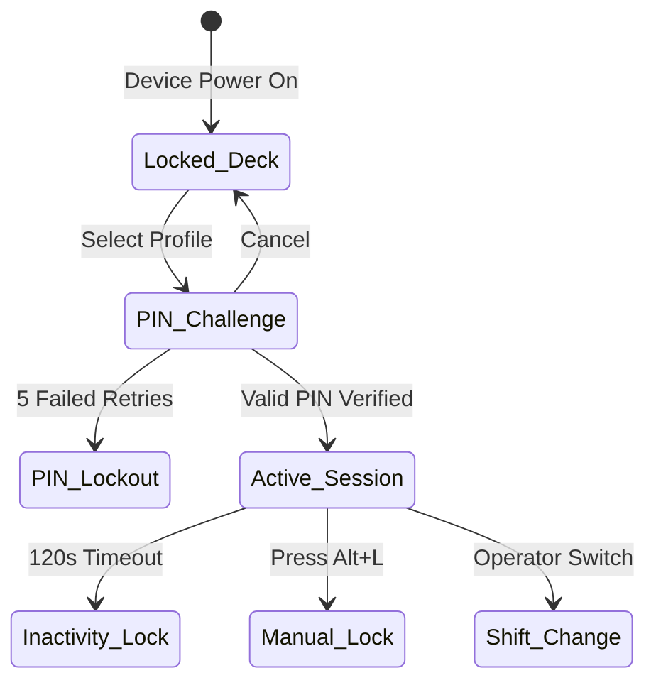

# OrderRail — Counter Authentication & Operator Governance Specification (COUNTER_AUTH_SPEC.md)

> **Definitive Functional & Security Specification** for Counter Terminal Authentication, Netflix-Style Operator Profile Selection, PIN Security, Permission Bundle Governance, Configurable Shift Modes, Audit Logging, and Native Transition Strategy.

---

## Executive Summary

On dedicated OrderRail terminals, **devices are authenticated permanently to the café location, while human operators switch continuously throughout the operational day.**

A cashier should never log into a POS terminal using an owner's master email and password. Instead:

$$\text{Dedicated Device} \longrightarrow \text{Operator Selection (Netflix Grid)} \longrightarrow \text{PIN Authentication} \longrightarrow \text{Permission-Bounded POS}$$

This specification details operator authentication, atomic permission bundles, configurable shift modes, audit logging schema, and native application strategy.

---

## Table of Contents

- [1. Operator Selection Screen ("Netflix-Style Profile Grid")](#1-operator-selection-screen-netflix-style-profile-grid)
- [2. PIN Authentication Mechanics & Security](#2-pin-authentication-mechanics--security)
- [3. Operator Session Lifecycle](#3-operator-session-lifecycle)
- [4. Permission Bundle Architecture (Atomic Permissions)](#4-permission-bundle-architecture-atomic-permissions)
- [5. Configurable Shift Management Modes](#5-configurable-shift-management-modes)
- [6. Audit Logging & Transaction Attribution Schema](#6-audit-logging--transaction-attribution-schema)
- [7. Failure Cases & Edge Protocols](#7-failure-cases--edge-protocols)
- [8. Native Application Strategy (Electron / Tauri / Mobile)](#8-native-application-strategy-electron--tauri--mobile)

---

## 1. Operator Selection Screen ("Netflix-Style Profile Grid")

When a paired Counter or operational terminal is idle, locked, or powering on, it presents the **Operator Selection Deck**.

```
┌─────────────────────────────────────────────────────────────────────────────────────────────────────────────────────────┐
│ OrderRail POS v2 │ Cafe Central │ TERMINAL: Counter POS #1 │ STATUS: ● ONLINE │ SHIFT MODE: SIMPLE │ 14:32:05            │
├─────────────────────────────────────────────────────────────────────────────────────────────────────────────────────────┤
│                                                                                                                         │
│                                           WHO IS OPERATING THIS COUNTER?                                                │
│                                          Select your profile to unlock POS                                              │
│                                                                                                                         │
│     ┌───────────────────────┐   ┌───────────────────────┐   ┌───────────────────────┐   ┌───────────────────────┐     │
│     │      [ AVATAR ]       │   │      [ AVATAR ]       │   │      [ AVATAR ]       │   │      [ AVATAR ]       │     │
│     │       SARAH M.        │   │       MARCUS K.       │   │       DAVID L.        │   │       ELENA R.        │     │
│     │    [ CASHIER BUNDLE ] │   │    [ MANAGER BUNDLE ] │   │    [ OWNER BUNDLE ]   │   │    [ CASHIER BUNDLE ] │     │
│     │   ● Shift Active      │   │   ● Shift Active      │   │   ○ Away              │   │   ○ Shift Ended       │     │
│     └───────────────────────┘   └───────────────────────┘   └───────────────────────┘   └───────────────────────┘     │
│                                                                                                                         │
├─────────────────────────────────────────────────────────────────────────────────────────────────────────────────────────┤
│ QUICK KEYS: [Alt+L: Lock Terminal] [F12: Manager PIN Challenge] │ DEVICE ID: dev_88392019-4b2a                          │
└─────────────────────────────────────────────────────────────────────────────────────────────────────────────────────────┘
```

---

## 2. PIN Authentication Mechanics & Security

Tapping an operator card opens an instant 4 to 6-digit numeric keypad:

```
┌──────────────────────────────────────────────────┐
│ UNLOCK TERMINAL                                  │
├──────────────────────────────────────────────────┤
│ Operator: Sarah M. (Cashier Bundle)              │
│                                                  │
│          [  ●  ]  [  ●  ]  [  ●  ]  [  ●  ]      │
│                                                  │
│          ┌─────────┐ ┌─────────┐ ┌─────────┐     │
│          │    1    │ │    2    │ │    3    │     │
│          └─────────┘ └─────────┘ └─────────┘     │
│          ┌─────────┐ ┌─────────┐ ┌─────────┐     │
│          │    4    │ │    5    │ │    6    │     │
│          └─────────┘ └─────────┘ └─────────┘     │
│          ┌─────────┐ ┌─────────┐ ┌─────────┐     │
│          │    7    │ │    8    │ │    9    │     │
│          └─────────┘ └─────────┘ └─────────┘     │
│          ┌─────────┐ ┌─────────┐ ┌─────────┐     │
│          │  CLEAR  │ │    0    │ │   DEL   │     │
│          └─────────┘ └─────────┘ └─────────┘     │
│                                                  │
│ [ CANCEL (Esc) ]            [ UNLOCK (Enter) ]   │
└──────────────────────────────────────────────────┘
```

- **Sub-100ms Unlock SLA:** Compares against salted local hashes in IndexedDB.
- **Inactivity Timeout:** Default 120s of idle time auto-locks to profile picker.
- **Lockout Policy:** 5 failed retries locks profile for 60 seconds (with Manager PIN override option).

---

## 3. Operator Session Lifecycle



---

## 4. Permission Bundle Architecture (Atomic Permissions)

Instead of hardcoding permissions inside fixed user roles, OrderRail utilizes an **Atomic Permission Bundle Architecture**.

### 4.1 Atomic Permission Definitions

```
┌─────────────────────────────────────────────────────────────────────────────────────────┐
│                               ATOMIC PERMISSION TAXONOMY                                │
├───────────────────┬───────────────────┬───────────────────┬───────────────────────────────┤
│  ORDER ATOMS      │  BILLING ATOMS    │  PRINTING ATOMS   │  ADMINISTRATIVE ATOMS         │
│                   │                   │                   │                               │
│ • orders.create   │ • billing.process │ • printing.bill   │ • reports.view                │
│ • orders.modify   │ • billing.disc.sm │ • printing.kot    │ • settings.manage             │
│ • orders.cancel   │ • billing.disc.lg │                   │ • devices.manage              │
│                   │ • billing.refund  │                   │ • staff.manage                │
└───────────────────┴───────────────────┴───────────────────┴───────────────────────────────┘
```

### 4.2 Default Permission Bundles

| Atomic Permission | Cashier Bundle | Manager Bundle | Owner Bundle |
|-------------------|:--------------:|:--------------:|:------------:|
| `orders.create` | ✅ | ✅ | ✅ |
| `orders.modify` | ✅ | ✅ | ✅ |
| `orders.cancel` | 🔑 Manager PIN | ✅ | ✅ |
| `billing.process` | ✅ | ✅ | ✅ |
| `billing.discount.small` (<=10%) | ✅ | ✅ | ✅ |
| `billing.discount.large` (>10%) | 🔑 Manager PIN | ✅ | ✅ |
| `billing.refund` | 🔑 Manager PIN | ✅ | ✅ |
| `printing.bill` | ✅ | ✅ | ✅ |
| `printing.kot` | ✅ | ✅ | ✅ |
| `reports.view` | ❌ | ✅ | ✅ |
| `settings.manage` | ❌ | 🔑 Manager PIN | ✅ |
| `devices.manage` | ❌ | ❌ | ✅ |
| `staff.manage` | ❌ | ❌ | ✅ |

### 4.3 Custom Permission Bundles (Future Extensibility)

Restaurants can create custom bundles (e.g., *"Junior Cashier"*, *"Head Barista"*, *"Floor Supervisor"*) in the Owner Portal by saving custom arrays of permission strings into `public.permission_bundles` without requiring code changes or backend deployments.

---

## 5. Configurable Shift Management Modes

Not every café requires complex float management or Z-reports. OrderRail supports **Three Configurable Shift Modes** toggled in Café Settings:

```
┌─────────────────────────────────────────────────────────────────────────────────────────┐
│                               SHIFT MANAGEMENT MODES                                    │
├─────────────────────────┬─────────────────────────┬─────────────────────────────────────┤
│   MODE 1: DISABLED      │    MODE 2: SIMPLE       │       MODE 3: ADVANCED              │
│   (Continuous Ops)      │    (Operator Tracking)  │       (Full Cash Control)           │
│                         │                         │                                     │
│ • No shift tracking.    │ • Operator login/logout │ • Opening cash float required.      │
│ • Cashiers take orders  │   timestamps tracked.   │ • Mid-shift cash drawer audit.      │
│   continuously.         │ • Basic audit logs.     │ • Closing reconciliation & variance.│
│ • Ideal for food trucks │ • No cash float entries │ • Thermal X-Report & Z-Report       │
│   & fast casual.        │   or Z-reports needed.  │   printing enabled.                 │
└─────────────────────────┴─────────────────────────┴─────────────────────────────────────┘
```

### 5.1 Mode Behavior Comparison Matrix

| POS Feature / Workflow | Mode 1: Disabled | Mode 2: Simple | Mode 3: Advanced |
|------------------------|:----------------:|:--------------:|:----------------:|
| Operator PIN Login | Optional | Mandatory | Mandatory |
| Inactivity Auto-Lock | Enabled | Enabled | Enabled |
| Opening Cash Float Prompt | Skipped | Skipped | Mandatory at shift start |
| Shift Change Workflow | Instant PIN switch | Instant PIN switch + Audit log | Float count & handoff |
| Shift Close & Variance | Disabled | Disabled | Full cash count & Over/Short |
| Z-Report Thermal Printing | Disabled | Disabled | Mandatory on shift close |

---

## 6. Audit Logging & Transaction Attribution Schema

Every operation records `device_id`, `operator_id`, and `cafe_id` into `public.audit_logs`:

```sql
CREATE TABLE IF NOT EXISTS public.audit_logs (
  id                  UUID PRIMARY KEY DEFAULT gen_random_uuid(),
  cafe_id             UUID NOT NULL REFERENCES public.cafes(id) ON DELETE CASCADE,
  device_id           UUID NOT NULL REFERENCES public.devices(id) ON DELETE CASCADE,
  operator_id         UUID REFERENCES auth.users(id) ON DELETE SET NULL,
  operator_name       TEXT NOT NULL,
  
  action_type         TEXT NOT NULL, -- e.g. 'orders.create', 'billing.discount.large'
  resource_type       TEXT,          -- e.g. 'dining_session', 'order'
  resource_id         TEXT,
  
  approved_by_id      UUID REFERENCES auth.users(id) ON DELETE SET NULL, -- Manager PIN override ID
  approved_by_name    TEXT,
  
  details             JSONB NOT NULL DEFAULT '{}'::jsonb,
  created_at          TIMESTAMPTZ NOT NULL DEFAULT now()
);

CREATE INDEX IF NOT EXISTS idx_audit_logs_cafe_device ON public.audit_logs(cafe_id, device_id, created_at DESC);
CREATE INDEX IF NOT EXISTS idx_audit_logs_operator ON public.audit_logs(operator_id, created_at DESC);
```

---

## 7. Failure Cases & Edge Protocols

| Failure Scenario | System Behavior | Recovery Protocol |
|------------------|-----------------|-------------------|
| **Incorrect PIN** | Shaking red error animation; logs attempt. | 5 failures triggers 60s lockout or Manager Override. |
| **Offline PIN Check** | Compares against local Argon2/Bcrypt hash in IndexedDB. | Offline authentication proceeds; syncs audit log when connected. |
| **Revoked Device** | Device token rejected; returns HTTP 403. | Device purges local DB and reverts to Unpaired state. |
| **Power Loss / Crash** | Browser reboots; active cart restored in IndexedDB. | Prompts for Cashier PIN to resume work without data loss. |

---

## 8. Native Application Strategy (Electron / Tauri / Mobile)

The web implementation is the primary platform. Native applications (Electron, Tauri, Android POS) reuse **100% of the web core architecture**:

- **Reused Components:** Device Tokens, Device Identity, Operator PIN Auth, Atomic Permission System, Audit Logging.
- **Native Additions Only:** ESC/POS USB drivers, Serial COM port cash drawers, Barcode Scanners, and Dual Customer Display monitors.
