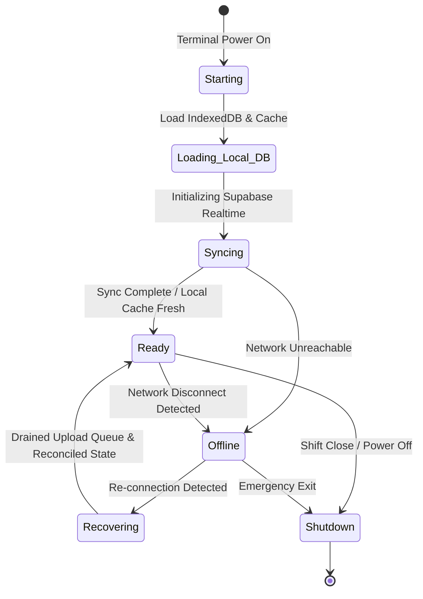
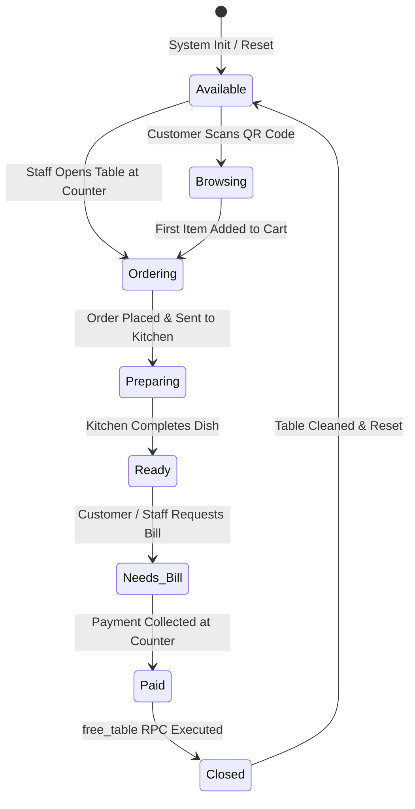
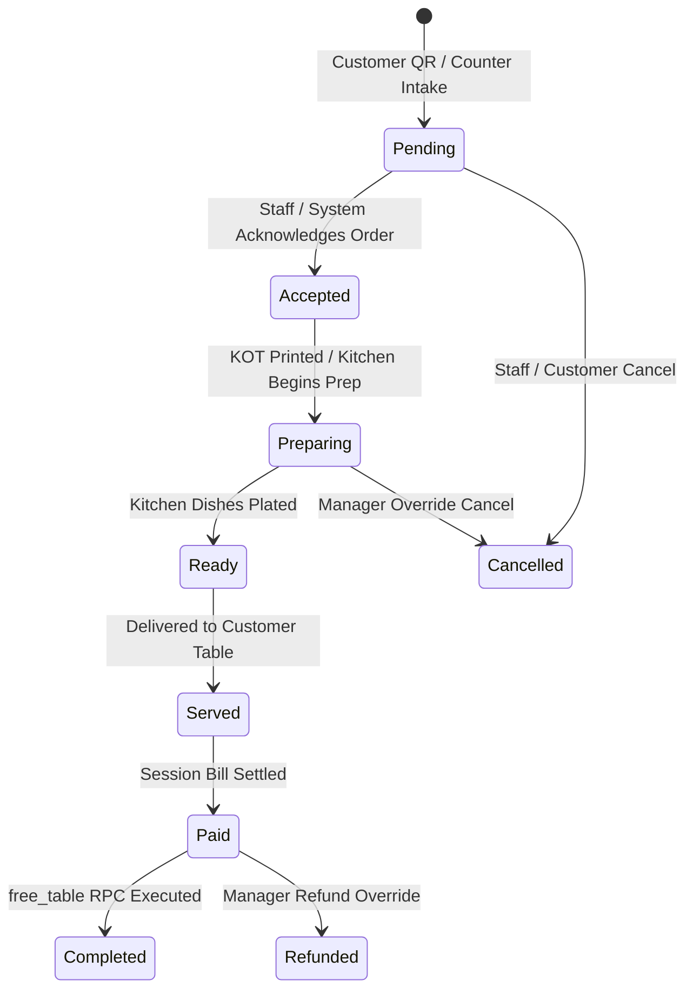
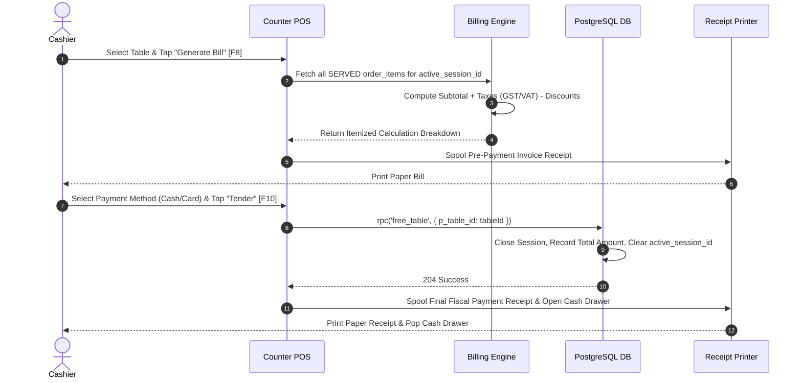
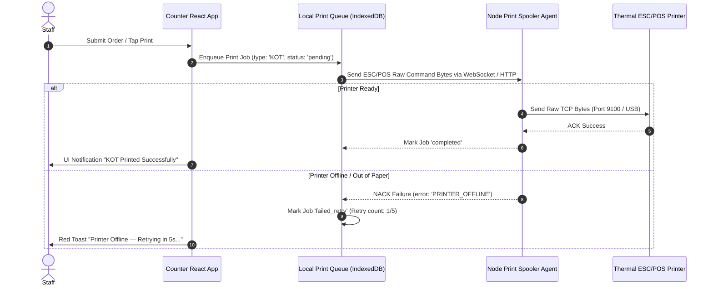

# OrderRail — Counter Functional Specification (COUNTER_SPEC.md)

> **Definitive Functional Specification & Operational Blueprint** for the OrderRail Counter application, detailing mission-critical point-of-sale mechanics, offline-first execution, state machine specifications, keyboard-first cashier workflows, failure recovery protocols, hardware abstractions, and printing pipelines.

---

## Table of Contents
- [1. Vision](#1-vision)
- [2. Core Principles](#2-core-principles)
- [3. User Roles & Access Control](#3-user-roles--access-control)
- [4. Counter Application State Machine](#4-counter-application-state-machine)
- [5. Layout & Workspace Architecture](#5-layout--workspace-architecture)
- [6. Table Lifecycle Specification](#6-table-lifecycle-specification)
- [7. Order Lifecycle Specification](#7-order-lifecycle-specification)
- [8. Billing Lifecycle Specification](#8-billing-lifecycle-specification)
- [9. Printing Pipeline & Sequence Diagrams](#9-printing-pipeline--sequence-diagrams)
- [10. Offline Architecture & Local Storage](#10-offline-architecture--local-storage)
- [11. Synchronization Engine & Idempotency](#11-synchronization-engine--idempotency)
- [12. Failure & Exception Handling Matrix](#12-failure--exception-handling-matrix)
- [13. Keyboard Shortcuts & Cashier Workflow](#13-keyboard-shortcuts--cashier-workflow)
- [14. Hardware Abstraction & Peripheral Support](#14-hardware-abstraction--peripheral-support)
- [15. Performance Targets & SLAs](#15-performance-targets--slas)
- [16. QA Test Scenarios & Stress Testing](#16-qa-test-scenarios--stress-testing)
- [17. Future Features & Roadmap](#17-future-features--roadmap)
- [18. Cross-References & Related Documentation](#18-cross-references--related-documentation)

---

## 1. Vision

### 1.1 Purpose of the Counter Application
The OrderRail Counter is the **mission-critical point-of-sale (POS) and operational control deck** of the restaurant. While customer mobile web applications handle self-service QR ordering and the Owner Portal manages high-level administrative setup, the Counter application operates as the high-availability execution engine where staff process walk-in orders, monitor dining sessions, manage floor layout occupancy, dispatch kitchen tickets, process payments, and trigger thermal receipts.

### 1.2 Operational Goals
1. **Zero Downtime Tolerance:** Serves as an un-interruptible local terminal that processes orders and prints receipts even during total internet or cloud outages.
2. **Sub-Second Cashier Workflows:** Enables high-volume cashiers to complete orders, apply discounts, and tender payments using pure keyboard shortcuts (< 3 seconds per transaction).
3. **Data & Money Protection:** Guarantees zero lost orders, zero lost payments, and absolute auditability across all transactions.

---

## 2. Core Principles

The Counter application operates under seven non-negotiable engineering and operational principles:

1. **Local-First Operations:** All UI actions, menu selections, and order intakes execute against local memory and IndexedDB first, syncing asynchronously to PostgreSQL.
2. **Never Lose an Order:** No customer QR order or counter walk-in ticket may be discarded due to network drops, app reboots, or browser crashes.
3. **Never Lose Money:** Every financial modification (discounts, voids, refunds, cash drawer opens) requires explicit authorization and writes an immutable audit record to `audit_logs`.
4. **One-Click & One-Key Printing:** Printing Kitchen Order Tickets (KOT) or customer bills requires a single keypress (`F8` or `F10`) without native OS print dialog popups.
5. **Offline is a First-Class Feature:** Offline operation is not an error mode; it is an expected operational state with visual indicators and automatic recovery.
6. **Every Destructive Action is Recoverable:** Accidental cancellations or voids can be inspected, audited, or restored by managers.
7. **Every Important Action is Auditable:** Every order mutation, PIN override, item void, or cash drawer trigger records timestamp, cashier ID, and terminal ID.

---

## 3. User Roles & Access Control

| Role | Core Responsibilities | Permitted Actions | Restrictions & Governance |
|------|-----------------------|-------------------|---------------------------|
| **Cashier** | Order intake, payment collection, bill printing, basic table status view. | Intake walk-in orders, print bills, accept cash/card, mark pending orders cancelled. | Cannot apply >10% discounts, void paid sessions, or edit menu prices. |
| **Shift Manager** | Shift supervision, exception handling, floor management, discount overrides. | All Cashier actions + apply custom discounts, cancel preparing orders, void sessions, open cash drawer. | Cannot alter global cafe settings or owner bank details. |
| **Cafe Owner** | Complete business governance, menu setup, staff role assignments, financial audit. | Unlimited access to all Counter, Owner, and Database functions. | Single source of administrative truth. |
| **Kitchen Staff** | Order preparation and order status updates (`preparing` → `ready` → `served`). | Advance order statuses on Kanban/KDS, trigger item completion. | Cannot access billing panels, cash drawers, or financial exports. |
| **Support Tech** | Terminal troubleshooting, hardware calibration, print spooler setup. | Configure IP printer addresses, test print jobs, inspect local sync logs. | Cannot view customer billing history or owner revenue metrics. |

---

## 4. Counter Application State Machine



### State Specifications

| State Name | Visible UI Indicators | Available Actions | Restricted Actions | Recovery Path |
|------------|-----------------------|-------------------|--------------------|---------------|
| **Starting** | OrderRail Splash Screen & Spinner | System initialization check. | All user interactions. | Auto-advances to `Loading_Local_DB`. |
| **Loading_Local_DB** | "Loading Local Cache..." Progress Bar | Reading IndexedDB offline queue and menu cache. | Network calls. | Auto-advances to `Syncing`. |
| **Syncing** | Blue "Synchronizing with Cloud..." Header | Menu browsing, reading cached table grid. | Live Cloud updates. | Auto-advances to `Ready` or falls back to `Offline`. |
| **Ready** | Green "Online — Connected" Status Badge | Full POS capabilities, KOT printing, live Realtime sync. | None. | Normal operating state. |
| **Offline** | Yellow "Offline Mode — Queuing Locally" Banner | Full POS intake, local printing, saving to IndexedDB. | Cloud sync, remote owner updates. | Auto-detects network and transitions to `Recovering`. |
| **Recovering** | Flashing Blue "Syncing Queued Orders (X)..." | Auto-posting queued orders sequentially to DB. | Destructive session voids. | Auto-advances to `Ready` when queue = 0. |
| **Shutdown** | "Closing Shift & Finalizing Sync..." Overlay | Draining remaining sync queue, closing print sockets. | New order intake. | Completes shift exit. |

---

## 5. Layout & Workspace Architecture

The Counter interface is optimized for **1920x1080 desktop displays** and POS touchscreen terminals:

```
┌───────────────────────────────────────────────────────────────────────────────────────────┐
│ HEADER: Cafe Name | Terminal #1 | Cashier: John D. | Network: ONLINE | Shift: 08:00 - 16:00   │
├───────────────────────────────┬───────────────────────────────┬───────────────────────────┤
│ TABLE PANEL (Left 30%)        │ ORDER WORKSPACE (Center 45%)  │ BILLING SIDEBAR (Right 25%)│
│ Search: [ Alt + T ]           │ Mode: [ Dine-In | Takeaway ]  │ Table 4 (#402) - 4 Guests │
│                               │                               │                           │
│ [T-1: FREE]   [T-2: OCCUPIED] │ 1x Espresso         $4.50     │ Subtotal:          $38.00 │
│ [T-3: FREE]   [T-4: BILL REQ] │ 2x Club Sandwich   $24.00     │ Tax (8%):           $3.04 │
│ [T-5: FREE]   [T-6: OCCUPIED] │ 1x Iced Latte       $5.50     │ Total:             $41.04 │
│                               │                               │                           │
│ Active: 3/10 | Overdue: 0     │ Quick Menu Grid [ Alt + M ]   │ [F8: Print Bill]          │
│                               │ (Espresso, Latte, Sandwich)   │ [F10: Pay Cash]           │
├───────────────────────────────┴───────────────────────────────┴───────────────────────────┤
│ QUICK ACTIONS BAR: [F1: New Order] [F2: Search] [F3: Call Staff (2)] [F4: Takeaway Mode]  │
├───────────────────────────────────────────────────────────────────────────────────────────┤
│ STATUS BAR & LIVE ACTIVITY: 12:44:02 - Order #21 (T-4) sent to kitchen | Print Spooler: OK│
└───────────────────────────────────────────────────────────────────────────────────────────┘
```

### Region Responsibilities
- **Header:** System status, logged-in user, active terminal ID, WebSocket sync indicator, current time.
- **Table Panel:** Real-time visual floor plan grid displaying table badges (`FREE`, `OCCUPIED`, `BILL_REQ`), guest counts, and session duration timers.
- **Order Workspace:** Item selection grid, active cart line items, quantity controls, special kitchen notes input.
- **Billing Sidebar:** Session itemization, tax breakdown, discount application, payment method selection (`Cash`, `Card`, `UPI`), and settlement controls.
- **Quick Actions Bar:** Keyboard shortcut function key indicators (`F1`-`F12`).
- **Status Bar & Live Activity:** Real-time scrolling audit log displaying system events, print status, and network health.

---

## 6. Table Lifecycle Specification



### Table State Transition Table

| State | Badge Color | Trigger Condition | System Action | Next Permitted States |
|-------|-------------|-------------------|---------------|-----------------------|
| **Available (Free)** | Green | Table has no active `dining_session_id`. | `tables.status = 'free'`, `active_session_id = null`. | `Browsing`, `Ordering` |
| **Browsing** | Blue | Customer scanned QR; session `status = 'browsing'`. | Creates ephemeral session (15-min timeout). | `Ordering`, `Available` |
| **Ordering** | Yellow | Items added to active cart or manual intake started. | Promotes session to `active`. | `Preparing`, `Available` |
| **Preparing** | Amber | Order submitted to kitchen (`status = 'pending'/'preparing'`). | Spools KOT print job; updates Kanban column. | `Ready`, `Cancelled` |
| **Ready** | Purple | Kitchen marks dishes prepared. | Audio chime on Counter; notifies staff to serve. | `Needs_Bill`, `Preparing` |
| **Needs_Bill** | Orange | Customer taps "Bring Bill" or staff taps "Print Bill". | Generates pre-payment invoice receipt. | `Paid` |
| **Paid** | Emerald | Payment tendered (Cash/Card/UPI) and verified. | Records payment transaction entry. | `Closed` |
| **Closed** | Grey | `free_table` RPC executes cleanly. | Seals session `closed_at`, resets table to `free`. | `Available` |

---

## 7. Order Lifecycle Specification



### Transition Governance Rules
1. **`Pending` → `Accepted`:** Automatic for counter intake; automated or manual tap for customer QR orders.
2. **`Accepted` → `Preparing`:** Triggers KOT print spooling to thermal kitchen printer.
3. **`Preparing` → `Ready`:** Advanced by Kitchen KDS tap or Counter Kanban drag.
4. **`Ready` → `Served`:** Staff confirms delivery to physical table.
5. **`Served` → `Paid` → `Completed`:** Final billing and table release sequence.
6. **Cancellation Safeguards:** Any order cancelled after reaching `Preparing` requires a **Manager PIN Override** to log potential food wastage.

---

## 8. Billing Lifecycle Specification



### Billing Actions & Rules
- **Open Bill:** Aggregates all `served` and `ready` order items under `active_session_id`.
- **Apply Discount:** Percentage (e.g. 10%) or Fixed Cents ($5.00). Discounts > 10% require Manager PIN.
- **Calculate Taxes:** Automated calculation based on tenant tax rates configured in `cafes.operating_hours` / settings.
- **Void Session:** Requires Owner / Manager PIN. Logs full void record to `audit_logs`.
- **Reprint Receipt:** Allowed anytime; automatically stamps **`*** REPRINT / DUPLICATE RECEIPT ***`** header.

---

## 9. Printing Pipeline & Sequence Diagrams



### Duplicate Prevention & Recovery
- **Print Job Hash:** Every print job generates a unique SHA-256 payload hash (`order_id + timestamp + line_items`).
- **Duplicate Suppression:** Spooler agent blocks re-sending identical payload hashes within a 30-second window unless explicitly flagged as a `REPRINT`.
- **Paper Out Recovery:** Spooler holds jobs in `pending_hardware` queue; automatically resumes printing without data loss when paper sensor clears.

---

## 10. Offline Architecture & Local Storage

OrderRail Counter employs a robust **local-first storage hierarchy**:

```
┌───────────────────────────────────────────────────────────────────────────────────────────┐
│                                 COUNTER BROWSER MEMORY                                    │
│                    (React State + Memory Cache — Instant UI Reads)                        │
└─────────────────────────────────────────────┬─────────────────────────────────────────────┘
                                              │
                                              ▼
┌───────────────────────────────────────────────────────────────────────────────────────────┐
│                                   INDEXEDDB LOCAL STORAGE                                 │
│  ├── cached_menu_items      (Full Menu Catalog)                                           │
│  ├── cached_tables          (Floor Plan & Layout Geometry)                                │
│  ├── offline_order_queue    (Un-synced Submissions)                                       │
│  ├── offline_print_queue    (Un-printed KOTs & Bills)                                     │
│  └── cached_shift_state     (Active Cash Float & Cashier Credentials)                     │
└─────────────────────────────────────────────┬─────────────────────────────────────────────┘
                                              │ Background Worker Sync
                                              ▼
┌───────────────────────────────────────────────────────────────────────────────────────────┐
│                                     POSTGRESQL CLOUD DB                                   │
└───────────────────────────────────────────────────────────────────────────────────────────┘
```

### Local Caching Rules
- **Menu Catalog:** Cached locally with a 24-hour expiration; updated in background via Supabase WAL.
- **Active Floor State:** Synced continuously; fallback to IndexedDB snapshot on network drop.
- **Offline Orders:** Stored in `offline_order_queue` with client-generated UUIDs.

---

## 11. Synchronization Engine & Idempotency

```mermaid
sequenceDiagram
    autonumber
    participant UI as Counter POS
    participant Queue as IndexedDB orderQueue
    participant Worker as Sync Background Worker
    participant Cloud as Supabase PostgreSQL

    UI->>Queue: Save Order (id: "uuid-123", sync_status: "pending")
    Worker->>Queue: Read Next Pending Order
    Worker->>Cloud: POST /rest/v1/orders (Payload with uuid-123)
    alt Cloud Available & Success
        Cloud-->>Worker: 201 Created
        Worker->>Queue: Mark "uuid-123" sync_status = "synced"
        Worker->>UI: Update Order Card to "Cloud Synced" (Green Check)
    else Network Drop / 5xx Error
        Cloud-->>Worker: HTTP 503 / Socket Timeout
        Worker->>Queue: Increment Retry Count (attempt 1); Schedule Backoff
        Worker->>UI: Show Yellow "Syncing Delayed" Icon
    end
```

### Idempotency & Ordering Guarantees
- **UUID Pre-allocation:** Orders created offline are assigned permanent RFC4122 UUIDs prior to database submission. Resubmitting a queued order after network blips uses `ON CONFLICT (id) DO NOTHING`, ensuring zero duplicate order rows in PostgreSQL.
- **FIFO Queue Order:** Upload queue processes orders in strict chronological order based on `created_at` timestamp.

---

## 12. Failure & Exception Handling Matrix

| Failure Event | Detection Mechanism | Immediate User Experience | System Recovery Path | Audit Trail Logged |
|---------------|---------------------|---------------------------|----------------------|--------------------|
| **Internet Disconnected** | Browser `navigator.onLine = false` + WebSocket drop. | Yellow header banner: *"Offline Mode — Orders Saved Locally"*. | UI remains 100% functional; orders saved to IndexedDB queue. Auto-syncs on reconnect. | `OFFLINE_ENTERED`, `OFFLINE_EXITED` |
| **Wi-Fi Down (Local LAN)** | Spooler HTTP ping timeout (>2000ms). | Red status badge: *"Local Network Down"*. | Swaps print output to USB direct port or holds in print queue. | `NETWORK_LAN_DOWN` |
| **Printer Offline / Unplugged** | TCP socket connection refused. | Red toast: *"Kitchen Printer Offline"*. | Spooler holds jobs in local queue; retries every 5s until printer ACKs. | `PRINTER_OFFLINE` |
| **Printer Out of Paper** | ESC/POS status byte returns paper end sensor error. | Red flashing alert: *"Kitchen Printer Out of Paper"*. | Staff replaces paper roll; spooler resumes printing automatically from exact failed line. | `PRINTER_PAPER_OUT` |
| **Laptop / PC Power Crash** | Sudden OS reboot / power cut. | App boots back up to splash screen. | Relaunches, reads IndexedDB cache, recovers un-synced orders, resumes WAL stream. | `SYSTEM_RECOVERED_POST_CRASH` |
| **Cloud DB Unavailable (503)** | PostgREST returns 5xx / 504 Gateway Timeout. | Orange warning: *"Cloud Database Unreachable"*. | System switches to offline local queue automatically. | `CLOUD_DB_UNAVAILABLE` |
| **Duplicate Customer QR Submit** | Two guests tap order at exact same second. | Orders process sequentially via Postgres WAL. | Both orders assign distinct `order_number` values under same `dining_session_id`. | None (Normal operation) |
| **Cashier Wrong Discount Entry** | Cashier enters 90% discount by mistake. | Validation popup: *"Discounts > 10% require Manager PIN"*. | Manager enters PIN to approve or taps "Cancel". | `HIGH_DISCOUNT_ATTEMPT` |
| **Failed Digital Payment** | Card reader / UPI webhook returns decline. | Red alert: *"Payment Declined"*. | Session remains `active` and table remains `occupied`. Staff prompts for alternate payment. | `PAYMENT_DECLINED` |

---

## 13. Keyboard Shortcuts & Cashier Workflow

The Counter is engineered for **100% mouse-free cashier operation**:

| Shortcut Key | Functional Action | Target Context |
|--------------|-------------------|----------------|
| **`F1`** | Open New Takeaway Order | Global POS |
| **`F2`** | Focus Menu Item Search Bar | Order Workspace |
| **`F3`** | Open Service Request Drawer | Global POS |
| **`F4`** | Toggle Dine-In / Takeaway Mode | Global POS |
| **`F8`** | Print Pre-Payment Bill Invoice | Billing Sidebar |
| **`F10`** | Pay Cash & Free Table | Billing Sidebar |
| **`F11`** | Pay Card / UPI & Free Table | Billing Sidebar |
| **`Alt + T`** | Jump Focus to Table Grid | Global POS |
| **`Alt + M`** | Jump Focus to Quick Menu Grid | Order Workspace |
| **`Alt + C`** | Cancel Active Selection / Close Modal | Modals / Dialogs |
| **`Ctrl + Z`** | Undo Last Added Item | Order Workspace |
| **`Esc`** | Clear Search / Dismiss Overlays | Global POS |

---

## 14. Hardware Abstraction & Peripheral Support

```
                               ┌─────────────────────────────────────────┐
                               │           COUNTER APPLICATION           │
                               └────────────────────┬────────────────────┘
                                                    │
                                                    ▼
                               ┌─────────────────────────────────────────┐
                               │       HARDWARE ABSTRACTION LAYER        │
                               └────────┬──────────────┬──────────────┬──┘
                                        │              │              │
                    ┌───────────────────┘              │              └───────────────────┐
                    ▼                                  ▼                                  ▼
┌───────────────────────────────────────┐ ┌─────────────────────────┐ ┌───────────────────────────────────────┐
│           THERMAL PRINTERS            │ │       CASH DRAWER       │ │           BARCODE SCANNER             │
│ (ESC/POS via TCP 9100 / USB Serial)   │ │ (RJ12 24V Solenoid Pulse)│ │   (USB HID Keyboard Emulation)    │
└───────────────────────────────────────┘ └─────────────────────────┘ └───────────────────────────────────────┘
```

### Supported Peripherals
1. **Thermal Printers:** Standard 80mm & 58mm ESC/POS receipt printers (Epson, Star Micronics, Xprinter) via Ethernet (TCP Port 9100), USB Serial, or Bluetooth.
2. **Cash Drawers:** RJ12 connector hooked to receipt printer. Triggered via ESC/POS pulse command (`ASCII 27 112 0 25 250`).
3. **Barcode / QR Scanners:** USB HID keyboard emulation for scanning bill QR codes and inventory barcodes.
4. **Customer Facing Display (CFD):** Secondary HDMI / Web browser window displaying live itemized cart totals to walk-in customers.
5. **Touchscreen POS Hardware:** Capacitive multi-touch support for all-in-one POS terminals.

---

## 15. Performance Targets & SLAs

| Operational Metric | Target SLA / Goal | Maximum Threshold | Measurement Point |
|--------------------|-------------------|-------------------|-------------------|
| **Table Open Latency** | < 100ms | < 250ms | Tap table card → render active session details. |
| **Menu Item Search** | < 50ms | < 100ms | Keystroke in search bar → filtered item results. |
| **Add Item to Cart** | < 20ms | < 50ms | Tap item → cart total calculation update. |
| **Bill Generation** | < 150ms | < 300ms | Tap "Print Bill" → complete tax calculation. |
| **KOT Print Spooling** | < 800ms | < 1500ms | Order submission → paper start on thermal printer. |
| **Payment & Free Table** | < 300ms | < 600ms | Tap "Pay Cash" → `free_table` RPC response. |
| **Offline Sync Draining** | < 2.0s per 50 orders | < 5.0s | Network reconnect → IndexedDB queue empty. |
| **App Cold Boot Time** | < 1.5 seconds | < 3.0 seconds | Terminal power on → Ready interactive state. |

---

## 16. QA Test Scenarios & Stress Testing

### Scenario 1: High-Volume Peak Service (Stress Test)
- **Setup:** 50 active tables, 200 concurrent customer mobile devices placing orders simultaneously.
- **Execution:** Counter staff processes 100 walk-in takeaway orders while maintaining table grid updates.
- **Pass Criteria:** Zero app crashes, < 150ms WAL sync latency, zero dropped orders in PostgreSQL.

### Scenario 2: Network Drop During Order Intake (Offline Test)
- **Setup:** Disconnect WAN router ethernet cable during active cashier order entry.
- **Execution:** Cashier inputs 10 orders; taps "Submit".
- **Pass Criteria:** Yellow offline banner renders, orders save to IndexedDB, KOTs print via local LAN spooler, orders auto-sync to Cloud upon reconnect.

### Scenario 3: Kitchen Printer Paper Out Recovery
- **Setup:** Remove paper roll from thermal KOT printer.
- **Execution:** Submit 3 kitchen orders from Counter.
- **Pass Criteria:** Counter displays "Printer Paper Out" toast; jobs queue in memory; replacing paper roll automatically prints all 3 KOTs without duplication.

### Scenario 4: Power Interruption Recovery
- **Setup:** Hard disconnect power cable from Counter POS terminal mid-session.
- **Execution:** Reconnect power; reboot terminal.
- **Pass Criteria:** App launches, restores state from IndexedDB, re-attaches to Supabase Realtime, zero session state lost.

---

## 17. Future Features & Roadmap

1. **Native Desktop Wrapper (Electron / Tauri):** Native desktop executable with direct hardware access (USB, Serial, raw TCP printing) bypassing browser security limits.
2. **Integrated Kitchen Display System (KDS):** Interactive touchscreen displays for line cooks replacing paper KOT printers.
3. **Multi-Counter Sync Locking:** Distributed lock manager for multi-cashier venues preventing simultaneous billing of the same table.
4. **Automated Inventory Reduction:** Real-time deduction of raw ingredient stock (Bill of Materials) upon KOT print execution.
5. **Table Reservation Grid:** Visual calendar integration for managing advance table reservations and guest check-ins.
6. **Split-Bill Payment Calculator:** Allowing cashiers to split session bills by item, percentage, or equal cash shares.

---

## 18. Cross-References & Related Documentation

- [`./DATABASE.md`](./DATABASE.md) — Comprehensive PostgreSQL database design, RLS permissions matrix, schema specifications, and RPC contracts.
- [`./ARCHITECTURE.md`](./ARCHITECTURE.md) — System Architecture, Component Hierarchy, and Realtime Engine.
- [`./PRODUCT.md`](./PRODUCT.md) — Product Requirements & Feature Specifications.
- [`./COUNTER.md`](./COUNTER.md) — Counter Operational Architecture & Staff Handover Governance.
- [`./CUSTOMER.md`](./CUSTOMER.md) — Customer Experience Architecture & Guest Journey Governance.
- [`./OWNER.md`](./OWNER.md) — Owner Administration & Business Governance Handbook.
- [`./DEVELOPMENT_WORKFLOW.md`](./DEVELOPMENT_WORKFLOW.md) — Engineering standards and testing guidelines.
