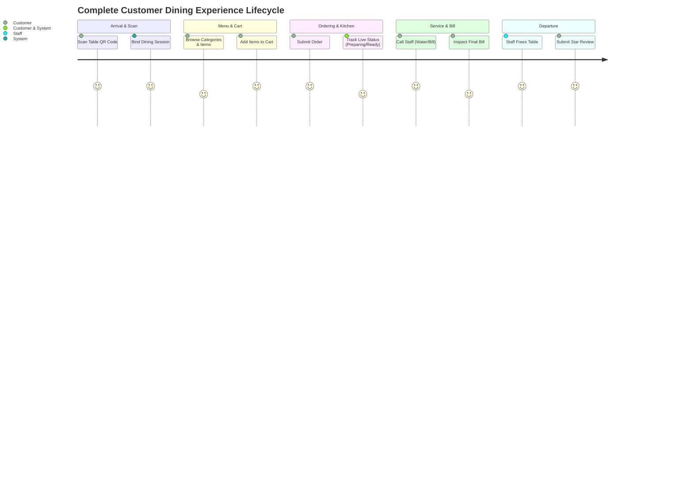
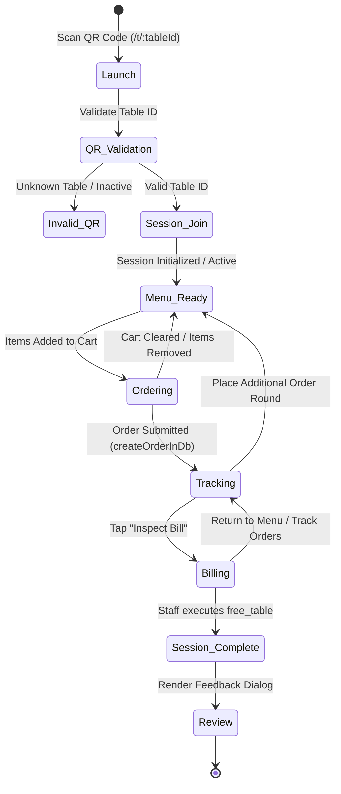
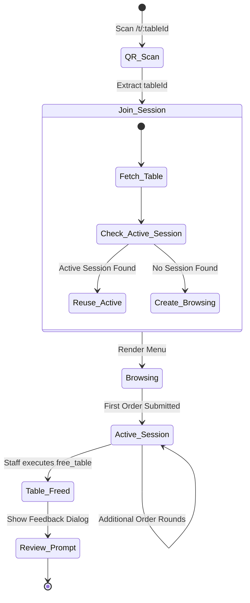
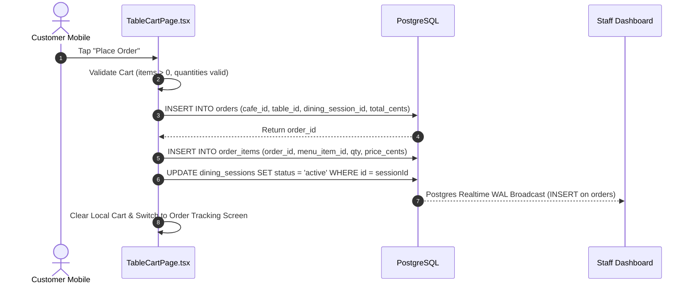

# OrderRail — Customer Experience Architecture & Governance Handbook

> **Definitive Customer Experience Architecture Document** for OrderRail, detailing the end-to-end guest journey, zero-friction QR dining, collaborative ordering, application state machines, error handling, notifications, privacy governance, customer analytics, and QA test scenarios.

---

## Table of Contents
- [1. Purpose & System Role](#1-purpose--system-role)
- [2. Design Philosophy](#2-design-philosophy)
- [3. End-to-End Customer Journey](#3-end-to-end-customer-journey)
- [4. Customer Application State Machine](#4-customer-application-state-machine)
- [5. Entry Points](#5-entry-points)
- [6. Dining Session Lifecycle](#6-dining-session-lifecycle)
- [7. Menu Browsing](#7-menu-browsing)
- [8. Cart Management](#8-cart-management)
- [9. Ordering Workflow](#9-ordering-workflow)
- [10. Collaborative Ordering](#10-collaborative-ordering)
- [11. Customer Notifications & Realtime Feedback](#11-customer-notifications--realtime-feedback)
- [12. Service Requests](#12-service-requests)
- [13. Order Tracking](#13-order-tracking)
- [14. Billing Experience](#14-billing-experience)
- [15. Feedback & Reviews](#15-feedback--reviews)
- [16. Error Handling & System Recovery](#16-error-handling--system-recovery)
- [17. Offline & Recovery Architecture](#17-offline--recovery-architecture)
- [18. Privacy & Data Handling](#18-privacy--data-handling)
- [19. Customer Experience Metrics & Analytics](#19-customer-experience-metrics--analytics)
- [20. Security & Permissions](#20-security--permissions)
- [21. Accessibility & Responsiveness](#21-accessibility--responsiveness)
- [22. Performance Goals & SLAs](#22-performance-goals--slas)
- [23. Future Customer Features](#23-future-customer-features)
- [24. Appendix: Customer Journey QA Test Scenarios](#24-appendix-customer-journey-qa-test-scenarios)
- [25. Cross-References & Related Documentation](#25-cross-references--related-documentation)

---

## 1. Purpose & System Role

### 1.1 Customer Application's Role
The OrderRail Customer web application is the primary guest interface for self-service dining. It allows restaurant patrons to scan a QR code at their physical table, browse the digital menu, place food and beverage orders, trigger real-time staff assistance, track kitchen progress, and inspect their dining bill directly from their mobile browser without downloading an app or creating an account.

```
┌───────────────────────────────────────────────────────────────────────────────────────────┐
│                                CUSTOMER MOBILE WEB APP                                    │
│             (Zero-Download Mobile-First PWA — Instant QR Code Access)                      │
└─────────────────────────────────────────────┬─────────────────────────────────────────────┘
                                              │
                    ┌─────────────────────────┴─────────────────────────┐
                    │                                                   │
                    ▼                                                   ▼
┌─────────────────────────────────────────┐         ┌─────────────────────────────────────────┐
│              POSTGRESQL DB              │         │            COUNTER TERMINAL             │
│        (Shared Session & Orders)        │         │      (Realtime Order Fulfillment)       │
└─────────────────────────────────────────┘         └─────────────────────────────────────────┘
```

### 1.2 Relationship with Counter, Database, and Owner
1. **With Database:** Customer devices operate under the unauthenticated `anon` PostgreSQL role, communicating via PostgREST and Supabase Realtime to mutate and listen to active `dining_sessions`, `orders`, and `service_requests` (as specified in [`DATABASE.md`](./DATABASE.md)).
2. **With Counter:** Orders placed by customers instantly stream to the Counter Terminal ([`COUNTER.md`](./COUNTER.md)) for kitchen preparation and status updates (`pending` → `preparing` → `ready` → `served`).
3. **With Owner:** Reads published menu items, categories, pricing, and operating hours managed in the Owner Portal.

---

## 2. Design Philosophy

### 2.1 Frictionless Self-Service Ordering
Guests at a restaurant table want to order quickly without administrative hurdles:
- **No App Download Required:** Built as a progressive web app running in native iOS Safari and Android Chrome.
- **No Account Creation / Sign-In Required:** Guests can order immediately upon QR scan without providing emails or passwords.
- **Instant Scan-to-Menu Latency:** Target < 1.5s from camera QR trigger to interactive menu presentation.

### 2.2 Mobile-First Touch Interaction
Designed specifically for small touchscreens:
- Dynamic floating cart button anchored at bottom right for easy thumb reach.
- Large touch targets (minimum 44x44px touch boundaries).
- Smooth sticky category navigation for effortless fast scrolling through long menus.

### 2.3 Dining Session-Centric Design
The customer experience is anchored to the table's physical **`dining_session_id`**.
- Guests joining the table automatically attach to the active session.
- Allows multiple diners at the same table to view shared order progress and request assistance collaboratively.

---

## 3. End-to-End Customer Journey



---

## 4. Customer Application State Machine



### 4.1 State Descriptions
1. **Launch:** App initializes from URL scan pattern `/t/:tableId`.
2. **QR Validation:** Verifies table exists in PostgreSQL and `is_active = true`.
3. **Session Join:** Binds or creates a `dining_sessions` record (`status: 'browsing'` or `'active'`).
4. **Menu Ready:** Interactive catalog loaded with real-time stock availability.
5. **Ordering:** Items placed in local cart and formatted into `CreateOrderPayload`.
6. **Tracking:** Real-time progress monitoring (`pending` → `preparing` → `ready` → `served`).
7. **Billing:** Itemized session summary review and staff bill call dispatch.
8. **Review:** Post-session star rating and feedback submission.
9. **Session Complete:** Session sealed in database; table freed.

---

## 5. Entry Points

### 5.1 Table QR Code Scan (Primary)
- Customer scans the physical QR code fixed to their table (URL pattern: `/t/:tableId`).
- `TableLayout.tsx` extracts `tableId`, initializes or attaches to the active `dining_session_id`, and redirects to `/t/:tableId/menu`.

### 5.2 Shared Session Links (Future)
- A guest at Table 4 taps "Share Table Link", sending a URL with encoded `session_token` to friends via WhatsApp or SMS so late arrivals join the exact same ordering session.

### 5.3 Advance Pre-Ordering & Reservations (Future)
- Customers scanning a promotional link pre-select items for an upcoming table reservation.

---

## 6. Dining Session Lifecycle



### 6.1 Joining & Continuing Sessions
- **First Diner:** Scanning QR creates a `dining_sessions` row with `status: 'browsing'`.
- **Subsequent Diners:** Scanning the same QR reuses the existing active session.
- **Browser Refresh Recovery:** If a customer reloads the page, `TableLayout.tsx` re-reads `tableId`, queries PostgreSQL for non-closed `dining_sessions`, and restores session context seamlessly.

---

## 7. Menu Browsing

### 7.1 Categories & Item Catalog
- Menu items are grouped under `menu_categories` (e.g. *Appetizers*, *Main Course*, *Beverages*, *Desserts*).
- Each item displays name, description, price, food type icon (`veg`, `non-veg`, `egg`), and image URL.

### 7.2 Real-Time Availability & Out-of-Stock Handling
- If staff marks an item `is_available = false` in the Owner Portal or Counter, Supabase Realtime updates the customer menu instantly.
- Unavailable items render with a greyed-out "Out of Stock" badge and disable the "Add to Cart" button.

---

## 8. Cart Management

### 8.1 Local Persistence & Dynamic Calculations
- Cart state is managed locally via React component state and persisted in browser `localStorage`.
- Item subtotals, quantity adjustments, and overall cart total in cents are calculated dynamically in real-time.

### 8.2 Session Cart Synchronization
- Placing an order pushes the cart items to `orders` and `order_items` in PostgreSQL.
- Once submitted, local cart clears, and items transition to the live **Order Status View**.

---

## 9. Ordering Workflow



---

## 10. Collaborative Ordering

- **Shared Dining Session:** Multiple diners sitting at Table 4 share the exact same `dining_session_id`.
- **Independent Cart & Device:** Each diner can add items on their own phone independently.
- **Unified Order Progress & Billing:** All order rounds submitted by any phone attach to Table 4's dining session. The combined bill displays all items ordered across all rounds.

---

## 11. Customer Notifications & Realtime Feedback

The customer UI presents non-intrusive toast notifications and animated progress badges triggered by database events:

| Trigger Event | Database Event Source | Customer Visual Notification | Toast Message |
|---------------|-----------------------|------------------------------|---------------|
| **Order Placed** | `INSERT on orders` | Amber "Order Sent" Badge | *"Order #21 submitted to kitchen."* |
| **Kitchen Ack** | `UPDATE orders (status='preparing')` | Blue "Preparing" Spinner | *"Chef has started preparing your order."* |
| **Order Ready** | `UPDATE orders (status='ready')` | Green "Order Ready" Badge | *"Food is ready and will be served shortly!"* |
| **Staff Called** | `UPDATE service_requests (status='acknowledged')` | Checkmark Banner | *"Staff acknowledged call and is on their way."* |
| **Bill Requested** | `INSERT service_requests (type='bill')` | Info Toast | *"Bill request sent to counter staff."* |
| **Table Freed** | `UPDATE tables (active_session_id=null)` | Thank You Dialog | *"Dining session complete. Rate your experience!"* |

---

## 12. Service Requests (Call Staff)

Customers can summon staff directly from their phone screen via `CallStaff.tsx`:

```
┌─────────────────────────────────────────────────────────┐
│                   CALL STAFF ASSISTANCE                 │
├─────────────────────────────────────────────────────────┤
│  [ 💧 Request Water ]         [ 🔔 Call Waiter ]        │
│  [ 🧾 Bring Bill ]            [ ❓ Custom Request ]     │
└─────────────────────────────────────────────────────────┘
```

1. Customer selects request type (`water`, `waiter`, `bill`, `custom`).
2. System inserts a row into `service_requests` (`status: 'open'`).
3. Cooldown timer (60 seconds) activates on the customer button to prevent spamming.
4. Staff dashboard displays floating badge and sounds audio chime. When staff taps "Acknowledge", customer screen updates to **"Staff Notified & On Their Way"**.

---

## 13. Order Tracking

Real-time status pipeline displayed on customer device (`OrderStatusView.tsx`):

| Order Status | Customer Badge Color | Visual Message | Customer Experience |
|--------------|----------------------|----------------|---------------------|
| `pending` | Amber | *"Order Sent to Kitchen"* | Kitchen received ticket. |
| `preparing` | Blue | *"Chef is Preparing Your Food"* | Cooking in progress. |
| `ready` | Green | *"Food Ready — Serving Shortly"* | Plated in kitchen. |
| `served` | Neutral / Emerald | *"Delivered to Your Table"* | Order complete. |
| `cancelled` | Red | *"Order Cancelled"* | Cancelled by staff/manager. |

---

## 14. Billing Experience

### 14.1 Viewing Totals & Requesting Bill
- Customers tap "View Session Bill" at any point during their meal.
- Displays an itemized breakdown of all orders placed during the session, formatted subtotal, taxes, and net amount.
- Tapping "Request Bill" sends a `bill` service request ticket to the Counter terminal.

### 14.2 Payment Flow
- **Current Model:** Counter staff receives bill request, prints physical invoice receipt, and collects cash/card/UPI at table or counter.
- **Future Model:** Embedded Razorpay / Stripe gateway link allowing customer to pay digitally from their phone screen.

---

## 15. Feedback & Reviews

- When staff executes `free_table` RPC on Table 4, the active session closes.
- Supabase Realtime notifies Table 4 customer devices.
- Customer screen automatically presents a **"Thank You for Dining!"** feedback dialog prompting for a 1-5 star rating and optional text review (`ReviewForm.tsx`), saved to `reviews` table.

---

## 16. Error Handling & System Recovery

| Error Event | Immediate System Impact | Recovery / User Experience |
|-------------|-------------------------|----------------------------|
| **Invalid QR Code** | Customer scans damaged or unassigned QR code. | Displays friendly 404 screen: *"Invalid Table. Please scan a valid cafe QR code or ask staff for assistance."* |
| **Expired Session** | Customer opens stale QR link from home. | System auto-creates fresh `browsing` session upon physical table re-scan. |
| **Table Inactive** | Table marked `is_active = false` by owner. | Displays alert: *"This table is currently out of service. Please notify staff."* |
| **Menu Loading Failure** | Network timeout while fetching catalog. | TanStack Query falls back to local cached menu in storage; displays "Retry Loading Menu" button. |
| **Order Submission Failure** | DB error during cart checkout. | Retains cart items intact in `localStorage`; prompts user: *"Order failed to post. Tap to retry."* |
| **Offline Disconnection** | Internet drops during dining. | `orderQueue.ts` saves orders to IndexedDB; presents persistent offline banner. Syncs upon reconnect. |
| **Post-Reconnect Recovery** | Network recovers mid-meal. | App auto-invalidates queries, pulls fresh order status from PostgreSQL, and drains offline queue. |

---

## 17. Offline & Recovery Architecture

1. **Cached Menu Data:** Menu items and categories are cached locally in browser storage using TanStack React Query (`staleTime: 5 mins`). If network drops while browsing, menu remains readable.
2. **Offline Cart Resilience:** Shopping cart state persists in `localStorage`.
3. **Queued Order Submissions:** If customer taps "Place Order" while offline, `orderQueue.ts` saves the order payload into IndexedDB. Upon network recovery, order posts automatically.
4. **Browser Refresh Recovery:** Page reload reads `tableId` from URL path, fetches active session from PostgreSQL, and resumes tracking state without data loss.

---

## 18. Privacy & Data Handling

1. **Zero Personally Identifiable Information (PII) Requirement:** Customers order completely anonymously without providing real names, email addresses, or phone numbers.
2. **Local Storage Usage:** Browser `localStorage` stores only non-sensitive transient state (`table_id`, active `cart` items, recent `session_id`).
3. **Temporary Session Identifiers:** `dining_session_id` is an ephemeral UUID linked to physical table location.
4. **Review Data Governance:** Star ratings and optional feedback comments are unlinked from personal identity; stored only with `cafe_id` and timestamp.
5. **Data Visibility Rules:** RLS policies prevent customer devices from querying order details, bills, or activity belonging to other tables.

---

## 19. Customer Experience Metrics & Analytics

1. **QR-to-Order Conversion Rate:** Percentage of QR scans that result in at least one submitted order.
2. **Average Order Value (AOV):** Total session revenue divided by total dining sessions per cafe.
3. **Average Session Duration:** Time elapsed from session `opened_at` to `closed_at`.
4. **Cart Abandonment Rate:** Percentage of sessions where items were added to cart but no order was placed.
5. **Service Request Frequency:** Average number of staff assistance calls per table session.
6. **Customer Satisfaction Score (CSAT):** Average star rating submitted via post-session review dialog.

---

## 20. Security & Permissions

- **`anon` Role Capabilities:** Anonymous customer clients can read active tables/menu items, create dining sessions, insert orders/order_items/service_requests, and update table status to `occupied`.
- **Restricted Actions:** Customers **cannot** edit menu prices, modify structural table metadata (`trg_enforce_demo_table_update_protection`), view orders from other tables, or mark tables `free`.
- **Session Isolation:** Queries filter strictly by `table_id` or `dining_session_id`.

---

## 21. Accessibility & Responsiveness

- **Mobile-First Responsive Layouts:** Optimized for screen widths from 320px (compact smartphones) to 768px (tablets).
- **Touch Target Sizing:** Interactive buttons adhere to minimum **44x44px** touch target dimensions.
- **Color Contrast:** High contrast text labels and ARIA support for badges and order statuses.
- **Future Multilingual Support:** Multi-language toggle (English, Hindi, Spanish) for menu titles and UI labels.

---

## 22. Performance Goals & SLAs

- **QR Scan to Menu Load:** < 1.5 seconds on 4G connection.
- **Menu Scroll Responsiveness:** 60 FPS smooth scrolling.
- **Order Placement Latency:** < 300ms to local UI confirmation.
- **Real-Time Status Update Sync:** < 150ms WAL latency from staff action to customer screen badge change.

---

## 23. Future Customer Features

1. **Digital Mobile Payments:** In-app UPI / Apple Pay / Google Pay payment settlement.
2. **AI Dish Recommendations:** Smart suggestions based on popularity and dietary preferences.
3. **Customer Loyalty Points:** Earning points per session tied to phone numbers.
4. **Split-Bill Calculator:** Allowing guests to select individual line items and split payments directly on mobile.

---

## 24. Appendix: Customer Journey QA Test Scenarios

### Scenario A: First-Time Guest Ordering
- [ ] Scan table QR code `/t/:tableId`.
- [ ] Verify menu loads within < 1.5 seconds.
- [ ] Add 2 items to cart; verify floating cart badge updates count.
- [ ] Tap "Place Order"; verify order appears as `pending` in tracking view.
- [ ] Confirm staff dashboard receives new order notification.

### Scenario B: Group Collaborative Ordering
- [ ] Diner A and Diner B scan Table 4 QR code on separate mobile phones.
- [ ] Verify both phones join the exact same active `dining_session_id`.
- [ ] Diner A submits Order Round 1; verify Diner B's screen displays Order Round 1 in tracking view via Realtime.
- [ ] Diner B submits Order Round 2; verify combined bill displays all items from both rounds.

### Scenario C: Offline Resilience & Queue Recovery
- [ ] Open menu on mobile phone; enable Airplane Mode (Disconnect Network).
- [ ] Verify cached menu remains interactive.
- [ ] Tap "Place Order"; verify order saves locally to IndexedDB queue with yellow offline banner.
- [ ] Disable Airplane Mode (Reconnect Network); verify queued order automatically posts to PostgreSQL and transitions to `pending`.

### Scenario D: Browser Refresh Mid-Session
- [ ] Place an order on Table 2.
- [ ] Perform hard refresh (F5 / pull-to-refresh) on mobile browser.
- [ ] Verify app re-attaches to Table 2 active session and restores tracking view without loss of order state.

### Scenario E: Bill Request & Session Completion
- [ ] Tap "Call Staff" → "Bring Bill". Verify staff dashboard receives bill call.
- [ ] Staff executes `free_table` RPC on Counter.
- [ ] Verify customer screen automatically transitions to Thank You screen and prompts for star review rating.

---

## 25. Cross-References & Related Documentation

- [`./DATABASE.md`](./DATABASE.md) — Comprehensive PostgreSQL database design, RLS permissions matrix, and schema specifications.
- [`./ARCHITECTURE.md`](./ARCHITECTURE.md) — System Architecture, Component Hierarchy, and Realtime Engine.
- [`./PRODUCT.md`](./PRODUCT.md) — Product Requirements & Feature Specifications.
- [`./COUNTER.md`](./COUNTER.md) — Counter Operational Architecture & Staff Handover Governance.
- [`./DEVELOPMENT_WORKFLOW.md`](./DEVELOPMENT_WORKFLOW.md) — Engineering standards and testing guidelines.
