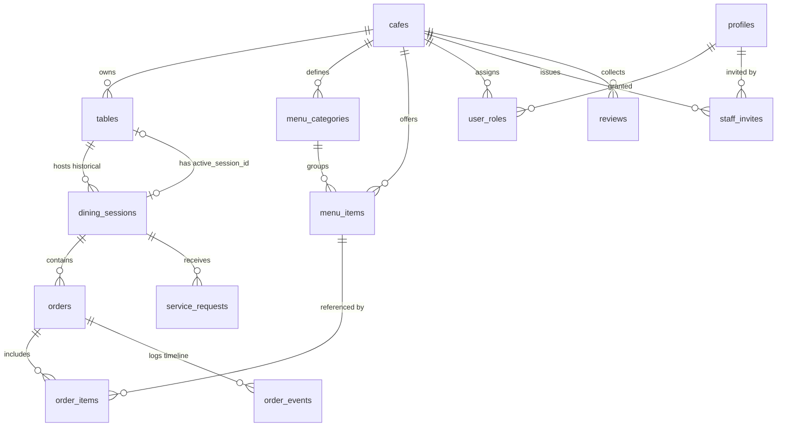
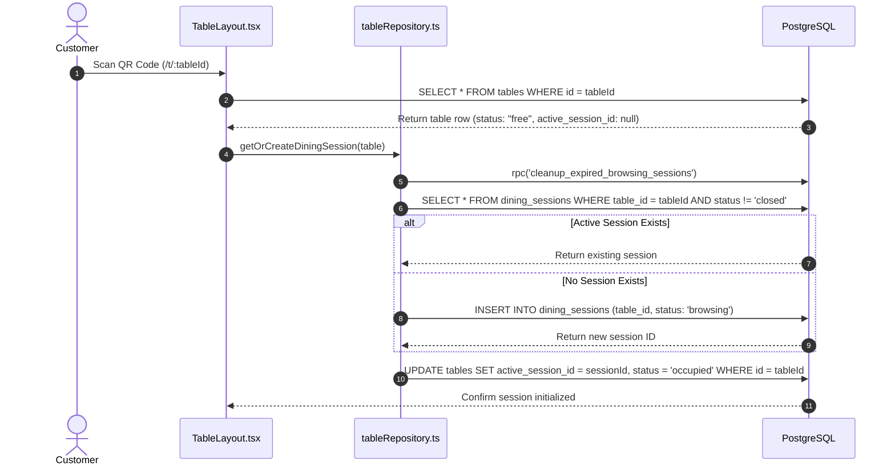
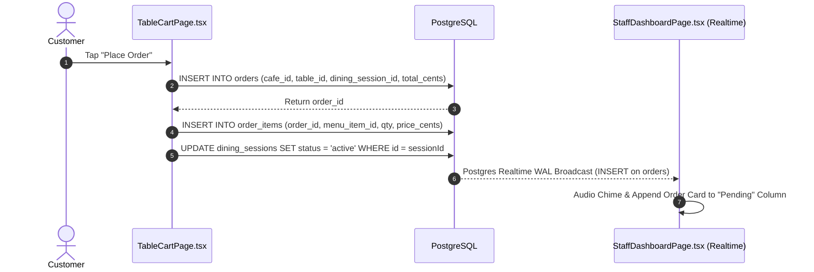
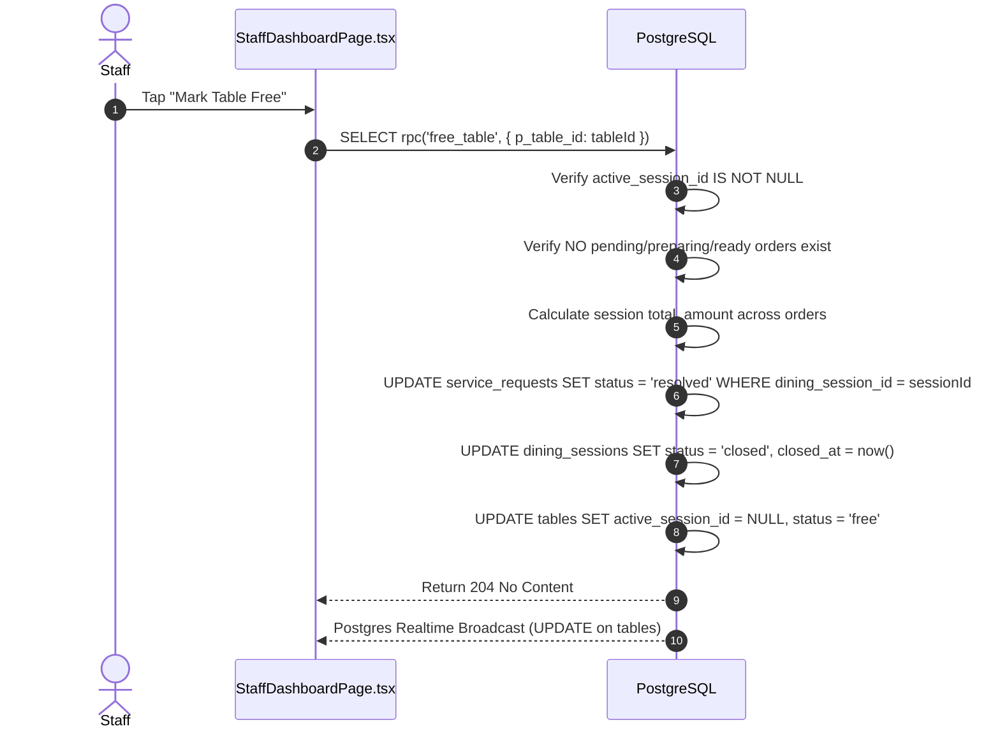

# OrderRail — Comprehensive Database Architecture Documentation

> **Single Source of Truth** for OrderRail PostgreSQL database design, ERD, domain modules, RLS security matrix, state machines, trigger dependencies, RPC contracts, frontend mapping, and deployment evolution.

---

## Table of Contents
- [1. Overview](#1-overview)
- [2. Design Philosophy](#2-design-philosophy)
- [3. Entity Relationship Diagram (ERD)](#3-entity-relationship-diagram-erd)
- [4. Complete Table Inventory](#4-complete-table-inventory)
- [5. Core Table Deep-Dive Documentation](#5-core-table-deep-dive-documentation)
- [6. Frontend ↔ Database Mapping](#6-frontend--database-mapping)
- [7. End-to-End Event Flows & Sequences](#7-end-to-end-event-flows--sequences)
- [8. State Machines & Lifecycles](#8-state-machines--lifecycles)
- [9. Row Level Security (RLS) Permissions Matrix](#9-row-level-security-rls-permissions-matrix)
- [10. Trigger Dependency & Execution Graph](#10-trigger-dependency--execution-graph)
- [11. RPC Functions & Stored Procedures](#11-rpc-functions--stored-procedures)
- [12. Data Integrity & Constraints](#12-data-integrity--constraints)
- [13. Performance & Realtime Architecture](#13-performance--realtime-architecture)
- [14. Migration History & Deployment Strategy](#14-migration-history--deployment-strategy)
- [15. Future Database Evolution](#15-future-database-evolution)
- [16. Cross-References & Related Documentation](#16-cross-references--related-documentation)

---

## 1. Overview

### 1.1 Purpose of the Database
The OrderRail database is the operational engine powering multi-tenant QR code dining, real-time kitchen workflows, staff dashboard synchronization, customer cart persistence, and cafe operations. It manages physical resources (cafes, tables, menu items), customer interactions (dining sessions, orders, service requests), and enterprise security (roles, RLS, demo restrictions).

### 1.2 PostgreSQL as the Absolute Source of Truth
In OrderRail, the PostgreSQL database is not merely a passive persistence store; it is the **authoritative coordinator of system state**. 
- Application clients (Customer web app, Staff dashboard, Owner portal) are lightweight UI projections of database state.
- Offline-first operations synchronize directly against PostgreSQL state machines.
- State transitions (table occupancy, dining session creation, order placement, table releases) are governed by database constraints, triggers, and RPC functions.

### 1.3 Why Business Logic Lives in the Database
Critical business rules reside inside PostgreSQL (via RLS policies, PL/pgSQL RPC functions, and triggers) to guarantee:
1. **Multi-Client Consistency:** Whether a customer submits an order via mobile web, staff updates an order status, or a background worker cleans up expired sessions, the same security and validation constraints apply.
2. **Zero-Trust Client Boundary:** Unauthenticated customer devices operate under the `anon` role. Business logic inside database RPCs and triggers prevents rogue clients from manipulating prices, hijacking sessions, or modifying structural metadata.
3. **Atomic Operations:** Session creation, table state transitions, and order rollups require transaction isolation to avoid race conditions.

---

## 2. Design Philosophy

### 2.1 Single Active Dining Session per Table
A physical restaurant table can have at most **one active dining session** at any point in time. 
- When a customer scans a QR code, `getOrCreateDiningSession()` binds or creates a `dining_sessions` record (`status: 'browsing'` or `'active'`) and links it to `tables.active_session_id`.
- Multiple diners sitting at the same table share the exact same `dining_session_id`, allowing collaborative ordering.

### 2.2 Orders Belong to Dining Sessions
Orders are bound to a `dining_session_id`, not directly to transient HTTP browser sessions.
- Even if a customer closes their browser or switches devices, their active orders remain linked to the table's dining session.
- Serving an order or completing kitchen preparation **does not close the session or free the table**.

### 2.3 Tables Represent Physical Resources
The `tables` entity represents physical restaurant hardware and layout geometry (`label`, `seats`, `cafe_id`).
- Physical table metadata is **structural** and static during routine dining workflows.
- Runtime table state (`active_session_id`, `status`) is **transient** and reflects real-time occupancy.

### 2.4 Separation of Runtime State & Structural Metadata
OrderRail enforces a strict boundary between:
- **Structural Metadata:** `id`, `cafe_id`, `label`, `seats`, `is_active`. Protected against unauthorized mutation via database triggers (`trg_enforce_demo_table_update_protection`).
- **Runtime State:** `active_session_id`, `status`. Continuously updated as diners arrive, order, and vacate.

### 2.5 Explicit Staff Table Release (`markTableFree`)
Table occupancy is decoupled from order completion.
- When all kitchen orders reach `"served"`, the dining session remains `active` and the table remains `occupied`.
- A table becomes `free` **only** when staff explicitly invokes `markTableFree()` / `free_table` RPC, closing the dining session and clearing `tables.active_session_id`.

---

## 3. Entity Relationship Diagram (ERD)



---

## 4. Complete Table Inventory

| Table Name | Schema | Domain | Core Purpose | RLS Enabled |
|------------|--------|--------|--------------|-------------|
| `cafes` | `public` | Multi-Tenancy | Tenant root configuration (branding, hours, permissions). | Yes |
| `tables` | `public` | Layout & Occupancy | Physical table resources and active session pointers. | Yes |
| `dining_sessions` | `public` | Customer Visit | Visit container tracking lifecycle (`browsing` → `active` → `closed`). | Yes |
| `orders` | `public` | Fulfillment | Kitchen order header (`pending` → `preparing` → `ready` → `served`). | Yes |
| `order_items` | `public` | Line Items | Individual ordered menu items with price snapshots. | Yes |
| `service_requests` | `public` | Assistance | Staff calls (`water`, `bill`, `waiter`) and resolution tracking. | Yes |
| `menu_categories` | `public` | Catalog | Display categories for menu sorting. | Yes |
| `menu_items` | `public` | Catalog | Dishes, beverages, pricing, stock availability, veg type. | Yes |
| `reviews` | `public` | Feedback | Customer star ratings and feedback. | Yes |
| `profiles` | `public` | Identity | User account profile data. | Yes |
| `user_roles` | `public` | Security | Role assignments (`owner`, `staff`) per cafe tenant. | Yes |
| `staff_invites` | `public` | Security | Invitation codes for staff onboarding. | Yes |
| `order_events` | `public` | Audit | Timestamped state audit history per order. | Yes |
| `audit_logs` | `public` | Audit | Admin and system action logging. | Yes |

---

## 5. Core Table Deep-Dive Documentation

### 5.1 `tables`
- **Responsibilities:** Manages physical seat allocations, layout labels, and active session binding.
- **Relationships:**
  - Belongs to `cafes` (`cafe_id` → `cafes.id`).
  - References active `dining_sessions` (`active_session_id` → `dining_sessions.id`).
  - Parent to `dining_sessions`, `orders`, `service_requests`.
- **Constraints:** `tables_status_check` (`CHECK (status IN ('free', 'occupied'))`), `tables_seats_check` (`CHECK (seats > 0)`).
- **Indexes:** `idx_tables_cafe` (`cafe_id`), `idx_tables_active_session` (`active_session_id`).
- **Frontend Consumers:** `StaffDashboardPage.tsx` (Table Grid & Popup), `TableLayout.tsx` (QR Scan binding), `OwnerTablesPage.tsx` (Table Layout Editor).
- **Related RPCs:** `free_table()`, `cleanup_expired_browsing_sessions()`.
- **Future Extensions:** Dynamic seat merging, floor plan X/Y spatial mapping, QR secret key validation.

### 5.2 `dining_sessions`
- **Responsibilities:** Serves as the primary operational container for a customer visit. Aggregates multiple order rounds and service requests under a single billing context.
- **Relationships:**
  - Belongs to `tables` (`table_id` → `tables.id`).
  - Parent to `orders` (`id` ← `orders.dining_session_id`).
  - Parent to `service_requests` (`id` ← `service_requests.dining_session_id`).
- **Constraints:** `dining_sessions_status_check` (`CHECK (status IN ('browsing', 'active', 'closed'))`).
- **Indexes:** `idx_dining_sessions_table_status` (`table_id, status`), `idx_dining_sessions_opened` (`opened_at`).
- **Frontend Consumers:** `TableLayout.tsx`, `TableMenuPage.tsx`, `TableCartPage.tsx`, `StaffDashboardPage.tsx`.
- **Related RPCs:** `free_table()`, `cleanup_expired_browsing_sessions()`.
- **Future Extensions:** Splitting sessions across tables, binding to customer loyalty accounts, pre-pay deposit integration.

### 5.3 `orders`
- **Responsibilities:** Stores kitchen fulfillment units, status tracking, sequential daily order numbering, and total pricing.
- **Relationships:**
  - Belongs to `cafes` (`cafe_id` → `cafes.id`).
  - Belongs to `tables` (`table_id` → `tables.id`).
  - Belongs to `dining_sessions` (`dining_session_id` → `dining_sessions.id`).
  - Parent to `order_items` and `order_events`.
- **Constraints:** `orders_status_check` (`CHECK (status IN ('pending', 'preparing', 'ready', 'served', 'cancelled'))`).
- **Indexes:** `idx_orders_cafe_status` (`cafe_id, status`), `idx_orders_dining_session` (`dining_session_id`), `idx_orders_created` (`created_at`).
- **Frontend Consumers:** `StaffDashboardPage.tsx` (Kanban Columns), `OwnerOrdersPage.tsx`, `OrderStatusView.tsx` (Customer Progress View).
- **Related RPCs:** `cancel_order_v2()`.
- **Future Extensions:** Kitchen station routing tag (`station_id`), estimate preparation time countdown.

### 5.4 `order_items`
- **Responsibilities:** Stores individual menu item line items within an order, capturing immutable price snapshots at order placement time.
- **Relationships:**
  - Belongs to `orders` (`order_id` → `orders.id` `ON DELETE CASCADE`).
  - References `menu_items` (`menu_item_id` → `menu_items.id`).
- **Constraints:** `qty_positive` (`CHECK (qty > 0)`), `price_cents_non_negative` (`CHECK (price_cents >= 0)`).
- **Indexes:** `idx_order_items_order` (`order_id`), `idx_order_items_menu_item` (`menu_item_id`).
- **Frontend Consumers:** `SharedOrderKanban.tsx`, `TableCartPage.tsx`, `EditOrderDialog.tsx`.
- **Related RPCs:** `populate_missing_order_items()`.
- **Future Extensions:** Customization add-ons/modifiers (JSONB), dietary warning flags.

### 5.5 `service_requests`
- **Responsibilities:** Captures real-time customer requests ("Water", "Bill", "Waiter") for staff assistance.
- **Relationships:**
  - Belongs to `cafes` (`cafe_id` → `cafes.id`).
  - Belongs to `tables` (`table_id` → `tables.id`).
  - Belongs to `dining_sessions` (`dining_session_id` → `dining_sessions.id`).
- **Constraints:** `service_requests_status` (`CHECK (status IN ('open', 'acknowledged', 'resolved'))`), `service_requests_type` (`CHECK (type IN ('water', 'bill', 'waiter', 'custom'))`).
- **Indexes:** `idx_service_requests_cafe_status` (`cafe_id, status`), `idx_service_requests_table` (`table_id`).
- **Frontend Consumers:** `CallStaff.tsx`, `StaffDashboardPage.tsx` (Floating Service Request Badges & Audio Chime).
- **Related RPCs:** `free_table()` (Auto-resolves open requests when table freed).
- **Future Extensions:** Staff dispatch assignment (`assigned_staff_id`), response latency analytics.

---

## 6. Frontend ↔ Database Mapping

```
┌───────────────────────────────────────────────────────────────────────────────────────────┐
│                                 FRONTEND APPLICATION UI                                   │
└───────────────────────────────────────────────────────────────────────────────────────────┘
          │                                 │                                 │
     Customer QR                       Staff Kanban                      Owner Portal
  (/t/:tableId/menu)                    (/staff)                      (/owner/settings)
          │                                 │                                 │
          ▼                                 ▼                                 ▼
┌──────────────────┐               ┌──────────────────┐              ┌──────────────────┐
│  TableLayout.tsx │               │StaffDashboard.tsx│              │ OwnerTables.tsx  │
└──────────────────┘               └──────────────────┘              └──────────────────┘
          │                                 │                                 │
          ├──────────────┐                  ├──────────────┐                  │
          ▼              ▼                  ▼              ▼                  ▼
┌──────────────────┬───────────────┬──────────────────┬───────────────┬──────────────────┐
│   dining_sessions│    orders     │      tables      │service_request│   menu_items     │
└──────────────────┴───────────────┴──────────────────┴───────────────┴──────────────────┘
                                   DATABASE TABLES
```

### Detailed Component Mapping

| Frontend Page / Component | Primary Database Actions | SQL Tables Read | SQL Tables Written | RPCs / Methods Invoked |
|---------------------------|--------------------------|-----------------|--------------------|------------------------|
| **`TableLayout.tsx`** | Binds QR scan, fetches table state | `tables`, `cafes`, `dining_sessions` | `dining_sessions`, `tables` | `getOrCreateDiningSession()` |
| **`TableMenuPage.tsx`** | Renders menu catalog | `menu_categories`, `menu_items` | None | Direct Supabase `SELECT` |
| **`TableCartPage.tsx`** | Submits customer orders | `menu_items`, `dining_sessions` | `orders`, `order_items`, `dining_sessions`, `tables` | `createOrderInDb()` |
| **`CallStaff.tsx`** | Triggers service calls | `tables` | `service_requests` | Supabase `INSERT service_requests` |
| **`StaffDashboardPage.tsx`** | Kanban fulfillment & Table grid | `tables`, `orders`, `order_items`, `service_requests`, `dining_sessions` | `orders`, `service_requests`, `tables`, `dining_sessions` | `free_table()`, `updateOrderStatusInDb()` |
| **`OwnerTablesPage.tsx`** | Manages physical layout | `tables` | `tables` | Supabase `INSERT/UPDATE/DELETE tables` |
| **`OwnerMenuPage.tsx`** | Manages menu & pricing | `menu_items`, `menu_categories` | `menu_items`, `menu_categories` | Supabase `INSERT/UPDATE/DELETE menu_items` |
| **`OwnerAnalytics.tsx`** | Business metrics & reporting | `orders`, `dining_sessions`, `reviews` | None | SQL rollup aggregations |

---

## 7. End-to-End Event Flows & Sequences

### 7.1 Customer Arrival & QR Scan Sequence


### 7.2 Order Placement & Realtime Kitchen Synchronisation


### 7.3 Staff Table Release (`markTableFree`)


---

## 8. State Machines & Lifecycles

### 8.1 Dining Session Lifecycle
```
       [ QR Scan ]
            │
            ▼
┌───────────────────────┐   First Order Placed   ┌───────────────────────┐
│       browsing        │ ─────────────────────► │        active         │
└───────────────────────┘                        └───────────────────────┘
            │                                                │
 15-Min Expiry / Idle                               Mark Table Free (Staff)
            │                                                │
            ▼                                                ▼
┌───────────────────────┐                        ┌───────────────────────┐
│        closed         │                        │        closed         │
└───────────────────────┘                        └───────────────────────┘
```

### 8.2 Table Lifecycle
```
┌───────────────────────┐    QR Scan / Active Session    ┌───────────────────────┐
│         free          │ ─────────────────────────────► │       occupied        │
└───────────────────────┘                                └───────────────────────┘
            ▲                                                        │
            │────────────── Mark Table Free (RPC) ───────────────────│
```

### 8.3 Order Lifecycle
```
┌─────────────┐   Staff Ack    ┌─────────────┐  Kitchen Done  ┌─────────────┐  Delivered  ┌─────────────┐
│   pending   │ ─────────────► │  preparing  │ ─────────────► │    ready    │ ───────────►│   served    │
└─────────────┘                └─────────────┘                └─────────────┘             └─────────────┘
       │                              │                              │
       └──────────────────────────────┴──────────────────────────────┴─── Staff/Cust Cancel ──► ┌───────────┐
                                                                                                │ cancelled │
                                                                                                └───────────┘
```

---

## 9. Row Level Security (RLS) Permissions Matrix

| Table Name | Anonymous (`anon`) | Authenticated Staff (`staff`) | Cafe Owner (`owner`) | Demo Restrictions |
|------------|--------------------|-------------------------------|----------------------|-------------------|
| `cafes` | `SELECT` (Public details) | `SELECT` | `SELECT`, `UPDATE` | Structural updates restricted |
| `tables` | `SELECT` (active=true), `UPDATE` (runtime fields: `active_session_id`, `status`) | `SELECT` (all), `UPDATE` (all) | `ALL` (CRUD) | `trg_enforce_demo_table_update_protection` blocks structural edits on demo cafe |
| `dining_sessions` | `SELECT`, `INSERT` | `SELECT`, `UPDATE` | `ALL` | Read/Write allowed for visit container |
| `orders` | `SELECT` (own session), `INSERT` | `SELECT`, `UPDATE` (status) | `ALL` | Price manipulation prevented via snapshot validation |
| `order_items` | `SELECT`, `INSERT` | `SELECT` | `ALL` | Immutable once created |
| `service_requests` | `INSERT` | `SELECT`, `UPDATE` (status) | `ALL` | Types constrained by ENUM |
| `menu_items` | `SELECT` (active=true) | `SELECT`, `UPDATE` (is_available if enabled) | `ALL` | Price & item modifications restricted in demo |
| `reviews` | `INSERT`, `SELECT` | `SELECT` | `SELECT`, `DELETE` | 1 review per session |

---

## 10. Trigger Dependency & Execution Graph

```
                          ┌───────────────────────────┐
                          │  UPDATE on public.tables  │
                          └─────────────┬─────────────┘
                                        │
             ┌──────────────────────────┴──────────────────────────┐
             ▼                                                     ▼
┌────────────────────────────────────────┐       ┌────────────────────────────────────────┐
│      trg_check_table_can_be_freed     │       │trg_enforce_demo_table_update_protection│
└──────────────────┬─────────────────────┘       └──────────────────┬─────────────────────┘
                   │                                                │
   Validates no active orders exist                Validates structural metadata
    before active_session_id cleared                (id, label, seats) remains unchanged
                   │                                                │
                   ▼                                                ▼
         [ Proceed / Exception ]                          [ Proceed / Exception ]
```

---

## 11. RPC Functions & Stored Procedures

### 11.1 `public.free_table(p_table_id UUID, p_staff_id UUID DEFAULT NULL)`
- **Purpose:** Safely closes an active dining session, verifies no pending kitchen orders remain, auto-resolves open service requests, and resets the table status to `'free'`.
- **Validation:** Checks if `active_session_id` is non-null. Throws `'Table is not currently occupied.'` if null. Checks if active orders exist (`status IN ('pending', 'preparing', 'ready')`). Throws `'Cannot mark table free: there are active orders...'` if found.
- **Database Changes:** Sums `total_cents` across all session orders and updates `dining_sessions.total_amount`. Updates `service_requests` status to `'resolved'` for all open requests in the session. Updates `dining_sessions.status = 'closed'` and `closed_at = now()`. Updates `tables.active_session_id = NULL` and `status = 'free'`.

### 11.2 `public.cleanup_expired_browsing_sessions()`
- **Purpose:** Housekeeping procedure to close abandoned `browsing` sessions older than 15 minutes.
- **Database Changes:** Sets `tables.active_session_id = NULL` and `status = 'free'` for tables holding expired browsing sessions. Updates `dining_sessions.status = 'closed'` for browsing sessions where `opened_at < now() - INTERVAL '15 minutes'`.

---

## 12. Data Integrity & Constraints

- **Foreign Keys:** All parent-child relationships enforce referential integrity (`ON DELETE CASCADE` for line items; `ON DELETE SET NULL` for table sessions).
- **Check Constraints:** Validates enumerated statuses (`CHECK (status IN ('free', 'occupied'))`, `CHECK (seats > 0)`).
- **Concurrency Isolation:** Session updates and table freeing use atomic Postgres transactions to prevent double-booking or state drift.

---

## 13. Performance & Realtime Architecture

- **Indexes:** B-tree indexes are maintained on `tables(cafe_id)`, `orders(table_id)`, `orders(dining_session_id)`, and `dining_sessions(table_id, status)`.
- **Realtime Subscriptions:** Supabase Realtime listens to PostgreSQL WAL changes on `orders`, `service_requests`, and `tables`, broadcasting live updates to staff dashboards without client polling.

---

## 14. Migration History & Deployment Strategy

### 14.1 Key Schema Migration Milestones

| Timestamp / Version | Migration File Name | Core Architectural Milestones |
|---------------------|---------------------|-------------------------------|
| `20260703153836` | `23b732fb-…` | Initial multi-tenant schema (`cafes`, `tables`, `menu_items`, `orders`). |
| `20260707141500` | `dining_session_architecture` | Introduced `dining_sessions` table and bound orders to sessions. |
| `20260707164000` | `free_table_rpc` | Added `free_table` RPC for atomic table release and session sealing. |
| `20260709222000` | `redefine_check_table_trigger` | Introduced `trg_check_table_can_be_freed` safety trigger on `tables`. |
| `20260719232600` | `demo_admin_bypass` | Added demo mode restriction infrastructure for public showcase. |
| `20260721210000` | `allow_demo_table_runtime_updates` | Introduced `trg_enforce_demo_table_update_protection` trigger. |
| `20260721224500` | `fix_demo_table_update_rls` | Fixed RLS policy name mismatch, granting permissive `tables_runtime_update` to `anon`. |

### 14.2 Production Migration Workflow Lessons
- **Pipeline Separation:** Frontend deployments to Vercel (`vite build`) do **not** run database migrations. Migrations must be explicitly deployed via `npx supabase db push`.
- **Policy Name Integrity:** PostgreSQL policy names in `DROP POLICY IF EXISTS` must match live database catalog names exactly (`tables_demo_update_restrict` vs `tables_demo_restrict`).

---

## 15. Future Database Evolution

1. **Counter POS Module:** `counter_orders` and `walk_in_customers` for quick-service takeaway ordering without table binding.
2. **Billing & Split Invoicing:** `bills`, `bill_items`, and `split_payments` bound to `dining_session_id` for individual guest payment calculation.
3. **Payment Gateway Integration:** `payment_intents`, `refunds`, and `pg_reconciliations` tracking Stripe / Razorpay Webhook transactions.
4. **Kitchen Display System (KDS):** `kitchen_stations`, `station_line_items`, and `prep_timers` for multi-station kitchen routing.
5. **Inventory & Stock Management:** `raw_ingredients`, `recipe_bom`, `stock_adjustments`, and automated inventory deduction on order completion.
6. **Customer Loyalty & Profiles:** `customer_profiles`, `reward_points`, `stamp_cards`, and session phone-number binding.
7. **Multi-Outlet Franchising:** Multi-branch hierarchy (`outlets`, `outlet_menu_overrides`, `regional_tax_rates`).

---

## 16. Cross-References & Related Documentation

- [ARCHITECTURE.md](file:///C:/Users/17042/Downloads/orderrail-pro-main%20old/orderrail-pro-main/ARCHITECTURE.md) — System Architecture & Component Hierarchy.
- [PRODUCT.md](file:///C:/Users/17042/Downloads/orderrail-pro-main%20old/orderrail-pro-main/PRODUCT.md) — Product Requirements & Feature Specifications.
- [DEVELOPMENT_WORKFLOW.md](file:///C:/Users/17042/Downloads/orderrail-pro-main%20old/orderrail-pro-main/DEVELOPMENT_WORKFLOW.md) — Git workflow and quality standards.
