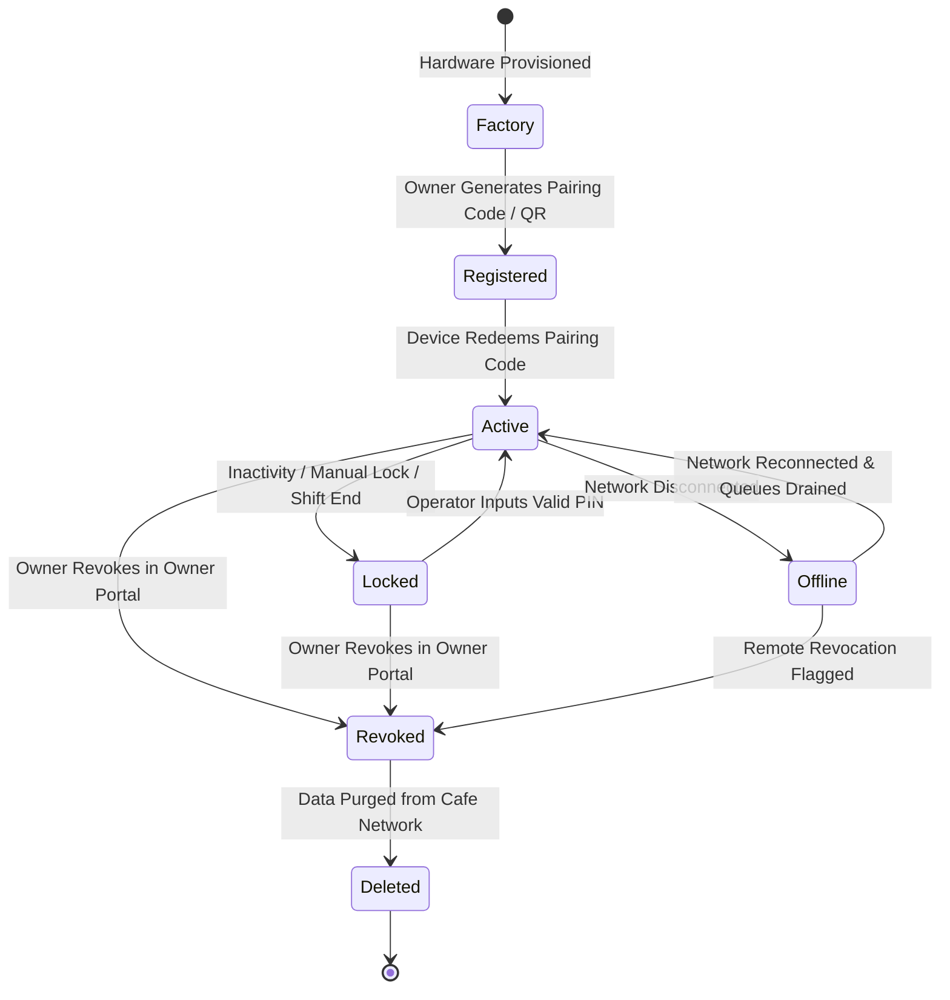
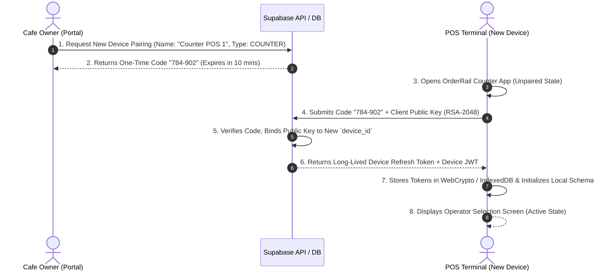

# OrderRail — Device Architecture Specification (DEVICE_ARCHITECTURE.md)

> **Definitive Architectural Specification & Hardware Ecosystem Blueprint** for dedicated OrderRail devices, establishing the foundation for Counter Terminals, Kitchen Display Systems (KDS), Customer-Facing Displays, and Self-Ordering Kiosks.

---

## Executive Summary

OrderRail has evolved from a single web application into a multi-terminal restaurant execution engine. While mobile web apps handle customer QR self-ordering and the Owner Portal provides administrative configuration, physical restaurant operations rely on **dedicated hardware devices**.

A fundamental architectural distinction governs this system:

```
┌─────────────────────────────────────────────────────────────────────────────────────────┐
│                                 THE FUNDAMENTAL SPLIT                                   │
├─────────────────────────────────────────┬───────────────────────────────────────────────┤
│                    DEDICATED DEVICE     │               TRANSIENT OPERATOR              │
│                 (Hardware Container)    │                (Human Identity)               │
│                                         │                                               │
│ • Fixed hardware (POS Terminal, KDS)    │ • Cashiers, Cooks, Managers                   │
│ • Permanently paired to a Cafe location │ • Shifts change throughout day                │
│ • Stores offline queues, local DB       │ • Log in/out via PIN code                     │
│ • Persists across browser reboots       │ • Bounded by role permissions                 │
└─────────────────────────────────────────┴───────────────────────────────────────────────┘
```

**Devices do not change. Operators do.**

---

## Table of Contents

- [1. What is a Device?](#1-what-is-a-device)
- [2. Device Types & Capabilities](#2-device-types--capabilities)
- [3. Device Lifecycle State Machine](#3-device-lifecycle-state-machine)
- [4. Device Registration, Pairing & Revocation](#4-device-registration-pairing--revocation)
- [5. Device Identity & Metadata Schema](#5-device-identity--metadata-schema)
- [6. Device Authentication & Security Tokens](#6-device-authentication--security-tokens)
- [7. Device Health & Telemetry System](#7-device-health--telemetry-system)
- [8. Multi-Device Scalability & Conflict Handling](#8-multi-device-scalability--conflict-handling)
- [9. Security Trust Model & Tamper Prevention](#9-security-trust-model--tamper-prevention)

---

## 1. What is a Device?

A **Device** in OrderRail is a recognized physical or logical hardware terminal permanently registered to a specific café (`cafes.id`). 

Unlike user accounts tied to individual human credentials (email/password or OAuth), a Device:
1. Possesses a unique cryptographic hardware identity (`device_id`).
2. Maintains persistent authorization to access café data independently of who is logged in.
3. Operates local storage engines (IndexedDB / SQLite), thermal print spoolers, cash drawer triggers, and local synchronization workers.
4. Acts as a host container upon which human operators authenticate using short PIN codes.

```
┌─────────────────────────────────────────────────────────────────────────────────────────┐
│                                  DEVICE CONTAINER MODEL                                 │
│                                                                                         │
│  ┌───────────────────────────────────────────────────────────────────────────────────┐  │
│  │ DEDICATED HARDWARE TERMINAL (Device ID: #dev-9821-4f, Cafe: Cafe Central)         │  │
│  │                                                                                   │  │
│  │  ┌─────────────────────────────────────────────────────────────────────────────┐  │  │
│  │  │ PERSISTENT DEVICE LAYER                                                 │  │  │
│  │  │ - Long-Lived Device JWT (WebCrypto RSA-2048 Keypair)                      │  │  │
│  │  │ - Offline IndexedDB Database (Order Queue, Menu Cache, Tables)            │  │  │
│  │  │ - Hardware Drivers (ESC/POS USB/LAN Printer, Cash Drawer Port 9100)       │  │  │
│  │  └─────────────────────────────────────────────────────────────────────────────┘  │  │
│  │                                          │                                        │  │
│  │                                          ▼                                        │  │
│  │  ┌─────────────────────────────────────────────────────────────────────────────┐  │  │
│  │  │ TRANSIENT OPERATOR SESSION                                                  │  │  │
│  │  │ - Current Staff: Sarah M. (Role: Cashier, PIN: 1234)                        │  │  │
│  │  │ - Session Token: Short-lived (Expires on idle lock or shift close)         │  │  │
│  │  └─────────────────────────────────────────────────────────────────────────────┘  │  │
│  └───────────────────────────────────────────────────────────────────────────────────┘  │
└─────────────────────────────────────────────────────────────────────────────────────────┘
```

---

## 2. Device Types & Capabilities

OrderRail defines four core device classifications, with an extensible taxonomy for future hardware additions.

```
┌─────────────────────────────────────────────────────────────────────────────────────────┐
│                                  DEVICE TYPE TAXONOMY                                   │
├───────────────────┬───────────────────┬───────────────────┬───────────────────────────────┤
│      COUNTER      │      KITCHEN      │ CUSTOMER_DISPLAY  │       SELF_ORDER_KIOSK        │
│    (POS Deck)     │  (KDS / Spooler)  │   (Facing Screen) │       (Self-Service)          │
│                   │                   │                   │                               │
│ Primary cashier   │ Kitchen prep deck │ Secondary display │ Customer order intake         │
│ terminal; full    │ showing line item │ showing real-time │ terminal with integrated      │
│ order intake,     │ status; controls  │ itemization, tax, │ payment gateway & thermal     │
│ billing & prints. │ KOT printing.     │ & QR payment.     │ receipt dispenser.            │
└───────────────────┴───────────────────┴───────────────────┴───────────────────────────────┘
```

### 2.1 Capability Matrix

Each device advertises its supported hardware and functional capabilities to the café network during health heartbeats:

| Capability Flag | Description | COUNTER | KITCHEN | CUSTOMER_DISPLAY | SELF_ORDER_KIOSK |
|-----------------|-------------|:-------:|:-------:|:----------------:|:----------------:|
| `ORDER_INTAKE` | Can create new orders | ✅ | ❌ | ❌ | ✅ |
| `ORDER_MODIFY` | Can modify active cart & line items | ✅ | ❌ | ❌ | ❌ |
| `BILLING_SETTLE` | Can process payments & close sessions | ✅ | ❌ | ❌ | ✅ |
| `CASH_DRAWER` | Can trigger physical cash drawer open | ✅ | ❌ | ❌ | ❌ |
| `RECEIPT_PRINT` | Connected to thermal receipt printer | ✅ | ❌ | ❌ | ✅ |
| `KOT_PRINT` | Connected to Kitchen Order Ticket printer | ✅ | ✅ | ❌ | ❌ |
| `KDS_VIEW` | Can render Kitchen Preparation Kanban | ❌ | ✅ | ❌ | ❌ |
| `CUSTOMER_VIEW` | Renders secondary checkout overview | ❌ | ❌ | ✅ | ❌ |
| `CARD_TERMINAL` | Integrated EMV/NFC payment reader | ✅ | ❌ | ❌ | ✅ |

### 2.2 Future Device Extensibility

The architecture uses string-based capability tokens stored in PostgreSQL JSONB (`devices.capabilities`), allowing seamless registration of new hardware classes without schema migrations:

- `WAITER_HANDHELD`: Mobile POS tablet used by floor servers for table-side ordering.
- `BAR_DISPATCH`: Specialized KDS terminal for beverage and cocktail preparation stations.
- `DRIVE_THRU`: Dedicated window terminal with order confirmation audio & dual-screen dispatch.

---

## 3. Device Lifecycle State Machine

A Device progresses through seven formal lifecycle states governed by strict security transition rules:



### 3.1 State Definitions

1. **Factory:** Fresh device instance or browser instance prior to café pairing. Contains no café data, tokens, or encryption keys.
2. **Registered:** Pending pairing state created when a Café Owner generates a single-use 6-digit Pairing Code or QR Code in the Owner Portal.
3. **Active:** Fully paired, operational device. Possesses a valid Device JWT, WebCrypto keypair, and active local database.
4. **Locked:** The device remains authenticated to the café, but user interactions are blocked until an authorized operator inputs their PIN.
5. **Offline:** Network connection is lost. The device continues processing orders and transactions locally using IndexedDB, queuing cloud sync jobs.
6. **Revoked:** Owner explicitly cancelled device trust. All API requests using this device token are rejected by Supabase RLS. Local cached data is wiped upon next network contact.
7. **Deleted:** Permanent database purge. Device record removed from `devices` table.

---

## 4. Device Registration, Pairing & Revocation

### 4.1 Device Pairing Sequence

Pairing establishes cryptographic trust between an un-authenticated hardware terminal and a café without exposing owner login credentials on the POS screen.



### 4.2 Revocation Protocol

If a terminal is stolen, compromised, or decommissioned:
1. Owner opens **Owner Portal → Settings → Hardware Devices**.
2. Clicks **Revoke Access** on the target device.
3. Database executes `UPDATE public.devices SET status = 'revoked', revoked_at = now() WHERE id = _device_id`.
4. Supabase RLS policies immediately reject any request bearing the revoked `device_id`.
5. Upon the device's next attempt to poll or sync, the server returns HTTP 403 `DEVICE_REVOKED`.
6. The client app triggers an immediate emergency purge:
   - Clears IndexedDB `orderQueue`, `menuCache`, and `sessionTokens`.
   - Purges WebCrypto keypairs.
   - Resets application state to **Factory / Unpaired**.

### 4.3 Hardware Replacement Workflow

When physical hardware breaks:
1. Owner registers a replacement device in Owner Portal.
2. Selects **Replace Existing Device** and chooses the broken terminal's ID.
3. System transfers local configuration settings (assigned printer IP, station location) to the new device registration code.
4. Old device is marked `revoked`, new device becomes `active`. Sales history remains anchored to the café and original transaction audit logs.

---

## 5. Device Identity & Metadata Schema

### 5.1 Database Table: `public.devices`

```sql
-- Core Dedicated Device Registry
CREATE TABLE IF NOT EXISTS public.devices (
  id              UUID PRIMARY KEY DEFAULT gen_random_uuid(),
  cafe_id         UUID NOT NULL REFERENCES public.cafes(id) ON DELETE CASCADE,
  device_type     TEXT NOT NULL CHECK (device_type IN ('COUNTER', 'KITCHEN', 'CUSTOMER_DISPLAY', 'SELF_ORDER_KIOSK')),
  name            TEXT NOT NULL, -- e.g. "Front Counter POS 1"
  location_zone   TEXT,          -- e.g. "Main Bar", "Patio Entrance"
  status          TEXT NOT NULL DEFAULT 'registered' CHECK (status IN ('registered', 'active', 'locked', 'offline', 'revoked')),
  
  -- Cryptographic Identity
  public_key      TEXT,          -- RSA-2048 Public Key PEM for offline token validation
  device_fingerprint TEXT,       -- Hardware MAC hash / WebGL Canvas fingerprint
  
  -- Hardware Capabilities JSONB
  capabilities    JSONB NOT NULL DEFAULT '[]'::jsonb,
  
  -- Telemetry & Health Tracking
  app_version     TEXT NOT NULL DEFAULT '2.0.0',
  ip_address      INET,
  mac_address     TEXT,
  printer_config  JSONB,         -- e.g. {"thermal_ip": "192.168.1.100", "port": 9100}
  last_seen_at    TIMESTAMPTZ,
  created_by      UUID REFERENCES auth.users(id) ON DELETE SET NULL,
  created_at      TIMESTAMPTZ NOT NULL DEFAULT now(),
  updated_at      TIMESTAMPTZ NOT NULL DEFAULT now()
);

-- Index for instant RLS validation and health heartbeats
CREATE INDEX IF NOT EXISTS idx_devices_cafe_status ON public.devices(cafe_id, status);
CREATE INDEX IF NOT EXISTS idx_devices_last_seen ON public.devices(last_seen_at DESC);
```

---

## 6. Device Authentication & Security Tokens

Device authentication operates via a **Dual-Token System** separate from user auth tokens:

```
┌─────────────────────────────────────────────────────────────────────────────────────────┐
│                                 DUAL-TOKEN ARCHITECTURE                                 │
├─────────────────────────────────────────┬───────────────────────────────────────────────┤
│       LONG-LIVED DEVICE REFRESH TOKEN   │        SHORT-LIVED DEVICE ACCESS TOKEN        │
│                                         │                                               │
│ • Issued during initial pairing         │ • Valid for 1 hour                            │
│ • Valid for 1 year (or until revoked)   │ • Embedded claims: `device_id`, `cafe_id`,    │
│ • Stored in WebCrypto non-exportable    │   `device_type`, `capabilities`               │
│   IndexedDB storage                     │ • Passed in HTTP `Authorization: Bearer`      │
│ • Used solely to obtain Access Tokens   │ • Validated by Supabase RLS policies          │
└─────────────────────────────────────────┴───────────────────────────────────────────────┘
```

### 6.1 Token Claims Payload Structure

```json
{
  "sub": "dev_88392019-4b2a-4c91-9921-102938475610",
  "iss": "orderrail-auth-engine",
  "aud": "orderrail-pos-terminal",
  "cafe_id": "cafe_e65f374a-a8fe-4d4c-829d-d41e7e309a74",
  "device_type": "COUNTER",
  "role": "device_terminal",
  "capabilities": ["ORDER_INTAKE", "BILLING_SETTLE", "CASH_DRAWER", "RECEIPT_PRINT"],
  "iat": 1784732400,
  "exp": 1784736000
}
```

### 6.2 Automatic Token Rotation Strategy

1. Devices check in with Supabase every **15 minutes**.
2. If the current Device Access Token expires in `< 20 minutes`, the background worker invokes `rpc('rotate_device_token')`.
3. Server validates device status (`status == 'active'`) and returns a new Access Token.
4. If internet is disconnected, the device continues using the existing token for local verification against the client's cached public key until internet returns.

---

## 7. Device Health & Telemetry System

Every active terminal reports a lightweight heartbeat payload to the café network:

```
┌─────────────────────────────────────────────────────────────────────────────────────────┐
│                              TELEMETRY HEARTBEAT PAYLOAD                                │
│                                                                                         │
│  {                                                                                      │
│    "device_id": "dev_88392019-4b2a-4c91-9921-102938475610",                            │
│    "status": "online",                                                                  │
│    "sync_queue_depth": 0,                                                               │
│    "peripherals": {                                                                     │
│      "receipt_printer": "READY",       // READY | PAPER_LOW | ERROR | DISCONNECTED      │
│      "kot_printer": "READY",           // READY | PAPER_LOW | ERROR | DISCONNECTED      │
│      "card_terminal": "CONNECTED"      // CONNECTED | DISCONNECTED                      │
│    },                                                                                   │
│    "battery_level": 98,                                                                 │
│    "memory_usage_mb": 142.5,                                                            │
│    "app_version": "2.0.0"                                                               │
│  }                                                                                      │
└─────────────────────────────────────────────────────────────────────────────────────────┘
```

### 7.1 Health State Classification Matrix

| System Condition | Telemetry Status | Header Badge Display | POS Operational Action |
|------------------|------------------|----------------------|------------------------|
| All systems nominal | `HEALTHY` | `● ONLINE (LAN 100%)` | Normal operation. |
| Sync queue `> 5` items | `DEGRADED` | `▲ SYNCING (5 Queued)` | Continues local intake; retries cloud sync worker. |
| Printer out of paper | `PRINTER_WARNING` | `▲ PRINTER: PAPER LOW` | Displays notification toast to cashier. |
| Internet disconnected | `OFFLINE` | `✖ OFFLINE (Local Mode)` | Switches storage to IndexedDB; queues orders. |
| Heartbeat missed `> 3m` | `UNRESPONSIVE` | Marked `OFFLINE` in Owner Portal | Alerts Owner that terminal may be powered off. |

---

## 8. Multi-Device Scalability & Conflict Handling

Busy restaurants deploy multiple terminals operating simultaneously:
- **Counter 1 & Counter 2:** Handling parallel walk-in cashier lines.
- **Kitchen KDS 1 & KDS 2:** Handling Grill vs Drinks prep lines.
- **Customer Facing Display:** Mirrored live checkout view.

```
┌─────────────────────────────────────────────────────────────────────────────────────────┐
│                            MULTI-DEVICE SYSTEM ARCHITECTURE                             │
│                                                                                         │
│  ┌───────────────────────┐   ┌───────────────────────┐   ┌───────────────────────────┐  │
│  │   COUNTER 1 (POS)     │   │   COUNTER 2 (POS)     │   │   KITCHEN KDS (Display)   │  │
│  │ Local DB + Queue      │   │ Local DB + Queue      │   │ Local DB + Queue          │  │
│  └───────────┬───────────┘   └───────────┬───────────┘   └─────────────┬─────────────┘  │
│              │                           │                             │                │
│              └───────────────────┬───────┴─────────────────────────────┘                │
│                                  │ Realtime WebSockets & RPC                            │
│                                  ▼                                                      │
│                      ┌───────────────────────┐                                          │
│                      │    SUPABASE CLOUD     │                                          │
│                      │  PostgreSQL (Truth)   │                                          │
│                      └───────────────────────┘                                          │
└─────────────────────────────────────────────────────────────────────────────────────────┘
```

### 8.1 Conflict Resolution Protocol (Vector Clocks & Idempotency)

When two counters modify the same table or dining session concurrently:

1. **Table Occupancy Collisions:**
   - Counter 1 and Counter 2 attempt to open Table 4 simultaneously.
   - Database enforces an atomic `open_dining_session` RPC with `WHERE active_session_id IS NULL`.
   - First transaction succeeds; second transaction receives `TABLE_ALREADY_OCCUPIED` and attaches its order to the existing session instead of duplicating it.

2. **Concurrent Cart Modifications:**
   - Both terminals write to the same `dining_session_id`.
   - Each order insertion uses a client-generated UUID (`order_id`) with deterministic sequence numbers.
   - Operations append additively; line items are never overwritten in-place.

3. **Multi-Kitchen Dispatch Routing:**
   - Orders contain item category tags (`category: "Coffee"` vs `category: "Food"`).
   - KDS terminals subscribe to filtered Supabase Realtime channels matching their assigned category responsibilities.

---

## 9. Security Trust Model & Tamper Prevention

### 9.1 Trust Boundaries

```
[ UNTRUSTED CUSTOMER APPS ] ──(Requires QR Token)──► ┌──────────────────────────┐
                                                     │   SUPABASE DATABASE &    │
[ DEDICATED POS TERMINALS ] ──(Requires Device JWT)─► │   ROW LEVEL SECURITY     │
                                                     └──────────────────────────┘
[ TRANSIENT OPERATORS ] ─────(Requires Staff PIN)──► [ POS INTERFACE ACTION ]
```

1. **Device Level:** Protects the database against unauthorized access from untrusted browsers. Only paired devices with valid JWTs can invoke cashier RPCs.
2. **Operator Level:** Protects sensitive POS operations (voids, discounts, drawer triggers) from unauthorized staff. Requires PIN verification.
3. **Physical Tamper Resistance:** If a POS terminal is left unattended, automatic inactivity timeouts lock the interface to the Operator Selection screen within 120 seconds.
