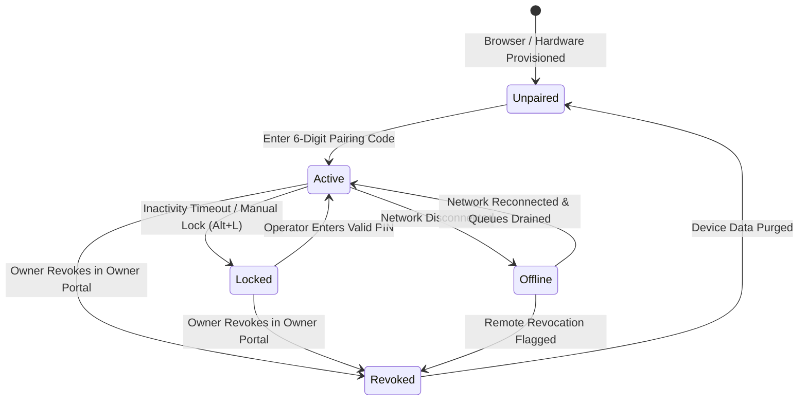

# OrderRail — Device Architecture Specification (DEVICE_ARCHITECTURE.md)

> **Definitive Architectural Specification & Hardware Ecosystem Blueprint** for dedicated OrderRail devices, establishing the foundation for Counter Terminals, Kitchen Display Systems (KDS), Customer-Facing Displays, Waiter Handhelds, and Self-Ordering Kiosks.

---

## Executive Summary

OrderRail operates as an ecosystem of specialized web applications running on dedicated physical hardware terminals. While customer mobile devices handle self-service QR ordering and the Owner Portal provides administrative configuration, physical restaurant operations rely on **dedicated operational devices**.

A fundamental architectural distinction governs this system:

```
┌─────────────────────────────────────────────────────────────────────────────────────────┐
│                                 THE FUNDAMENTAL SPLIT                                   │
├─────────────────────────────────────────┬───────────────────────────────────────────────┤
│                    DEDICATED DEVICE     │               TRANSIENT OPERATOR              │
│                 (Hardware Container)    │                (Human Identity)               │
│                                         │                                               │
│ • Fixed hardware (POS Terminal, KDS)    │ • Cashiers, Cooks, Managers                   │
│ • Permanently paired to a Cafe location │ • Shifts change throughout day                │
│ • Stores offline queues & local DB      │ • Log in/out via PIN code                     │
│ • Persists across browser reboots       │ • Bounded by atomic permission bundles        │
└─────────────────────────────────────────┴───────────────────────────────────────────────┘
```

**Devices do not change. Operators do.**

---

## Table of Contents

- [1. What is a Device?](#1-what-is-a-device)
- [2. Device Types & Capabilities](#2-device-types--capabilities)
- [3. Unified Device Lifecycle & State Machine](#3-unified-device-lifecycle--state-machine)
- [4. Simplified Device Registration & Pairing](#4-simplified-device-registration--pairing)
- [5. Minimal Device Identity Schema](#5-minimal-device-identity-schema)
- [6. Device Authentication & Token Security](#6-device-authentication--token-security)
- [7. Device Health & Telemetry System](#7-device-health--telemetry-system)
- [8. Multi-Device Scalability & Conflict Handling](#8-multi-device-scalability--conflict-handling)
- [9. Owner Portal Device Management](#9-owner-portal-device-management)
- [10. Native Application Strategy (Electron / Tauri / Mobile)](#10-native-application-strategy-electron--tauri--mobile)

---

## 1. What is a Device?

A **Device** in OrderRail is a recognized physical or logical hardware terminal permanently registered to a specific café (`cafes.id`).

Unlike user accounts tied to individual human credentials, a Device:
1. Possesses a unique identity (`device_id`).
2. Maintains persistent authorization to access café data independently of who is logged in.
3. Operates local storage engines (IndexedDB), thermal print spoolers, and local synchronization workers.
4. Acts as a host container upon which human operators authenticate using short PIN codes.

```
┌─────────────────────────────────────────────────────────────────────────────────────────┐
│                                UNIFIED DEVICE MODEL                                     │
│                                                                                         │
│  ┌───────────────────────────────────────────────────────────────────────────────────┐  │
│  │ DEDICATED HARDWARE TERMINAL (Device ID: #dev-9821, Cafe: Cafe Central)            │  │
│  │                                                                                   │  │
│  │  ┌─────────────────────────────────────────────────────────────────────────────┐  │  │
│  │  │ PERSISTENT DEVICE LAYER                                                 │  │  │
│  │  │ - Long-Lived Device Token                                                   │  │  │
│  │  │ - Offline IndexedDB Database (Order Queue, Menu Cache, Tables)            │  │  │
│  │  │ - Hardware Drivers (ESC/POS Thermal Printer, Cash Drawer)                   │  │  │
│  │  └─────────────────────────────────────────────────────────────────────────────┘  │  │
│  │                                          │                                        │  │
│  │                                          ▼                                        │  │
│  │  ┌─────────────────────────────────────────────────────────────────────────────┐  │  │
│  │  │ OPERATOR AUTHENTICATION LAYER                                               │  │  │
│  │  │ - Operator Selection (Profile Grid)                                         │  │  │
│  │  │ - 4-Digit PIN Challenge                                                     │  │  │
│  │  └─────────────────────────────────────────────────────────────────────────────┘  │  │
│  │                                          │                                        │  │
│  │                                          ▼                                        │  │
│  │  ┌─────────────────────────────────────────────────────────────────────────────┐  │  │
│  │  │ APPLICATION INTERFACE (Counter / Kitchen / Kiosk / Handheld)                │  │  │
│  │  │ - Bound by Atomic Permission Bundle                                         │  │  │
│  │  └─────────────────────────────────────────────────────────────────────────────┘  │  │
│  └───────────────────────────────────────────────────────────────────────────────────┘  │
└─────────────────────────────────────────────────────────────────────────────────────────┘
```

---

## 2. Device Types & Capabilities

OrderRail defines five operational device classifications:

```
┌─────────────────────────────────────────────────────────────────────────────────────────────────┐
│                                      DEVICE TYPE TAXONOMY                                       │
├───────────────────┬───────────────────┬───────────────────┬───────────────────┬─────────────────┤
│      COUNTER      │      KITCHEN      │ WAITER_HANDHELD   │  SELF_ORDER_KIOSK │ CUSTOMER_DISPLAY│
│    (POS Deck)     │  (KDS / Spooler)  │   (Floor Tablet)  │   (Self-Service)  │ (Facing Screen) │
│                   │                   │                   │                   │                 │
│ Cashier POS deck; │ Kitchen prep deck │ Mobile floor POS  │ Customer order    │ Secondary       │
│ order intake,     │ showing line item │ tablet for table  │ intake terminal;  │ checkout        │
│ billing & prints. │ preparation.      │ side ordering.    │ payment & prints. │ overview.       │
└───────────────────┴───────────────────┴───────────────────┴───────────────────┴─────────────────┘
```

### 2.1 Capability Matrix

Each device advertises string-based capabilities stored in JSONB:

| Capability Flag | Description | COUNTER | KITCHEN | WAITER_HANDHELD | SELF_ORDER_KIOSK | CUSTOMER_DISPLAY |
|-----------------|-------------|:-------:|:-------:|:---------------:|:----------------:|:----------------:|
| `orders.create` | Can intake new orders | ✅ | ❌ | ✅ | ✅ | ❌ |
| `orders.modify` | Can modify active cart & line items | ✅ | ❌ | ✅ | ❌ | ❌ |
| `billing.process` | Can process payments & close sessions | ✅ | ❌ | ✅ | ✅ | ❌ |
| `cash_drawer.trigger` | Can trigger physical cash drawer open | ✅ | ❌ | ❌ | ❌ | ❌ |
| `printing.bill` | Connected to receipt printer | ✅ | ❌ | ❌ | ✅ | ❌ |
| `printing.kot` | Connected to Kitchen Ticket printer | ✅ | ✅ | ❌ | ❌ | ❌ |
| `kds.view` | Can render Kitchen Preparation Kanban | ❌ | ✅ | ❌ | ❌ | ❌ |
| `customer.view` | Renders secondary checkout display | ❌ | ❌ | ❌ | ❌ | ✅ |

---

## 3. Unified Device Lifecycle & State Machine

Every operational device follows the exact same lifecycle state machine:



### 3.1 Consistent Multi-Device Experience

Every operational device adheres to the exact same flow:
$$\text{Device Pairing} \longrightarrow \text{Operator Selection} \longrightarrow \text{PIN Authentication} \longrightarrow \text{Application Workspace}$$

- **Counter:** POS Cashier workspace opens upon PIN unlock.
- **Kitchen:** KDS Kanban view opens upon Cook PIN unlock.
- **Waiter Handheld:** Floor table map opens upon Server PIN unlock.
- **Self-Ordering Kiosk:** Kiosk ordering screen opens automatically (or under Kiosk Guest account).

---

## 4. Simplified Device Registration & Pairing

The pairing process eliminates client-side RSA keypair generation and complex cryptography in favor of a clean, secure token-exchange architecture:

```
┌─────────────────────────────────────────────────────────────────────────────────────────┐
│                              SIMPLIFIED PAIRING FLOW                                    │
│                                                                                         │
│    CAFE OWNER PORTAL                                    NEW HARDWARE TERMINAL           │
│  ┌────────────────────┐                                ┌─────────────────────┐          │
│  │ 1. Register Device │                                │ 4. Open OrderRail   │          │
│  │    "Counter POS 1" │                                │    App (Unpaired)   │          │
│  └─────────┬──────────┘                                └──────────┬──────────┘          │
│            │                                                      │                     │
│            ▼                                                      ▼                     │
│  ┌────────────────────┐   Owner communicates code      ┌─────────────────────┐          │
│  │ 2. Generate 6-Digit│ ─────────────────────────────► │ 5. Enter Code       │          │
│  │    Pairing Code    │                                │    "784-902"        │          │
│  └─────────┬──────────┘                                └──────────┬──────────┘          │
│            │                                                      │                     │
│            ▼                                                      ▼                     │
│  ┌────────────────────┐                                ┌─────────────────────┐          │
│  │ 3. Server Stores   │ ◄─── 6. Validates & Issues ────│ 6. Submit Code to    │          │
│  │    Pending Code    │      Long-Lived Device Token   │    Server           │          │
│  └────────────────────┘                                └──────────┬──────────┘          │
│                                                                   │                     │
│                                                                   ▼                     │
│                                                        ┌─────────────────────┐          │
│                                                        │ 7. Store Token &    │          │
│                                                        │    Device Ready!    │          │
│                                                        └─────────────────────┘          │
└─────────────────────────────────────────────────────────────────────────────────────────┘
```

### 4.1 Step-by-Step Sequence

1. **Owner Registers Device:** Owner opens Owner Portal → Hardware Devices → Click "Add New Device".
2. **Server Generates Pairing Code:** Server creates a short-lived 6-digit numeric pairing code (e.g. `784-902`) expiring in 10 minutes.
3. **Counter Enters Code:** Staff opens the OrderRail app on the new terminal and inputs `784-902`.
4. **Server Validates & Creates Record:** Server verifies the code, creates the row in `public.devices`, and generates a secure long-lived `device_token`.
5. **Token Storage:** Device receives `device_token` and saves it securely in browser `IndexedDB` / `localStorage`.
6. **Device Ready:** Terminal transitions instantly to **Active** state and renders the Operator Selection screen.

---

## 5. Minimal Device Identity Schema

To avoid unreliable or blocked browser identifiers (such as MAC addresses, WebGL fingerprints, or canvas canvas hashes), the Device Identity schema contains only clean, reliable metadata fields.

### 5.1 Database Table: `public.devices`

```sql
CREATE TABLE IF NOT EXISTS public.devices (
  id                    UUID PRIMARY KEY DEFAULT gen_random_uuid(),
  cafe_id               UUID NOT NULL REFERENCES public.cafes(id) ON DELETE CASCADE,
  device_name           TEXT NOT NULL, -- e.g. "Front Counter POS 1"
  device_type           TEXT NOT NULL CHECK (device_type IN ('COUNTER', 'KITCHEN', 'WAITER_HANDHELD', 'SELF_ORDER_KIOSK', 'CUSTOMER_DISPLAY')),
  status                TEXT NOT NULL DEFAULT 'registered' CHECK (status IN ('registered', 'active', 'locked', 'offline', 'revoked')),
  
  -- Capabilities & Configurations
  capabilities          JSONB NOT NULL DEFAULT '[]'::jsonb, -- e.g. ["orders.create", "billing.process"]
  printer_configuration JSONB DEFAULT '{}'::jsonb,         -- e.g. {"thermal_ip": "192.168.1.100", "port": 9100}
  
  -- Minimal Reliable Telemetry
  app_version           TEXT NOT NULL DEFAULT '2.0.0',
  last_seen             TIMESTAMPTZ,
  current_operator_name TEXT, -- Snapshot of currently logged-in operator
  
  created_at            TIMESTAMPTZ NOT NULL DEFAULT now(),
  updated_at            TIMESTAMPTZ NOT NULL DEFAULT now()
);

-- Index for RLS policies and health heartbeats
CREATE INDEX IF NOT EXISTS idx_devices_cafe_status ON public.devices(cafe_id, status);
CREATE INDEX IF NOT EXISTS idx_devices_last_seen ON public.devices(last_seen DESC);
```

---

## 6. Device Authentication & Token Security

- **Persistent Device Token:** Issued upon pairing. Stored in IndexedDB. Used in `Authorization: Bearer <device_token>` headers for all POS backend calls.
- **Revocation Support:** Owner can click "Revoke Access" in Owner Portal at any time. Server immediately sets `status = 'revoked'`. Subsequent API calls return `403 Forbidden`. The device purges local tokens and reverts to the Unpaired state.
- **Offline Behavior:** Device token remains stored locally. In offline mode, the terminal continues accepting orders into IndexedDB `orderQueue` and syncs when reconnected.

---

## 7. Device Health & Telemetry System

Devices send a lightweight background telemetry ping every **30 seconds** when online:

```json
{
  "device_id": "dev_88392019-4b2a-4c91-9921-102938475610",
  "status": "online",
  "current_operator": "Sarah M.",
  "sync_queue_depth": 0,
  "printer_status": "READY",
  "app_version": "2.0.0"
}
```

---

## 8. Multi-Device Scalability & Conflict Handling

Multiple devices operating concurrently (e.g. 2 Counters + 2 Kitchen KDS terminals) synchronize via Supabase Realtime WebSockets:

- **Atomic Sessions:** Table sessions enforce atomic `open_dining_session` RPC checks.
- **Additive Orders:** Orders append line items additively with client-generated UUIDs.
- **KDS Category Subscriptions:** KDS terminals filter realtime events by item categories (e.g. Kitchen vs Bar).

---

## 9. Owner Portal Device Management

The Owner Portal provides a dedicated **Device Management Dashboard** (`/owner/devices`):

```
┌─────────────────────────────────────────────────────────────────────────────────────────────────────────────────────────┐
│ Owner Portal │ Cafe Central │ HARDWARE DEVICE MANAGEMENT                                                                │
├─────────────────────────────────────────────────────────────────────────────────────────────────────────────────────────┤
│                                                                                                                         │
│  [ + REGISTER NEW DEVICE ]                                                                                              │
│                                                                                                                         │
│  REGISTERED TERMINALS (3)                                                                                               │
│  ┌───────────────────────┬────────────┬────────────┬──────────────────┬───────────┬────────────────┬─────────────────┐  │
│  │ DEVICE NAME           │ TYPE       │ STATUS     │ CURRENT OPERATOR │ LAST SEEN │ PRINTER STATUS │ ACTIONS         │  │
│  ├───────────────────────┼────────────┼────────────┼──────────────────┼───────────┼────────────────┼─────────────────┤  │
│  │ Front Counter POS 1   │ COUNTER    │ ● ONLINE   │ Sarah M. (#402)  │ Just now  │ ● READY        │ [Manage] [Revoke]│  │
│  │ Main Kitchen KDS      │ KITCHEN    │ ● ONLINE   │ Marcus K.        │ 12s ago   │ ● READY        │ [Manage] [Revoke]│  │
│  │ Terrace Tablet        │ HANDHELD   │ ✖ OFFLINE  │ None             │ 42m ago   │ N/A            │ [Manage] [Revoke]│  │
│  └───────────────────────┴────────────┴────────────┴──────────────────┴───────────┴────────────────┴─────────────────┘  │
│                                                                                                                         │
└─────────────────────────────────────────────────────────────────────────────────────────────────────────────────────────┘
```

### 9.1 Available Owner Management Actions

- **Rename Device:** Edit friendly terminal display name.
- **Lock Device Remote:** Immediately lock an active terminal to the Operator Picker.
- **Unlock Device Remote:** Clear remote lock.
- **Transfer Device:** Reassign terminal to a different zone/station.
- **Revoke Device:** Immediately invalidate device token and force unpair.
- **Replace Device:** Generate replacement pairing code while preserving terminal settings.
- **View Diagnostics:** Inspect sync queue depth, error logs, and heartbeat latency.
- **Restart / Update Device (Future Native):** Trigger app reload or binary update.

---

## 10. Native Application Strategy (Electron / Tauri / Mobile)

The web application is the primary platform. Native desktop (Electron, Tauri) or mobile POS (Android/iOS) wrappers **reuse 100% of the web core architecture**:

```
┌─────────────────────────────────────────────────────────────────────────────────────────┐
│                               UNIFIED NATIVE STRATEGY                                   │
│                                                                                         │
│   REUSED ARCHITECTURE (100% Identical)           NATIVE HARDWARE ADDITIONS ONLY         │
│   - Device Authentication & Tokens               - USB ESC/POS Thermal Printing         │
│   - Device Identity Schema                       - Direct RS232 Cash Drawer Pulses      │
│   - Operator Selection & PIN Auth                - Physical Barcode Scanners            │
│   - Atomic Permission System                     - Secondary Monitor Customer Display   │
│   - Transaction Audit Logging                    - Offline Native SQLite Storage        │
└─────────────────────────────────────────────────────────────────────────────────────────┘
```

No architectural changes are required when moving from browser to desktop software.
