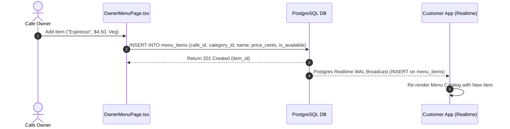
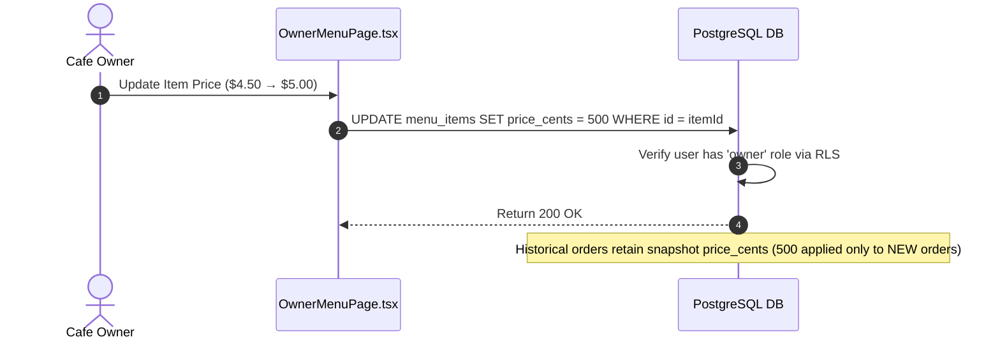
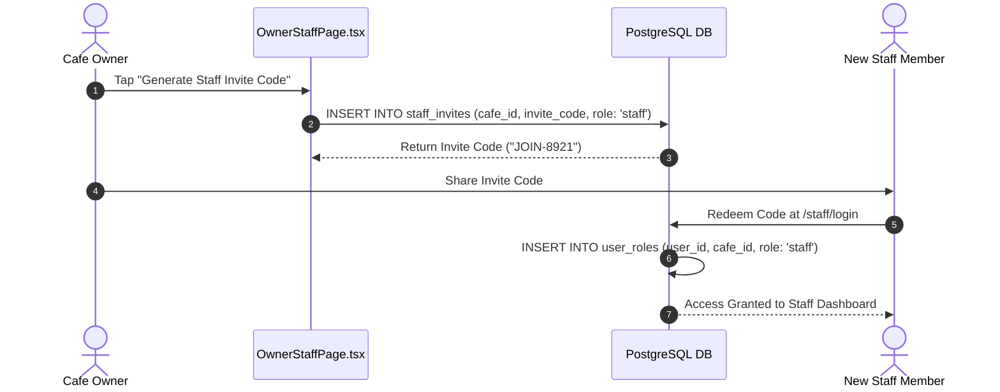
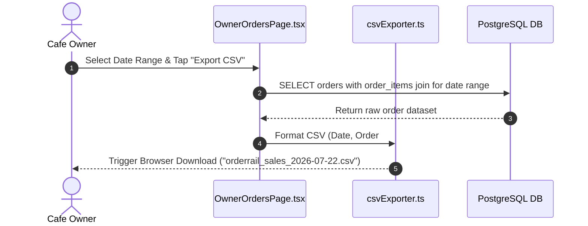

# OrderRail — Owner Administration & Business Governance

> **Definitive Business Governance & Administrative Architecture Document** for OrderRail, detailing cafe setup, menu management, role-based staff administration, financial analytics, audit governance, and operational oversight.

---

## Table of Contents
- [1. Purpose & System Role](#1-purpose--system-role)
- [2. Design Philosophy](#2-design-philosophy)
- [3. Owner Dashboard Overview](#3-owner-dashboard-overview)
- [4. Business Configuration](#4-business-configuration)
- [5. Menu Management & Publishing](#5-menu-management--publishing)
- [6. Category Management](#6-category-management)
- [7. Table Layout Management](#7-table-layout-management)
- [8. Staff Management & Onboarding](#8-staff-management--onboarding)
- [9. Order Oversight & Operations](#9-order-oversight--operations)
- [10. Financial Reporting & CSV Export](#10-financial-reporting--csv-export)
- [11. Analytics & Key Performance Indicators](#11-analytics--key-performance-indicators)
- [12. Customer Feedback Management](#12-customer-feedback-management)
- [13. Operational Controls & Demo Protections](#13-operational-controls--demo-protections)
- [14. Security & Permissions Matrix](#14-security--permissions-matrix)
- [15. Audit Logs & System Accountability](#15-audit-logs--system-accountability)
- [16. Backup & Data Governance](#16-backup--data-governance)
- [17. Performance Goals & SLAs](#17-performance-goals--slas)
- [18. Future Business Features](#18-future-business-features)
- [19. Cross-References & Related Documentation](#19-cross-references--related-documentation)

---

## 1. Purpose & System Role

### 1.1 Owner Portal Role
The OrderRail Owner Portal (`/owner/*`) is the central administrative command deck for restaurant proprietors, store managers, and corporate administrators. It provides complete governance over business rules, menu offerings, pricing, seat allocation, staff access, financial reports, and real-time revenue analytics.

```
                               ┌─────────────────────────────────────────┐
                               │              OWNER PORTAL               │
                               │  (Administrative Control & Analytics)   │
                               └────────────────────┬────────────────────┘
                                                    │
                                                    ▼
┌───────────────────────────────────────────────────────────────────────────────────────────┐
│                                     POSTGRESQL DB                                         │
│                      (Multi-Tenant Root: cafes, user_roles, RLS)                          │
└───────────────────────┬───────────────────────────────────────────┬───────────────────────┘
                        │                                           │
                        ▼                                           ▼
┌─────────────────────────────────────────┐       ┌─────────────────────────────────────────┐
│            COUNTER TERMINAL             │       │         CUSTOMER MOBILE WEB APP         │
│     (Operational Staff Execution)       │       │        (Self-Service QR Ordering)        │
└─────────────────────────────────────────┘       └─────────────────────────────────────────┘
```

### 1.2 Relationship with Customer, Counter, and Database
1. **With Database:** Mutates core tenant records in `cafes`, `menu_items`, `menu_categories`, `tables`, `profiles`, and `user_roles` under PostgreSQL Row Level Security (`owner` claim).
2. **With Counter:** Configures operational parameters (e.g. `staff_can_manage_specials`), populates active tables, and reviews staff performance.
3. **With Customer:** Publishes live menu catalogs, item pricing, currency formats, operating hours, and social review links.

---

## 2. Design Philosophy

### 2.1 Strategic Administrative Separation
OrderRail strictly separates operational fast-lane actions (Counter Terminal POS) from administrative setup (Owner Portal). 
- Counter staff cannot alter prices or alter structural layout geometry.
- Cafe Owners exercise full control over business rules while maintaining high-level oversight of live floor activities.

### 2.2 Multi-Tenant Data Isolation
Every owner administration action is strictly scoped to the owner's assigned **`cafe_id`**.
- RLS policies prevent owners from inspecting or modifying data belonging to other cafe tenants.
- Shared database infrastructure maintains complete tenant isolation at the database layer (see [`DATABASE.md`](./DATABASE.md)).

---

## 3. Owner Dashboard Overview

The Owner Portal workspace is structured into six administrative modules:

```
┌───────────────────────────────────────────────────────────────────────────────────────────┐
│                                   OWNER MAIN NAVIGATION                                   │
├─────────────────┬─────────────────┬─────────────────┬─────────────────┬───────────────────┤
│   ANALYTICS     │     ORDERS      │      MENU       │     TABLES      │   STAFF & SETTINGS│
│   (Revenue)     │   (Oversight)   │  (Catalog/Price)│  (Layout Edit)  │    (Role/Config)  │
└─────────────────┴─────────────────┴─────────────────┴─────────────────┴───────────────────┘
```

1. **Analytics (`/owner/analytics`):** Real-time gross revenue, order volume, peak hours, category performance, and average ticket size.
2. **Orders (`/owner/orders`):** Audit-level view of all historical and active orders, status filters, and CSV report export.
3. **Menu Editor (`/owner/menu`):** Catalog creation, dish pricing, category sorting, veg/non-veg flags, and instant availability toggles.
4. **Table Layout (`/owner/tables`):** Physical table creation, seat capacity setup, and QR code generation.
5. **Staff Management (`/owner/staff`):** Invite link generation, staff role revocation, and team permissions.
6. **Settings (`/owner/settings`):** Cafe branding, logo upload, operating hours, currency, and Google Maps review links.

---

## 4. Business Configuration

Owners configure core cafe metadata stored in `public.cafes`:

| Parameter | Database Column | Purpose | Default / Example |
|-----------|-----------------|---------|-------------------|
| **Cafe Name** | `cafes.name` | Display title on customer menu and receipts. | `"OrderRail Cafe"` |
| **URL Slug** | `cafes.slug` | Unique web routing slug (`/menu/:slug`). | `"orderrail"` |
| **Currency** | `cafes.currency` | Currency symbol format. | `"$"` or `"₹"` |
| **Operating Hours** | `cafes.operating_hours` | Opening and closing hours string. | `"08:00 AM - 10:00 PM"` |
| **Contact Phone / WA** | `cafes.phone`, `cafes.whatsapp` | Customer contact and support numbers. | `"+1-555-0199"` |
| **Google Review URL** | `cafes.google_maps_review_url` | Target link for post-dining customer review prompts. | `"https://g.page/r/..."` |
| **Staff Special Control** | `cafes.staff_can_manage_specials` | Toggle allowing staff to modify item availability. | `false` |

---

## 5. Menu Management & Publishing

### 5.1 Menu Publishing Sequence


### 5.2 Price Change Governance Sequence


---

## 6. Category Management

- **Structure:** Menu items are grouped into `menu_categories` (e.g. *Beverages*, *Main Course*, *Desserts*).
- **Ordering & Sorting:** Categories include a `sort_order` integer column allowing owners to arrange the display sequence on customer mobile devices.
- **Cascade Protection:** Deleting a category prompts the owner to reassign or archive associated `menu_items`.

---

## 7. Table Layout Management

Owners define physical restaurant layout geometry in `public.tables`:

- **Creating Tables:** Owners specify `label` (e.g. `"1"`, `"Patio-2"`) and `seats` count (e.g. `4`).
- **QR Code Generation:** The portal generates unique vector QR codes linking to `/t/:tableId`.
- **Structural Protection:** Structural metadata (`label`, `seats`) is protected against client tampering via database triggers (see [`DATABASE.md`](./DATABASE.md)).

---

## 8. Staff Management & Onboarding

### 8.1 Staff Invitation Sequence


---

## 9. Order Oversight & Operations

Owners maintain high-level operational oversight via `/owner/orders`:
- **Real-Time Kanban View:** Monitors order progression across `pending`, `preparing`, `ready`, and `served`.
- **Audit Filtering:** Filters historical orders by date range, order status, table label, or daily order number.
- **Cancellation Inspection:** Inspects cancelled orders and review manager PIN override logs to prevent food wastage or internal fraud.

---

## 10. Financial Reporting & CSV Export



---

## 11. Analytics & Key Performance Indicators

The Owner Analytics Engine (`/owner/analytics`) computes key business performance indicators:

| Analytics Metric | Calculation Formula | Business Value |
|------------------|---------------------|----------------|
| **Gross Sales Revenue** | `SUM(orders.total_cents)` for status = `'served'` | Total topline revenue realized. |
| **Total Order Volume** | `COUNT(orders.id)` | Volume of customer orders processed. |
| **Average Order Value (AOV)** | `Gross Sales / Total Orders` | Average guest ticket size. |
| **Top-Selling Categories** | `SUM(order_items.qty)` grouped by `category_id` | Identifies high-margin menu items. |
| **Peak Sales Hours** | `COUNT(orders.id)` grouped by `EXTRACT(HOUR FROM created_at)` | Informs staff shift scheduling. |
| **Table Occupancy Rate** | `Active Sessions / Total Tables` | Measures floor space efficiency. |

---

## 12. Customer Feedback Management

- **Review Ingestion:** Post-dining customer ratings submitted via [`CUSTOMER.md`](./CUSTOMER.md) are ingested into `public.reviews`.
- **Owner Review Panel (`/owner/reviews`):** Displays star rating distributions (1 to 5 stars), customer comment logs, and session timestamps.
- **Reputation Management:** Direct links to the cafe's official Google Maps Review URL encourage happy diners to leave public Google reviews.

---

## 13. Operational Controls & Demo Protections

OrderRail includes built-in safeguards for public demo showcases (`is_demo_cafe = true`):
- **Structural Table Protection:** Trigger `trg_enforce_demo_table_update_protection` blocks structural modifications (`label`, `seats`, `cafe_id`) on demo tables.
- **Demo Admin Bypass:** Demo administrators authenticated via `is_demo_admin(auth.uid())` can bypass restrictions for maintenance testing.

---

## 14. Security & Permissions Matrix

| System Action | Counter Staff | Shift Manager | Cafe Owner |
|---------------|---------------|---------------|------------|
| Edit Cafe Details / Branding | No | No | **Yes** |
| Manage Menu Items & Pricing | No | Read Only | **Yes** |
| Add / Delete Tables | No | No | **Yes** |
| Generate Staff Invites | No | No | **Yes** |
| Revoke Staff Access | No | No | **Yes** |
| Export Financial CSV Reports | No | No | **Yes** |
| View Revenue Analytics | No | No | **Yes** |
| Override Order Cancellations | PIN Required | Yes | **Yes** |

---

## 15. Audit Logs & System Accountability

- **`audit_logs` Table:** Captures high-risk administrative events:
  - Menu price modifications (`old_price`, `new_price`, `actor_id`).
  - Staff role assignments and revocations.
  - Manual voiding of paid dining sessions.
- Audit logs maintain immutable timestamps for regulatory compliance and internal audit trails.

---

## 16. Backup & Data Governance

1. **Automated Daily Backups:** Supabase managed Point-in-Time Recovery (PITR) captures physical database snapshots.
2. **Data Retention Policy:** Historical `orders`, `order_items`, and `dining_sessions` records are retained indefinitely for annual tax reporting and year-over-year sales comparison.
3. **Tenant Privacy:** Owner authentication credentials and API keys are stored securely using bcrypt hashing and Supabase Auth.

---

## 17. Performance Goals & SLAs

- **Dashboard Load Time:** < 1.0 second for initial analytics render.
- **Menu Update Propagation:** < 150ms from owner save to customer mobile UI update via Supabase Realtime.
- **Report Generation Speed:** < 2.0 seconds for generating a 10,000-row annual sales CSV export.

---

## 18. Future Business Features

1. **Multi-Outlet Corporate Dashboard:** Single login for owners managing chains of 5+ cafe branches with cross-outlet sales comparison.
2. **Automated Inventory & Recipe BOM:** Ingredient-level cost tracking and automatic stock reorder alerts.
3. **Staff Payroll & Performance Bonuses:** Tracking sales volume per server for tip distribution and commission bonuses.
4. **AI Sales Forecasting:** Predictive ML models projecting ingredient demand based on weather, day of week, and historical trends.

---

## 19. Cross-References & Related Documentation

- [`./DATABASE.md`](./DATABASE.md) — Comprehensive PostgreSQL database design, RLS permissions matrix, schema specifications, and trigger dependencies.
- [`./ARCHITECTURE.md`](./ARCHITECTURE.md) — System Architecture, Component Hierarchy, and Realtime Engine.
- [`./PRODUCT.md`](./PRODUCT.md) — Product Requirements & Feature Specifications.
- [`./COUNTER.md`](./COUNTER.md) — Counter Operational Architecture & Staff Governance.
- [`./CUSTOMER.md`](./CUSTOMER.md) — Customer Experience Architecture & Guest Journey Governance.
- [`./DEVELOPMENT_WORKFLOW.md`](./DEVELOPMENT_WORKFLOW.md) — Engineering standards and testing guidelines.
