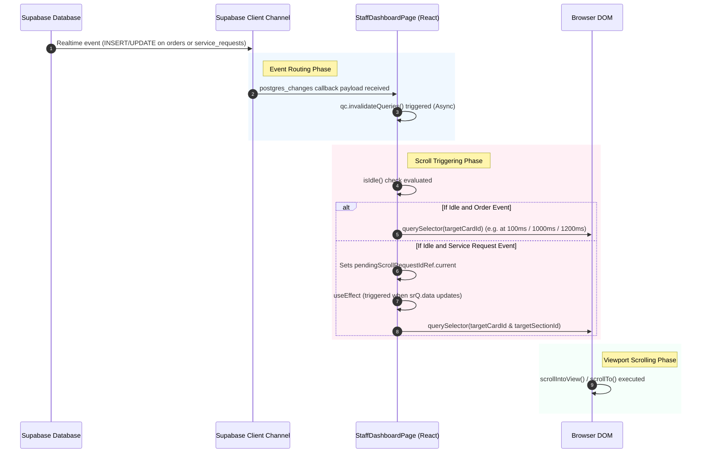
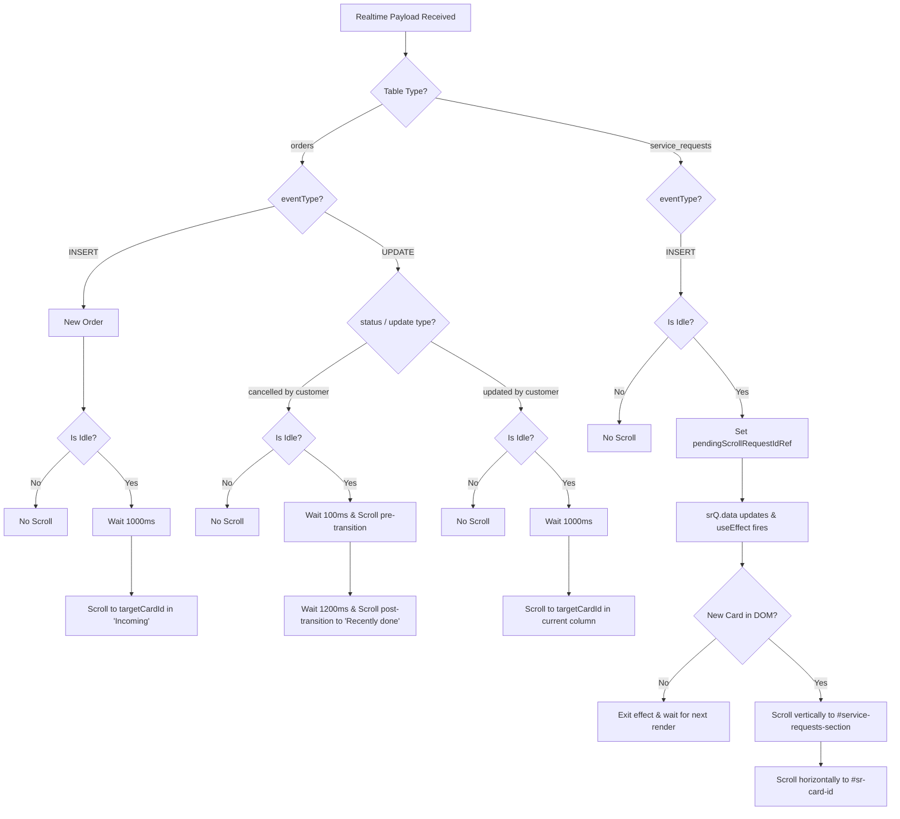

# Staff Dashboard Auto-Focus Logic Investigation

This report analyzes the realtime event flow, subscription architecture, and scrolling mechanics within the Staff Dashboard (`StaffDashboardPage.tsx`) to identify why scroll focusing misbehaves under certain events.

---

## 1. Event Flow Diagram

The diagram below traces how realtime events originate in the database, propagate through Supabase, trigger React state changes, and execute scrolling operations.

---

## 2. Realtime Subscriptions

There is a single active Supabase channel subscription created within a `useEffect` hook in `StaffDashboardPage.tsx`:

* **Channel Name**: `staff-${cafeId}`
* **Active Listeners**:

| Table | Event Filter | Payload Action / Callback |
| :--- | :--- | :--- |
| **`orders`** | `cafe_id=eq.${cafeId}` | Invalidates query `["staff-orders", cafeId]`. Checks `payload.eventType` (INSERT / UPDATE) to fire toast, chime, vibrate, card flash, and scroll. |
| **`order_items`** | None | Invalidates query `["staff-orders", cafeId]`. |
| **`service_requests`**| `cafe_id=eq.${cafeId}` | Invalidates query `["staff-sr", cafeId]`. Checks `payload.eventType === "INSERT"` to fire toast, chime, vibrate, and set `pendingScrollRequestIdRef`. |
| **`tables`** | `cafe_id=eq.${cafeId}` | Invalidates query `["staff-tables", cafeId]`. |

---

## 3. Scrolling Decision Tree

The following diagram maps the logic used to determine where and when the page scrolls after a realtime event payload arrives.

---

## 4. Root Cause Analysis

### Why do all events scroll or default to the "Incoming Orders" section?

1. **Horizontal Co-location of columns**:
   On desktop layouts, the three Kanban columns ("Incoming", "In progress", "Recently done") are aligned side-by-side horizontally (`grid-cols-3`). Because they share the same vertical offset relative to the document top, any call to `scrollIntoView({ block: "center" })` on *any card* in *any column* centers that vertical line on the screen. This centers the entire Kanban section, where the "Incoming" column is the first column on the left and naturally dominates the viewport.
2. **Missing Element / Query Lag Fallback**:
   If an order update or cancellation scrolls before the query refetch completes and the card transitions to its correct column, or if the card element cannot be resolved in the DOM, `document.getElementById(...)` returns `null` or the scroll fails to target the correct position. In these scenarios, the page either remains stationary or shifts scroll focus back to the top/active sections (where "Incoming" resides).
3. **No Centralized Coordinates Check**:
   There is no single coordinator managing window-level vertical scroll offsets across different column blocks. Instead, multiple timeouts trigger independent scroll calls, which can override each other or default the window focus to the top.

### Why did horizontal service request scrolling fail historically?

1. **Fixed-delay Race Conditions**:
   The previous implementation used a fixed `300ms` timeout to wait for the horizontal card to render. Because React Query refetches are asynchronous and subject to database latency, the target card element (`sr-card-${id}`) was frequently not yet present in the DOM when the timeout fired, causing the horizontal scroll to fail silently.
2. **Scroll Snapping Conflicts**:
   The container used CSS scroll snapping with `snap-mandatory` and cards used `snap-start` (left-aligned). This caused the browser's scroll engine to override smooth javascript `scrollIntoView({ inline: "center" })` centering requests, snapping the cards back to the left edge of the viewport.
