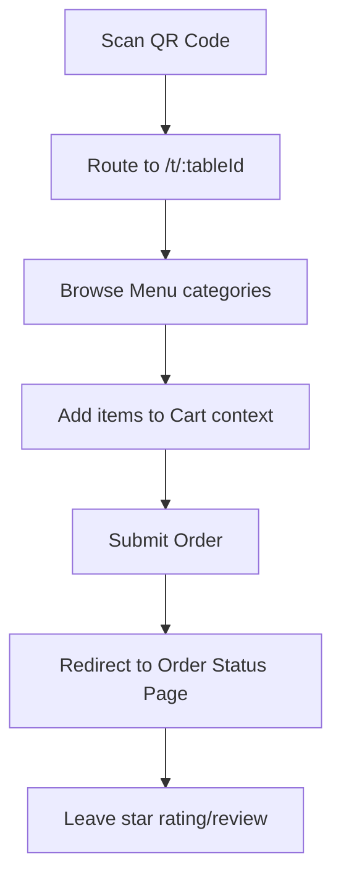
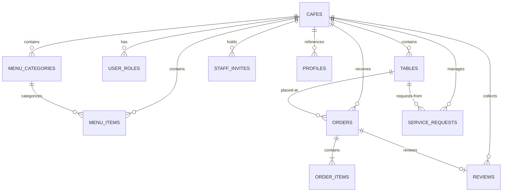

# OrderRail Architecture Documentation

This document provides a comprehensive technical overview of the **OrderRail** codebase, route maps, business workflows, data schemas, state management, and recommendations for architectural improvements.

---

## 1. Folder Structure

```
orderrail/
├── .lovable/                 # (Deleted)
├── docs/
│   └── INSTALLATION.md       # Setup and onboarding documentation
├── public/
│   ├── manifest.webmanifest  # PWA configuration
│   └── robots.txt
├── src/
│   ├── components/
│   │   ├── customer/         # Customer-facing layout components (Cart, Menu, Reviews)
│   │   └── ui/               # Reusable UI primitives (buttons, cards, badges)
│   ├── hooks/                # Global React hooks (use-toast, use-mobile)
│   ├── integrations/
│   │   └── supabase/         # Supabase JS SDK client wrapper and TS types
│   ├── layouts/              # Main layout files (TableLayout, StaffLayout, OwnerLayout)
│   ├── lib/                  # Core modules (auth context, cart, DB client, offline queue)
│   ├── pages/
│   │   ├── owner/            # Owner Dashboard subpages (analytics, settings, menus)
│   │   ├── staff/            # Staff login and live Kanban order dashboard
│   │   └── table/            # Customer router pages
│   ├── App.tsx               # Main application routing and bootstrap
│   └── main.tsx
├── supabase/
│   ├── migrations/           # Database schema migrations
│   ├── config.toml           # CLI configuration
│   └── seed.sql              # Automated setup bootstrap query
├── package.json              # Dependencies and scripts
└── vite.config.ts            # Vite compile configuration
```

---

## 2. Route Map

* **`/`** ([Index.tsx](file:///C:/Users/17042/Downloads/orderrail-pro-main%20old/orderrail-pro-main/src/pages/Index.tsx)) — Landing page displaying features and available demo QR codes.
* **`/t/:tableId`** ([TableLayout.tsx](file:///C:/Users/17042/Downloads/orderrail-pro-main%20old/orderrail-pro-main/src/layouts/TableLayout.tsx)) — Layout wrapper establishing active table/cafe query context.
  * **`/t/:tableId/`** ([TableMenuPage.tsx](file:///C:/Users/17042/Downloads/orderrail-pro-main%20old/orderrail-pro-main/src/pages/table/TableMenuPage.tsx)) — Interactive menu browser.
  * **`/t/:tableId/cart`** ([TableCartPage.tsx](file:///C:/Users/17042/Downloads/orderrail-pro-main%20old/orderrail-pro-main/src/pages/table/TableCartPage.tsx)) — Cart checkout page.
  * **`/t/:tableId/call`** ([TableCallPage.tsx](file:///C:/Users/17042/Downloads/orderrail-pro-main%20old/orderrail-pro-main/src/pages/table/TableCallPage.tsx)) — Service request creation (e.g. water, waiter, bill).
  * **`/t/:tableId/order/:orderId`** ([TableOrderPage.tsx](file:///C:/Users/17042/Downloads/orderrail-pro-main%20old/orderrail-pro-main/src/pages/table/TableOrderPage.tsx)) — Order status and tracking page with feedback review options.
* **`/staff/login`** ([StaffLoginPage.tsx](file:///C:/Users/17042/Downloads/orderrail-pro-main%20old/orderrail-pro-main/src/pages/staff/StaffLoginPage.tsx)) — Login page for owners and staff (supporting role-claiming in demo mode).
* **`/staff`** ([StaffLayout.tsx](file:///C:/Users/17042/Downloads/orderrail-pro-main%20old/orderrail-pro-main/src/layouts/StaffLayout.tsx)) — Dashboard wrapper.
  * **`/staff/`** ([StaffDashboardPage.tsx](file:///C:/Users/17042/Downloads/orderrail-pro-main%20old/orderrail-pro-main/src/pages/staff/StaffDashboardPage.tsx)) — Live Kanban console tracking orders, service requests, and active tables.
* **`/owner`** ([OwnerLayout.tsx](file:///C:/Users/17042/Downloads/orderrail-pro-main%20old/orderrail-pro-main/src/layouts/OwnerLayout.tsx)) — Owner sidebar layout.
  * **`/owner/`** ([OwnerAnalyticsPage.tsx](file:///C:/Users/17042/Downloads/orderrail-pro-main%20old/orderrail-pro-main/src/pages/owner/OwnerAnalyticsPage.tsx)) — Basic stats and sales analytics.
  * **`/owner/orders`** ([OwnerOrdersPage.tsx](file:///C:/Users/17042/Downloads/orderrail-pro-main%20old/orderrail-pro-main/src/pages/owner/OwnerOrdersPage.tsx)) — Historic order logs.
  * **`/owner/menu`** ([OwnerMenuPage.tsx](file:///C:/Users/17042/Downloads/orderrail-pro-main%20old/orderrail-pro-main/src/pages/owner/OwnerMenuPage.tsx)) — Manage categories and menu items.
  * **`/owner/tables`** ([OwnerTablesPage.tsx](file:///C:/Users/17042/Downloads/orderrail-pro-main%20old/orderrail-pro-main/src/pages/owner/OwnerTablesPage.tsx)) — Manage tables and download QR codes.
  * **`/owner/staff`** ([OwnerStaffPage.tsx](file:///C:/Users/17042/Downloads/orderrail-pro-main%20old/orderrail-pro-main/src/pages/owner/OwnerStaffPage.tsx)) — Assign/invite staff or owners.
  * **`/owner/reviews`** ([OwnerReviewsPage.tsx](file:///C:/Users/17042/Downloads/orderrail-pro-main%20old/orderrail-pro-main/src/pages/owner/OwnerReviewsPage.tsx)) — View customer ratings and comments.
  * **`/owner/settings`** ([OwnerSettingsPage.tsx](file:///C:/Users/17042/Downloads/orderrail-pro-main%20old/orderrail-pro-main/src/pages/owner/OwnerSettingsPage.tsx)) — Update cafe details (name, currency, description).

---

## 3. Core Business Flows

### 3.1 Customer Flow


### 3.2 Staff Flow
* **Login & Auth:** Accesses `/staff/login`, registers or signs in, and clicks "Claim Staff" to obtain authorization.
* **Kanban Monitoring:** Views incoming (`pending`), in-preparation (`preparing`), and ready (`ready`) columns.
* **Order Progression:** Moves an order forward using button clicks (e.g. pending $\rightarrow$ preparing $\rightarrow$ ready $\rightarrow$ served).
* **Alert Responses:** Manages physical customer requests (e.g. water, bill) in the horizontal notification strip and resolves them once handled.

### 3.3 Owner Flow
* **Menu Control:** Creates categories and items, sets pricing (in cents), toggles availability, and uploads thumbnail photos.
* **QR Creation:** Adds table labels and seating limits, automatically generating new QR routes.
* **Team Invite:** Registers new staff members by sending invites or adding existing user accounts via email.

---

## 4. Authentication Flow

Authentication is managed natively via **Supabase Auth**:
* Custom email/password login is implemented via `supabase.auth.signInWithPassword` and `supabase.auth.signUp`.
* Google sign-in is executed via the native OAuth provider (`supabase.auth.signInWithOAuth`).
* Global auth state is exposed via a React Context Provider ([auth.tsx](file:///C:/Users/17042/Downloads/orderrail-pro-main%20old/orderrail-pro-main/src/lib/auth.tsx)).
* **User Roles:** The provider fetches active roles from the database table `public.user_roles`. Dashboard layouts check access permissions using `hasRole(roles, "owner")` or `hasRole(roles, "staff")`.

---

## 5. Database Schema & Storage Relationships

### 5.1 Database Table Relationships


### 5.2 Storage usage
* **Bucket:** `menu-images`
* **Structure:** Files are stored as `<cafe_id>/<filename>`.
* **Access Control:** Row Level Security (RLS) policies permit public read access for customers while restricting write/update/delete operations to authenticated `owners` matching the path's `cafe_id`.

---

## 6. State Management & Sync

### 6.1 State Management Architecture
* **Global Auth:** Managed in [auth.tsx](file:///C:/Users/17042/Downloads/orderrail-pro-main%20old/orderrail-pro-main/src/lib/auth.tsx) to store active sessions and roles.
* **Global Cart:** Managed in [cart.tsx](file:///C:/Users/17042/Downloads/orderrail-pro-main%20old/orderrail-pro-main/src/lib/cart.tsx) using a React Context Provider per table ID, persisting items, quantities, and notes directly into `localStorage`.
* **Server Data Cache:** Managed using `react-query` (`@tanstack/react-query`), configuring caching lifetimes and cache invalidations for tables, orders, reviews, and menu entries.

### 6.2 Realtime subscriptions
Realtime PostgreSQL synchronizations run in [StaffDashboardPage.tsx](file:///C:/Users/17042/Downloads/orderrail-pro-main%20old/orderrail-pro-main/src/pages/staff/StaffDashboardPage.tsx#L93):
* Opens a Supabase Postgres channel `staff-<cafeId>`.
* Filters events where `cafe_id = eq.<cafeId>` on `orders` and `service_requests`.
* Listens to `INSERT`, `UPDATE`, and `DELETE` events to invalidate query keys (`staff-orders`, `staff-sr`) to automatically refresh the UI.

### 6.3 Offline support
Implemented in [orderQueue.ts](file:///C:/Users/17042/Downloads/orderrail-pro-main%20old/orderrail-pro-main/src/lib/orderQueue.ts):
* If `navigator.onLine` is false or the server request fails during checkout, the order payload is serialized and appended to a `localStorage` array `orderrail.order_queue`.
* Once the browser fires the `online` event, `flushQueue()` iterates through the queued items, inserts the records to Supabase, and clears the local queue upon successful sync.

---

## 7. Configuration & Shared Code

### 7.1 Environment Variables
Configured in [.env](file:///C:/Users/17042/Downloads/orderrail-pro-main%20old/orderrail-pro-main/.env):
* `VITE_SUPABASE_URL` — Connection URL for the Supabase backend.
* `VITE_SUPABASE_PUBLISHABLE_KEY` — Public anon token for client initialization.

### 7.2 Shared Utilities
* **[db.ts](file:///C:/Users/17042/Downloads/orderrail-pro-main%20old/orderrail-pro-main/src/lib/db.ts)**:
  * Exposes row types (`Cafe`, `TableRow`, `MenuItem`, etc.).
  * Exposes `formatMoney(cents, currency)` helper utilizing `Intl.NumberFormat` for currency displays.
* **[utils.ts](file:///C:/Users/17042/Downloads/orderrail-pro-main%20old/orderrail-pro-main/src/lib/utils.ts)**:
  * Exposes the `cn` function for Tailwind CSS class merging.

---

## 8. Technical Debt & Cleanup Recommendations

### 8.1 Technical Debt & Unnecessary Complexity
* **Hardcoded Tenant Slug:** Although the database is structured as a multi-tenant application (containing `cafe_id` on every table), the application code queries `slug = 'orderrail'` on page load to resolve the cafe ID. This is a hybrid approach that increases schema complexity (managing multiple foreign keys) without providing active multi-tenant frontend features.
* **No local seed in CLI:** The project previously lacked local seed data, making it impossible to run the application immediately after schema initialization without manual database manipulation. (This has been resolved by implementing `supabase/seed.sql`).

### 8.2 Opportunities to Simplify the Project
* **Centralize Cafe Context:** Pages currently execute separate queries to fetch the cafe ID using the hardcoded `"orderrail"` slug. Setting up a global `CafeContext` (or fetching it once inside a top-level route layout) would remove redundant database reads.
* **real-time Filter Simplification:** The subscription filters inside the Staff Dashboard can be consolidated to prevent multiple open channels.
