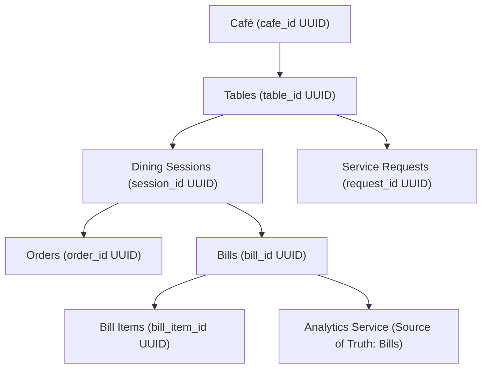

# OrderRail Domain Architecture & Repository Specifications

This document defines the normalized domain data model, entity hierarchy, repository boundaries, and realtime event registry for OrderRail.

---

## 1. Domain Entity Hierarchy



---

## 2. UUID Entity Relationships & Normalized Keys

Every relationship in OrderRail relies exclusively on immutable PostgreSQL UUIDs. Human labels (such as `"Table 4"`, `"Order #27"`, `"Bill #101"`) are resolved dynamically in presentation layers.

| Domain Entity | Primary Key | Foreign Key 1 | Foreign Key 2 | Foreign Key 3 |
| :--- | :--- | :--- | :--- | :--- |
| **cafes** | `id` (UUID) | - | - | - |
| **tables** | `id` (UUID) | `cafe_id` (UUID) | `active_session_id` (UUID, nullable) | - |
| **dining_sessions** | `id` (UUID) | `cafe_id` (UUID) | `table_id` (UUID) | - |
| **orders** | `id` (UUID) | `cafe_id` (UUID) | `table_id` (UUID) | `dining_session_id` (UUID) |
| **bills** | `id` (UUID) | `cafe_id` (UUID) | `session_id` (UUID, UNIQUE) | `table_id` (UUID, nullable) |
| **bill_items** | `id` (UUID) | `bill_id` (UUID) | `menu_item_id` (UUID, nullable) | - |
| **service_requests** | `id` (UUID) | `cafe_id` (UUID) | `table_id` (UUID) | `dining_session_id` (UUID, nullable) |

---

## 3. Ownership Boundaries & Service Architecture

```
src/lib/
├── tables/
│   ├── tableRepository.ts        <-- Manages `tables` and `dining_sessions` CRUD only
│   └── naturalTableSort.ts
├── orders/
│   └── repository.ts             <-- Manages `orders` and `order_items` CRUD only
├── billing/
│   ├── BillRepository.ts         <-- Manages `bills` and `bill_items` CRUD only
│   ├── BillService.ts            <-- Immutability & calculation rules
│   └── BillCalculator.ts
├── serviceRequests/
│   └── repository.ts             <-- Manages `service_requests` CRUD only
├── analytics/
│   ├── AnalyticsRepository.ts    <-- Reads `bills` and `bill_items` single source of truth
│   └── AnalyticsService.ts
└── operations/
    ├── RestaurantOperationsService.ts <-- High-Level Cross-Domain Orchestrator
    ├── SortingPolicy.ts
    └── realtimeEvents.ts
```

### Responsibility Rules:
1. **Single-Aggregate Repositories**: `BillRepository` does NOT reset tables or close sessions. `TableRepository` does NOT generate bills or update order statuses.
2. **Cross-Domain Orchestration**: `RestaurantOperationsService` coordinates multi-aggregate flows (`resetTable`, `openSession`, `closeSession`, `releaseTable`).

---

## 4. Realtime Event Registry (`realtimeEvents.ts`)

Workstation channels communicate using standardized broadcast events:

| Event Name | Trigger Action | Payload |
| :--- | :--- | :--- |
| `TABLE_RESET` | Table reset to AVAILABLE & requests dismissed | `{ tableId, activeSessionId, timestamp }` |
| `SESSION_OPENED` | Dining session opened & table occupied | `{ tableId, sessionId, timestamp }` |
| `ORDER_CREATED` | New order submitted to kitchen | `{ orderId, tableId, sessionId, timestamp }` |
| `ORDER_UPDATED` | Order status transition (KOT ➔ PREPARING ➔ SERVED) | `{ orderId, status, timestamp }` |
| `SERVICE_REQUEST_UPDATED` | Request created, acknowledged, or dismissed | `{ requestId, tableId, status, timestamp }` |
| `SESSION_CLOSED` | Session payment finalized & closed | `{ sessionId, tableId, timestamp }` |
