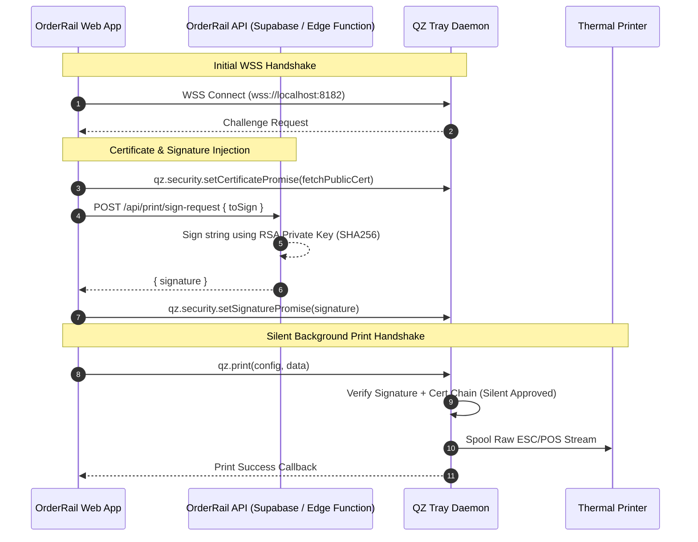
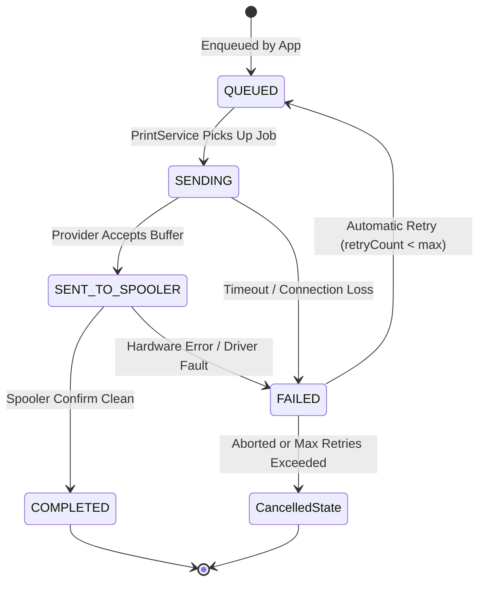
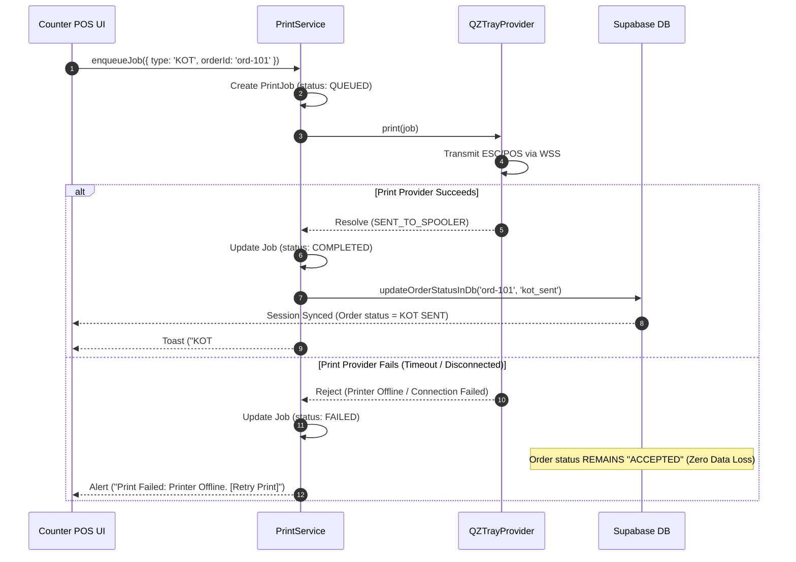
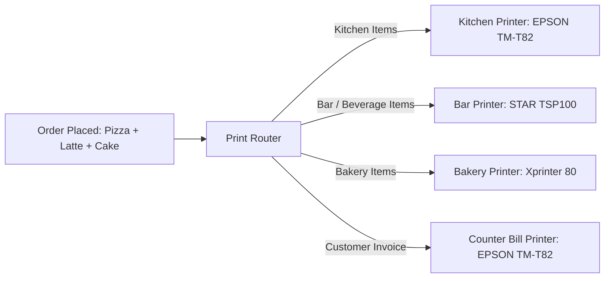

# OrderRail — Printing Infrastructure Architecture & Technical Design Document

**Document Version:** 1.0.0  
**Status:** Approved Architectural Spec  
**Author:** Google DeepMind / OrderRail Core Architecture Team  
**Date:** July 25, 2026  

---

## Executive Summary & Architectural Vision

OrderRail currently relies on browser-native printing via `window.print()`. While this served well for the MVP, browser print dialogs introduce operational friction during high-volume cafe operations:
1. Cashiers must manually confirm browser print dialogs for every receipt and KOT.
2. Large or slow browser rendering engines cause UI blocking during peak hours.
3. Silent background printing is impossible without raw hardware provider integration.
4. Flexible printer routing (e.g., KOTs to kitchen thermal printer, Customer Bills to counter thermal printer) cannot be configured cleanly within standard browser print popups.

This document establishes the **Production Printing Infrastructure Architecture** for OrderRail. It defines a silent, decoupled, provider-based printing framework that abstracts hardware communication behind a unified `PrintService` contract. The system initially integrates **QZ Tray** via Secure WebSockets (`wss://`) while preserving seamless extensibility for future native print agents, cloud queues, and multi-station kitchen routing.

---

## 1. High-Level Architecture & Provider Model

### Architectural Strategy
The core web application must **never** directly invoke QZ Tray APIs (`qz.*`) or couple itself to a specific hardware library. All printing actions are dispatched to an abstract `PrintService`, which delegates execution to an active `PrintProvider`.

```mermaid
graph TD
    SubGraph_App["OrderRail Core Application"]
        CounterUI["Counter / POS UI"]
        OrderManager["Order State Machine"]
    End

    SubGraph_Service["Print Service Subsystem"]
        PrintService["PrintService (Facade & Queue Manager)"]
        PrintJobStore["PrintJobStore (IndexedDB / LocalStorage)"]
    End

    SubGraph_Providers["Provider Abstraction Layer"]
        PrintProvider["<<Interface>> PrintProvider"]
        MockProvider["MockProvider (Unit Tests & Sandbox)"]
        BrowserProvider["BrowserPrintProvider (Fallback)"]
        QZTrayProvider["QZTrayProvider (Production WSS)"]
        AgentProvider["OrderRailPrintAgentProvider (Future Direct Socket)"]
    End

    SubGraph_Hardware["Physical Hardware & Local Services"]
        QZTrayDaemon["QZ Tray Daemon (WSS :8182)"]
        OSSpooler["OS Print Spooler (Windows / CUPS)"]
        ThermalPrinters["Thermal Printers (80mm / 58mm)"]
    End

    CounterUI -->|enqueueJob| PrintService
    OrderManager -->|queryState| PrintService
    PrintService -->|persist| PrintJobStore
    PrintService -->|dispatches to| PrintProvider

    PrintProvider <|.. MockProvider
    PrintProvider <|.. BrowserProvider
    PrintProvider <|.. QZTrayProvider
    PrintProvider <|.. AgentProvider

    QZTrayProvider -->|WSS JSON-RPC| QZTrayDaemon
    QZTrayDaemon -->|Native Driver| OSSpooler
    OSSpooler -->|USB / Network| ThermalPrinters
```

### Component Responsibilities

| Component | Primary Responsibility |
| :--- | :--- |
| **`CounterUI` / `SummaryPanel`** | Triggers print intents (e.g., `printKot(order)`, `printBill(receipt)`). Completely unaware of hardware details. |
| **`PrintService`** | Manages job queuing, retry backoff, provider lifecycle, and job status notifications. |
| **`PrintJobStore`** | Persists `PrintJob` execution history locally for auditing, retry recovery, and offline support. |
| **`PrintProvider` (Interface)** | Defines canonical hardware methods: `connect()`, `discoverPrinters()`, `print(job)`, `getStatus()`. |
| **`QZTrayProvider`** | Implements WSS connection management, RSA-SHA256 signature requests, and ESC/POS payload transport via QZ Tray JS library. |
| **`MockProvider`** | Simulates instant or delayed print responses for automated unit testing and dev environment testing. |
| **`OrderRailPrintAgentProvider`**| Future native local daemon communicating via direct TCP/IP `9100` raw sockets. |

---

## 2. QZ Tray Capability & Integration Spec

### 2.1 Installation & System Prerequisites
- **Target Machine**: Counter Workstation PC (Windows 10/11, macOS 11+, or Ubuntu Linux).
- **Runtime Requirement**: Adoptium OpenJDK 11+ or bundled Java JRE packaged inside QZ Tray installer (`QZ Tray v2.2.x`).
- **Daemon Footprint**: Lightweight background service (~45 MB RAM) with automatic system startup.

### 2.2 WebSocket Communication & Protocols
- **Primary Endpoint**: `wss://localhost:8182` (Secure WebSocket with self-signed or trusted QZ CA root).
- **Fallback Endpoints**: `wss://127.0.0.1:8182`, `ws://localhost:8181` (Unencrypted fallback if SSL blocked).
- **Heartbeat & Connection Management**: `PrintService` maintains a persistent WSS connection. If connection drops, an exponential backoff auto-reconnect strategy attempts re-connection at 1s, 2s, 5s, 10s, up to 30s intervals.

### 2.3 Security, Certificate & Digital Signature Model
To suppress QZ Tray's native "Allow site to print?" security prompt, OrderRail implements digital certificate signing:



#### Security Implementation Rules
1. **Public Certificate**: `override.crt` hosted on OrderRail CDN/API containing OrderRail's X.509 public key.
2. **Backend Signing Endpoint**: `/api/print/sign-request` signs arbitrary QZ challenge strings using OrderRail's private key stored securely in environment variables (Supabase Secret Vault / Vercel Env Secrets).
3. **Zero Security Prompts**: Once configured, cashier experiences 100% silent, uninterrupted printing.

---

## 3. Printer Discovery & Identifier Mapping

### 3.1 Printer Discovery Mechanism
Printers are discovered using `qz.printers.find()`, which queries the local OS print spooler (Windows Print Spooler / CUPS).

```typescript
export interface DiscoveredPrinter {
  name: string;           // e.g., "EPSON TM-T82III Receipt"
  isDefault: boolean;     // System default flag
  connectionType: 'USB' | 'NETWORK' | 'SERIAL' | 'VIRTUAL';
}
```

### 3.2 Identifier Stability Analysis

| Identifier Type | Example | Stability Across Reboots | Re-plug Stability | Recommendation |
| :--- | :--- | :--- | :--- | :--- |
| **OS Spooler Name** | `EPSON_TM_T82_KOT` | **High** | **High** (Bound to OS driver) | **RECOMMENDED FOR MVP** |
| **USB Port ID** | `USB001`, `COM3` | Low | Low (Changes if cable re-plugged) | Avoid binding directly |
| **MAC / IP Address** | `192.168.1.150` | High (if static) | High | Recommended for Network ESC/POS |

### 3.3 Logical Destination Mapping Strategy
OrderRail decouples application print targets from physical printer names. The application speaks exclusively to **Logical Destinations**:

- **`KOT_PRINTER`**: Logical target for Kitchen Order Tickets.
- **`BILL_PRINTER`**: Logical target for Customer Invoices / Receipts.
- **`DEFAULT_PRINTER`**: Fallback target for single-printer setups.

```typescript
export interface PrinterMappingConfig {
  mode: 'SINGLE_PRINTER' | 'DUAL_PRINTER';
  kotPrinterName: string;   // e.g. "EPSON_TM_T82_KITCHEN"
  billPrinterName: string;  // e.g. "EPSON_TM_T82_COUNTER"
  paperWidth: '80mm' | '58mm';
  autoCut: boolean;
  kickCashDrawer: boolean;
}
```

---

## 4. Print Job Model & Lifecycle State Machine

### 4.1 Data Models (`PrintJob`)

```typescript
export type PrintJobType = 'KOT' | 'BILL' | 'TEST';
export type PrintDestination = 'KOT_PRINTER' | 'BILL_PRINTER' | 'DEFAULT_PRINTER';

export type PrintJobStatus = 
  | 'QUEUED'           // Created in local queue
  | 'SENDING'          // Dispatched to provider
  | 'SENT_TO_SPOOLER'  // Accepted by local spooler / daemon
  | 'COMPLETED'        // Spooler returned clean completion
  | 'FAILED'           // Permanent failure after retries
  | 'CANCELLED';       // Manually aborted by staff

export interface PrintPayload {
  rawEscPosHex?: string;    // Compiled ESC/POS binary hex string
  htmlSnippet?: string;      // HTML fallback for browser preview
  plainText?: string;       // Fallback ascii text
}

export interface PrintJob {
  id: string;                // UUID (e.g. "job-98421-a7")
  type: PrintJobType;
  orderId?: string;          // Associated Order ID
  sessionCode?: string;      // Associated Dining Session
  destination: PrintDestination;
  printerName: string;       // Physical target printer name
  payload: PrintPayload;
  status: PrintJobStatus;
  retryCount: number;
  maxRetries: number;
  errorMessage?: string;
  createdAt: string;         // ISO timestamp
  updatedAt: string;         // ISO timestamp
}
```

### 4.2 State Machine Diagram



---

## 5. Transaction Boundaries & Data Consistency

### Critical Rule: Order Status State Guarantees
Order status transitions in OrderRail (e.g., from `ACCEPTED` -> `KOT_SENT`) **must be bound strictly to the Print Service transaction boundary**.



#### State Consistency Principles
1. **Zero Premature Transitions**: Order status `ACCEPTED` is never advanced to `KOT_SENT` before the print provider acknowledges spooler handoff.
2. **Idempotency**: Retrying a print job re-uses the existing `PrintJob.id` and payload, avoiding duplicate database records or ambiguous counter state.

---

## 6. Error Handling & Failure Matrix

| Failure Scenario | Root Cause | System Behavior & Order Status | Cashier Recovery Action |
| :--- | :--- | :--- | :--- |
| **QZ Tray Daemon Offline** | QZ Tray not started / Java crash | Order status remains `ACCEPTED`. PrintJob marked `FAILED`. | Top bar displays **"Print Agent Offline"**. Prompt: **"Start QZ Tray or use Manual Print"**. |
| **WSS Disconnected** | Local network / loopback interface drop | PrintService attempts 3 auto-reconnects. Order status remains unchanged. | Auto-reconnect banner displays. **"Retry Connection"** button available. |
| **Printer Offline / Unplugged** | USB cable loose or thermal printer powered off | Provider timeout (5000ms). Job marked `FAILED`. Order remains `ACCEPTED`. | Alert dialog: **"Printer Offline: Check power & USB cable."** Button: **[Retry Print]**. |
| **Paper Out / Cover Open** | Thermal printer mechanism fault | OS Spooler buffers job. Provider handoff succeeds or times out. | Cashier fixes paper, then clicks **[Reprint KOT]** on order card. |
| **Invalid Printer Name** | Configured printer renamed or deleted in Windows | Provider throws `PrinterNotFoundException`. Job marked `FAILED`. | Navigates cashier to **Owner Settings -> Printers** to re-select active printer. |
| **RSA Signature Error** | Expired cert / backend signing offline | Fallback to un-signed connection mode (triggers browser prompt). | Warning toast; system logs signature failure silently for admin inspection. |

---

## 7. Paper Status & Hardware Inquiries (Epson vs Generic)

### Technical Findings
1. **OS Spooler Abstraction Barrier**: Standard Windows Print Spooler and CUPS APIs treat thermal printers as write-only devices. They return `Success` as soon as raw bytes enter the OS spool buffer.
2. **Raw ESC/POS Status Commands (`DLE EOT n`)**:
   - Epson TM-T series support real-time status inquiry via `DLE EOT 1` (Transmit printer status) and `DLE EOT 4` (Transmit paper sensor status).
   - Low-cost white-label ESC/POS printers (Xprinter, TVS, Hoin) frequently return malformed status bytes or freeze WSS sockets on status requests over generic USB-to-Serial bridges.

### Operational Recommendation for MVP
- **Do NOT rely on automated hardware paper-out polling for MVP status transitions**.
- Bind the transaction boundary to **OS Spooler Handoff Confirmation**.
- Standardize on **`Reprint KOT`** / **`Reprint Bill`** as the primary operational recovery workflow for paper-out, cover open, or thermal paper jams.

---

## 8. Payload Format Strategy (ESC/POS DSL vs HTML)

### Format Evaluation Matrix

| Payload Format | Print Speed | Cash Drawer Kick | Auto Paper Cut | Rendering Precision | Recommendation |
| :--- | :--- | :--- | :--- | :--- | :--- |
| **ESC/POS Binary Stream** | **Ultra Fast (<100ms)** | ✅ Native (`ESC p 0 25 250`) | ✅ Native (`GS V 66 0`) | **100% Perfect Sharp Text** | **PRIMARY PRODUCTION FORMAT** |
| **HTML / Canvas Raster** | Slow (1500ms+) | ❌ Requires driver hack | ❌ Driver dependent | Blur / Margin issues | Fallback for web preview |
| **PDF Document** | Slow (2000ms+) | ❌ Not supported | ❌ Driver dependent | Heavy memory load | Avoid for POS |

### ESC/POS Command Standard (OrderRail Thermal Format)
OrderRail standardizes on raw ESC/POS command generation:
- **Initialization**: `ESC @` (`0x1B 0x40`)
- **Center Alignment**: `ESC a 1` (`0x1B 0x61 0x01`)
- **Bold Text**: `ESC E 1` (`0x1B 0x45 0x01`)
- **Double Height/Width**: `GS ! 0x11` (`0x1D 0x21 0x11`)
- **Full Cut**: `GS V 66 0` (`0x1D 0x56 0x42 0x00`)
- **Cash Drawer Pulse**: `ESC p 0 25 250` (`0x1B 0x70 0x00 0x19 0xFA`)

---

## 9. TypeScript API Contracts & Provider Specification

```typescript
/**
 * Canonical Print Service Provider Interface
 * All underlying print drivers (QZ Tray, Mock, Browser, Native) implement this contract.
 */
export interface IPrintProvider {
  readonly id: string;
  readonly name: string;
  
  /** Initialize provider and open persistent connection */
  initialize(): Promise<void>;

  /** Check if provider connection is alive */
  isConnected(): boolean;

  /** Discover all accessible local & network printers */
  discoverPrinters(): Promise<DiscoveredPrinter[]>;

  /** Execute silent background print job */
  printJob(job: PrintJob): Promise<boolean>;

  /** Close connection and release resources */
  dispose(): Promise<void>;
}

/**
 * Main Application Print Facade
 */
export interface IPrintService {
  /** Set active provider (e.g. QZTrayProvider vs MockProvider) */
  setProvider(provider: IPrintProvider): void;

  /** Enqueue a print job for execution */
  enqueue(
    type: PrintJobType,
    destination: PrintDestination,
    payload: PrintPayload,
    orderId?: string
  ): Promise<PrintJob>;

  /** Retry a failed print job */
  retryJob(jobId: string): Promise<boolean>;

  /** Retrieve queued / historical jobs */
  getJobHistory(): PrintJob[];

  /** Subscribe to print service status updates */
  subscribeStatus(callback: (status: { connected: boolean; activeProvider: string }) => void): () => void;
}
```

---

## 10. Owner Configuration UI Specification (Behavioral)

The Owner Operations Center (`/owner/settings`) will feature a dedicated **Printer Management Panel**:

```
─────────────────────────────────────────────────────────────────────────────
 🖨️ PRINTER SETTINGS                                    [ Connection: ONLINE ]
─────────────────────────────────────────────────────────────────────────────
 Printing Mode:
 (•) Single Printer (KOT + Bills on same thermal printer)
 ( ) Dual Printers   (Separate Kitchen KOT & Counter Bill printers)

 ── Primary Printer Configuration ──────────────────────────────────────────
 KOT Printer:    [ EPSON TM-T82III Receipt (USB001)       ▼ ]  [ Test Print ]
 Bill Printer:   [ EPSON TM-T82III Receipt (USB001)       ▼ ]  [ Test Print ]

 Paper Size:     (•) 80mm (3-inch Standard)   ( ) 58mm (2-inch Compact)
 Hardware Ops:   [✓] Auto Paper Cut           [✓] Open Cash Drawer on Bill
─────────────────────────────────────────────────────────────────────────────
```

### Behavioral Spec Rules
1. **Auto-Discovery**: Opening the panel automatically invokes `PrintService.discoverPrinters()` and populates dropdowns with live OS printer names.
2. **Test Print Action**: Clicking **[Test Print]** sends a non-intrusive test payload (`ORDERRAIL TEST PRINT - SUCCESS`) directly to the selected printer.
3. **Persisted Configuration**: Printer selection is stored in `localStorage` under `orderrail_printer_config_v1` with Supabase sync for multi-workstation cafes.

---

## 11. Future Scalability & Multi-Station Kitchen Routing

The provider model designed today natively supports multi-station kitchen routing for future enterprise cafe releases:



By decoupling `PrintDestination` from static strings into dynamic station tokens (`STATION_KITCHEN`, `STATION_BAR`), OrderRail will support arbitrary printer routing without refactoring core POS or database state logic.

---

## 12. Production Deployment Checklist & Implementation Roadmap

### Phase 1: Core Provider Infrastructure & Contracts (Sprint 1)
- [ ] Create `src/lib/printing/` architecture folder structure.
- [ ] Implement `IPrintProvider`, `PrintService`, and `MockProvider`.
- [ ] Implement `PrintJobStore` (IndexedDB persistence for print jobs).
- [ ] Add unit tests verifying print job queue state transitions (`QUEUED` -> `COMPLETED` / `FAILED`).

### Phase 2: QZ Tray Provider Integration & Backend Signing (Sprint 2)
- [ ] Install QZ Tray JS client SDK (`qz-tray`).
- [ ] Create Supabase Edge Function `/api/print/sign-request` for RSA-SHA256 signature generation.
- [ ] Implement `QZTrayProvider` with auto-reconnect WSS logic.
- [ ] Build ESC/POS binary stream compiler for KOTs and Receipts.

### Phase 3: Owner Configuration UI & Counter Integration (Sprint 3)
- [ ] Build Owner Printer Configuration Panel in `/owner/settings`.
- [ ] Wire `PrintService` to Counter Page action handlers (`Send KOT`, `Reprint KOT`, `Complete Session`).
- [ ] Verify transaction boundary guarantees (Order status updates only after spooler confirmation).

### Phase 4: Production Hardening & Multi-Station Routing (Sprint 4)
- [ ] Field-test across Epson, Star, TVS, and Xprinter hardware.
- [ ] Conduct failure injection testing (Pulling USB cable, running out of paper, QZ daemon crash).
- [ ] Document final operating manual for cafe staff onboarding.

---

**Document Approved By:** OrderRail Technical Architecture Committee  
**Target Implementation Start:** Sprint 2 (Post-Architecture Signoff)  
