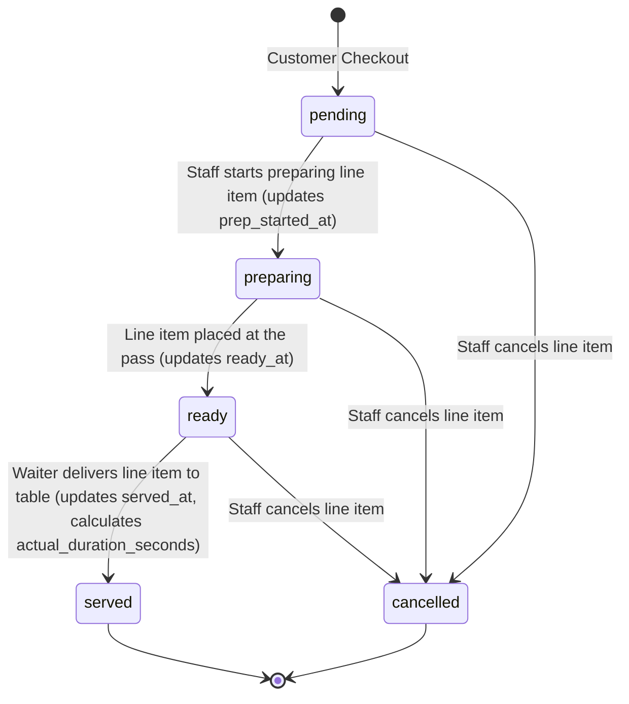
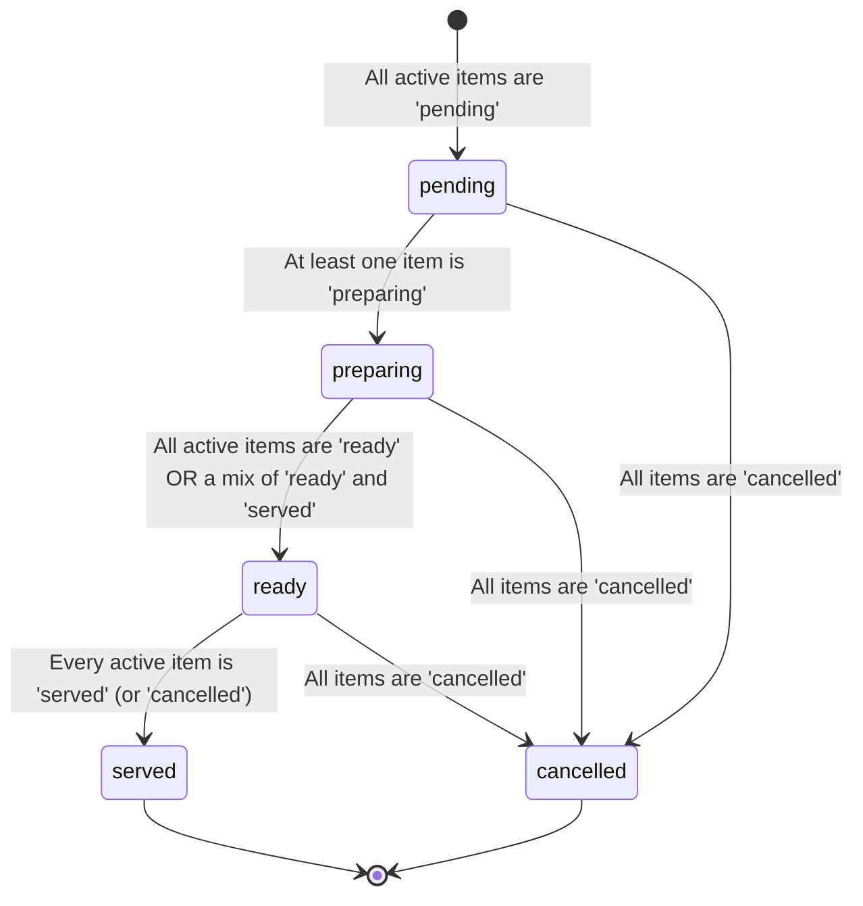

# Kitchen Intelligence PRD v1.0 (Frozen)

This document is the finalized and frozen product requirements, state diagrams, database designs, and estimation engine algorithms for the **Kitchen Intelligence System** of OrderRail. This document serves as the official Version 1.0 specification for all future implementation phases.

---

## 1. Table of Contents
1. [Architecture Changes After Final Review](#1-architecture-changes-after-final-review)
2. [Product Principles](#2-product-principles)
3. [Operational Workflow & Customer Experience](#3-operational-workflow--customer-experience)
4. [Counter Workflow & Staff Interaction](#4-counter-workflow--staff-interaction)
5. [Order Item & Database Architecture](#5-order-item--database-architecture)
6. [ETA Engine & Station Parallelism](#6-eta-engine--station-parallelism)
7. [Timeline & Analytics Specifications](#7-timeline--analytics-specifications)
8. [Alternatives, Trade-Offs, Risks & Open Questions](#8-alternatives-trade-offs-risks--open-questions)
9. [Future Roadmap & Configurations](#9-future-roadmap--configurations)
10. [Implementation Roadmap](#10-implementation-roadmap)

---

## 1. Architecture Changes After Final Review

Following the final architectural freeze review, the following adjustments have been locked into the Version 1.0 specification:
* **Customer Statuses:** Customer-facing item progress is simplified to match the four backend states: `Pending`, `Preparing`, `Ready`, and `Served`. The "Ready" status is designed to support both self-service and full-service cafés.
* **Workflow Visual Emphasizers:** All four status actions remain fully selectable inside the drawer to allow correction of accidental clicks. However, the UI visually highlights both the *current state* and the *recommended next state* to guide staff speed.
* **ETA Queue Model:** New orders are appended to the end of the existing queue for each station. Active orders contribute to each station's backlog, and the final order-level ETA is calculated as the maximum completion time across all stations. Recalculations occur only on meaningful operational events, not on a ticker.
* **Positive Customer Messaging:** The customer tracking UI will never display warning labels like "Delayed", "Late", or "Kitchen Busy". If the calculated ETA is exceeded, the UI transitions to reassuring progress statements.
* **Timeline Additions:** Added `item_ready` to the timeline logger schema.
* **Database Field Rename:** Renamed `prep_time_minutes` to `base_prep_time_minutes`.

---

## 2. Product Principles

These three principles guide all product development for the Kitchen Intelligence System:

* **Principle 1: Consistency over Optimization**
  Do not create different user experiences or workflows for small vs. large orders. Every order follows the exact same interaction model: **Tap card ➔ Open drawer ➔ Manage status ➔ Close drawer**.
* **Principle 2: Hide Operational Complexity**
  Expose simple progress metrics to customers. Keep internal calculations, queues, and preparation bottleneck notifications hidden. Use positive reassurance instead of displaying delays.
* **Principle 3: Counter Coordination**
  The counter staff coordinates all kitchen operations on a single dashboard. OrderRail RC1 does **NOT** include "Kitchen Mode", "Waiter Mode", or "Chef Displays". These are reserved for future roadmap expansions.

---

## 3. Operational Workflow & Customer Experience

### 3.1 Physical Café Workspace Routing
Cafés route items to specific preparation zones. We define two primary stations:
1. **Coffee Station (Barista):** Prepares hot/cold drinks (e.g., Cappuccino, Iced Latte).
2. **Kitchen Station (Cook):** Prepares cooked foods (e.g., Pasta, Pizza, Toasted Sandwiches).

### 3.2 Customer Tracking Experience
The customer order status screen displays a single rounded estimate (e.g., `≈ 20 mins`) and a checklist of item statuses. 

#### Positive Messaging Rules:
If the calculated ETA timestamp is exceeded before all items are served, the system transitions the display text from the time estimate to one of the following random/rotated reassuring progress messages:
* *"Your order is being freshly prepared."*
* *"Almost ready."*
* *"We're putting the finishing touches on your order."*

> [!IMPORTANT]
> The interface must **never** expose words like "Late", "Delayed", "Overloaded", or "Kitchen Busy". This protects the café's brand integrity and avoids customer friction.

---

## 4. Counter Workflow & Staff Interaction

To optimize screen space and build muscle memory, counter staff manage order items using a modal drawer pattern. Inside this drawer, all four status controls are selectable, but the current state and recommended next logical step are highlighted.

```
+───────────────────────────────────────────────────+
| ORDER DRAWER — Order #0024                        |
+───────────────────────────────────────────────────+
|  1 x Cappuccino (Current: Prep)                   |
|  [ Pending ]  ===[ PREPARING ]===► [*READY*]  [ Served ]
|               (Current Active)     (Recommended)  |
|                                                   |
|  1 x Pasta (Current: Pending)                     |
|  [ Pending ]  ===[ *PREPARING* ]===► [ Ready ]  [ Served ]
|               (Recommended)                       |
|                                                   |
|                        [ Close Drawer ]           |
+───────────────────────────────────────────────────+
```

### Staff Interaction Steps:
1. **Tap Card:** Staff taps the order card on the dashboard.
2. **Open Drawer:** A bottom drawer overlays the page containing itemized lines.
3. **Manage Status:** Staff clicks a status button. The button matching the recommended transition (e.g. from `preparing` to `ready`) is given a stronger visual style (e.g. outline glow or bold text), but other states remain clickable to allow correction.
4. **Close Drawer:** Staff closes the drawer to return to the Kanban overview.

---

## 5. Order Item & Database Architecture

### 5.1 Updated Schema Proposal
To support analytics, station routing, and item state management, we will apply these schema updates:

```sql
-- 1. Create order item status enum
CREATE TYPE public.order_item_status AS ENUM ('pending', 'preparing', 'ready', 'served', 'cancelled');

-- 2. Create preparation station enum
CREATE TYPE public.prep_station AS ENUM ('coffee', 'kitchen');

-- 3. Add station field and rename preparation setting on menu_items
ALTER TABLE public.menu_items 
ADD COLUMN station public.prep_station NOT NULL DEFAULT 'kitchen',
ADD COLUMN base_prep_time_minutes INTEGER NOT NULL DEFAULT 5;

-- 4. Add status and analytics fields to order_items
ALTER TABLE public.order_items 
ADD COLUMN status public.order_item_status NOT NULL DEFAULT 'pending',
ADD COLUMN prep_started_at TIMESTAMP WITH TIME ZONE NULL,
ADD COLUMN ready_at TIMESTAMP WITH TIME ZONE NULL,
ADD COLUMN served_at TIMESTAMP WITH TIME ZONE NULL,
ADD COLUMN predicted_duration_seconds INTEGER NULL,
ADD COLUMN actual_duration_seconds INTEGER NULL;

-- 5. Add ETA tracking to orders
ALTER TABLE public.orders 
ADD COLUMN eta_timestamp TIMESTAMP WITH TIME ZONE NULL,
ADD COLUMN eta_calculated_at TIMESTAMP WITH TIME ZONE NULL;

-- 6. Add performance indexes
CREATE INDEX idx_order_items_status ON public.order_items(status);
CREATE INDEX idx_menu_items_station ON public.menu_items(station);
```

### 5.2 State Machine Diagrams

#### Order Item Lifecycle (Bundled Line Item)
An order item represents a single line (e.g. *Coffee x4*). All status updates apply to the line as a whole:



#### Order Lifecycle (Dynamic State Rollup)
The parent order's status is rolled up dynamically from its child items:



---

## 6. ETA Engine & Station Parallelism

The ETA engine uses a parallel-processing model based on café stations.

### 6.1 Parallel and Sequential Station Logic
* **Parallel Work Across Stations:** Preparation occurs concurrently at the **Coffee** and **Kitchen** stations. Therefore, we calculate the total preparation duration for each station separately and take the maximum.
* **Sequential Queueing Within Stations:** Items routed to the *same* station queue sequentially.
* **Queue Appending:** Any newly placed order is appended to the end of the existing queue for each station. Existing active orders in the queue (`pending` and `preparing`) contribute to each station's backlog calculation.

### 6.2 The Mathematical Formula
For a new order $O_{new}$:

1. **Calculate Base Prep Time per Item Line ($T_{item}$):**
   To scale preparation time for larger quantities within a line item, we apply a quantity discount factor:
   $$T_{item} = Item.base\_prep\_time\_minutes \times (1 + (Qty - 1) \times S_{factor})$$
   *Where $S_{factor}$ represents batching efficiencies (default: `0.3` for drinks, `0.5` for kitchen foods).*

2. **Calculate Station Queue backlogs ($Wait_{station}$):**
   Sum the scaled times of all active items in the queue backlog for that station:
   $$Wait_{station} = \sum_{j \in Q_{station\_backlog}} T_{item}(j)$$
   *Where $Q_{station\_backlog}$ contains all existing items at the station with status `pending` or `preparing`.*

3. **Calculate Total Completion Time per Station ($D_{station}$):**
   $$D_{station} = Wait_{station} + \sum_{k \in O_{new\_station}} T_{item}(k)$$

4. **Compute Dynamic Base ETA:**
   $$ETA_{base} = \max_{s \in Stations} (D_s)$$

5. **Apply Buffer & Rounding:**
   * **Dynamic Safety Buffer:** Add $+3$ minutes if queue load is high, or during peak hours.
   * **Rounding:** Round the final value up to the nearest 5-minute increment. Display to the customer as `≈ X mins`.

### 6.3 Refresh Trigger Rules
To prevent unnecessary database calculation thrashing:
* Recalculate and update the cached `eta_timestamp` **only** on meaningful operational events:
  * A new order is submitted.
  * A line item status changes (e.g. from preparing to ready).
  * A line item or order is cancelled.
  * Café queue backlog changes.
* **Never** recalculate ETA on a tick interval (e.g. every second).

---

## 7. Timeline & Analytics Specifications

### 7.1 Timeline Event Logging
To prevent database inflation and event clutter, the timeline logs only five critical event types:

| Event Type | Actor | Metadata Logged |
| :--- | :--- | :--- |
| `order_placed` | Customer | `order_id`, `items_list`, `timestamp` |
| `item_preparing` | Staff | `order_id`, `order_item_id`, `item_name`, `station` |
| `item_ready` | Staff | `order_id`, `order_item_id`, `item_name` |
| `item_served` | Staff | `order_id`, `order_item_id`, `item_name`, `served_by` |
| `order_completed` | Staff | `order_id`, `total_prep_duration_seconds` |

### 7.2 Analytics Fields
For every `order_items` entry, we capture performance values to train future prediction models:
* `predicted_duration_seconds`: Original duration predicted by the ETA engine.
* `actual_duration_seconds`: Difference between `prep_started_at` and `ready_at`.
* `prep_started_at`: Timestamp when the item moved to `preparing`.
* `ready_at`: Timestamp when the item moved to `ready`.
* `served_at`: Timestamp when the item moved to `served`.

---

## 8. Alternatives, Trade-Offs, Risks & Open Questions

### 8.1 Evaluated Alternatives

* **Alternative A: Inline Kanban Item Controls**
  * *Trade-off:* Saves one tap, but clutters the board interface and increases accidental touch mistakes.
  * *Decision:* Rejected. The drawer layout provides clean button tap surfaces and fits mobile tablets.
* **Alternative B: Individual Item ETAs**
  * *Trade-off:* High precision for customer, but high frustration risk if one item is delayed.
  * *Decision:* Rejected. Hiding complexity protects the customer experience.

### 8.2 Operational Risks & Mitigation

1. **Accidental Taps:** Staff might tap the wrong status button in the drawer.
   * *Mitigation:* Ensure status buttons are not instant-triggers or provide an easy "Undo" action in the drawer before closing.
2. **Staff Workflow Bottleneck:** Tapping items in a drawer takes extra time.
   * *Mitigation:* Keep the drawer design clean. Auto-advance items to the next logical state when tapped, reducing the need to select specific states manually.

---

## 9. Future Roadmap & Configurations

### 9.1 Café Type Configuration
To support diverse operational business models in future versions (post-RC1 validation), we document a planned owner setting:
* **Cafe Type** Setting:
  * `Full Service`: Food and drinks are run directly to the customer's table by waiters.
  * `Self Service`: Customers pick up food and drinks from the counter when notified.
* **Behavior:** This setting is **out of scope** for the current RC1 codebase. It will be implemented post-validation and will control customer-facing wording only (e.g. *"Your coffee is ready at the counter!"* vs *"Your coffee is on the way!"*).

---

## 10. Implementation Roadmap

```
┌──────────────────────────────────────────────────────────┐
│ Sprint U3B: DB Migrations, Station & Prep Time Settings   │
└────────────────────────────┬─────────────────────────────┘
                             ▼
┌──────────────────────────────────────────────────────────┐
│ Sprint U3C: Staff Order Drawer & Item Status Updates     │
└────────────────────────────┬─────────────────────────────┘
                             ▼
┌──────────────────────────────────────────────────────────┐
│ Sprint U3D: ETA Parallel Engine & Timeline Event Logs    │
└────────────────────────────┬─────────────────────────────┘
                             ▼
┌──────────────────────────────────────────────────────────┐
│ Sprint U3E: Customer Progress Checklist UI & QA          │
└──────────────────────────────────────────────────────────┘
```

### Confirmation
This Product Requirements Document (PRD) and Architecture Specification is **confirmed as implementation-ready** for **Sprint U3B**.
