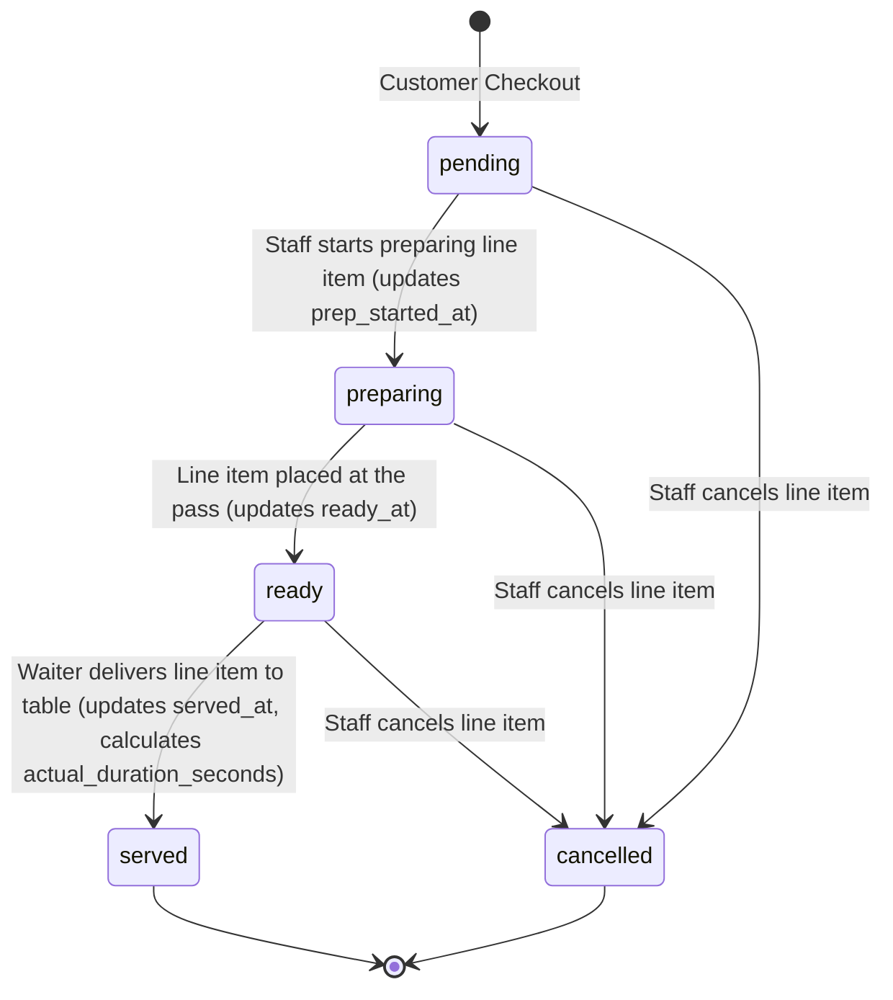
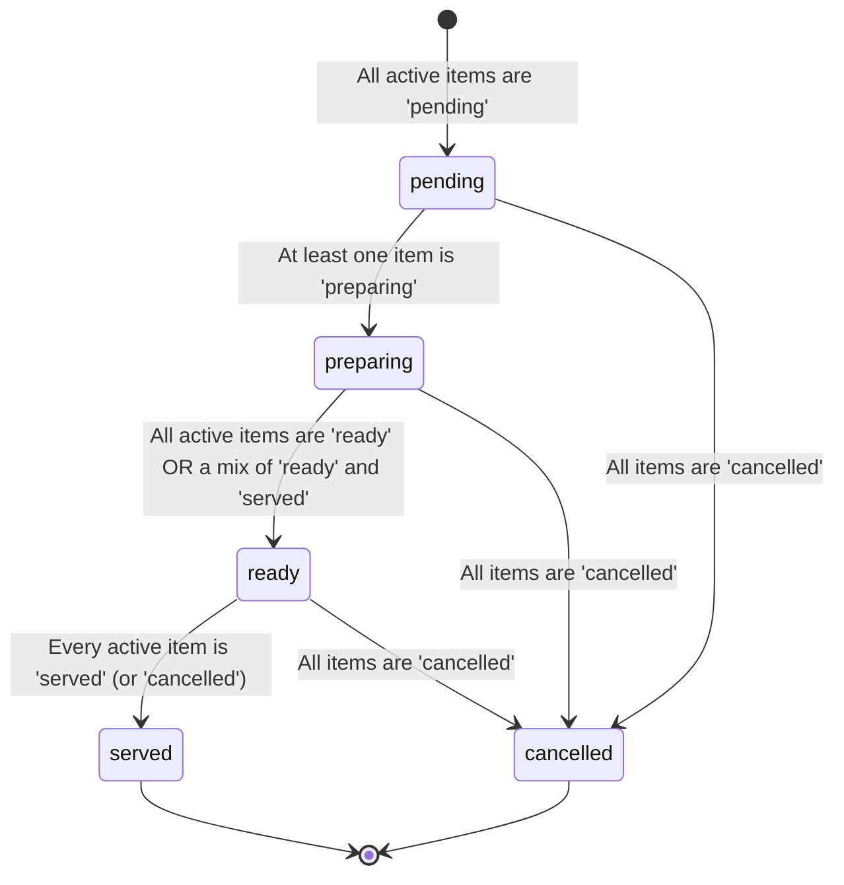

# Sprint U3A: Kitchen Intelligence Architecture & Operational Analysis (Revised)

This document is the finalized product requirements, state diagrams, database designs, and estimation engine algorithms for the **Kitchen Intelligence System** of OrderRail. It incorporates all review adjustments and serves as the official reference specification for implementation.

---

## 1. Table of Contents
1. [Architecture Changes After Final Review](#1-architecture-changes-after-final-review)
2. [Product Principles](#2-product-principles)
3. [Operational Workflow & Customer Experience](#3-operational-workflow--customer-experience)
4. [Counter Workflow & Staff Interaction](#4-counter-workflow--staff-interaction)
5. [Order Item & Database Architecture](#5-order-item--database-architecture)
6. [ETA Engine & Station Parallelism](#6-eta-engine--station-parallelism)
7. [Timeline & Analytics Specifications](#7-timeline--analytics-specifications)
8. [Alternatives, Trade-Offs, Risks & Open Questions](#8-alternatives-trade-offs-risks--open-questions)
9. [Implementation Roadmap](#9-implementation-roadmap)

---

## 1. Architecture Changes After Final Review

Following the final architectural review, the following key modifications have been integrated into the system design:
* **Workflow Simplification:** Removed all inline item controls from Kanban cards. Instead, a unified **Order Drawer** pattern has been introduced. Staff open the drawer by tapping the order card, manage item statuses, and close the drawer.
* **Order Item Model definition:** Confirmed that an `OrderItem` represents one menu line (e.g., *Coffee x4* is one item with quantity = 4, not four separate entries). Status transitions apply to the entire line.
* **Station Parallelism in ETA:** The ETA engine now splits calculations by physical preparation stations. Calculation runs in parallel across stations (e.g., drinks and kitchen food cook simultaneously), but sequentializes items within the same station.
* **Aggregated Order Completion Rule:** An order is marked as `served` (completed) if and only if all active items are either `served` or `cancelled`. Partial serving does not complete the order.
* **Strict Privacy for Customers:** Customers never see station queues, parallel execution offsets, or detailed math. They only see a rounded range (e.g., `≈ 20 mins`) and a checklist of item statuses.

---

## 2. Product Principles

These three principles guide all product development for the Kitchen Intelligence System:

* **Principle 1: Consistency over Optimization**
  Do not create different user experiences or workflows for small vs. large orders. Every order follows the exact same interaction model: **Tap card ➔ Open drawer ➔ Manage status ➔ Close drawer**.
* **Principle 2: Hide Operational Complexity**
  Expose simple progress metrics to customers. Keep internal calculations, queues, and preparation bottleneck notifications hidden.
* **Principle 3: Counter Coordination**
  The counter staff coordinates all kitchen operations on a single dashboard. OrderRail RC1 does **NOT** include "Kitchen Mode", "Waiter Mode", or "Chef Displays". These are reserved for future roadmap expansions.

---

## 3. Operational Workflow & Customer Experience

### 3.1 Physical Café Workspace Routing
Cafés route items to specific preparation zones. We define two primary stations:
1. **Coffee Station (Barista):** Prepares hot/cold drinks (e.g., Cappuccino, Iced Latte).
2. **Kitchen Station (Cook):** Prepares cooked foods (e.g., Pasta, Pizza, Toasted Sandwiches).

### 3.2 Customer Tracking Experience
The customer order status screen remains simple. It displays a unified order-level ETA and a simple check-list status for each order line.

#### Customer UI Mockup:
```
+-----------------------------------------------------+
|                  ORDER STATUS                       |
|                  Order #0024                        |
+-----------------------------------------------------+
|                                                     |
|   Estimated Wait Time:                              |
|   [     ≈ 20 mins     ]  <-- Rounded order-level ETA |
|                                                     |
|   Status: Preparing food & beverages                |
|                                                     |
+-----------------------------------------------------+
|   ITEMS                                             |
|                                                     |
|   [✓] 1 x Cappuccino            (Served)            |
|   [ ] 1 x Pasta                 (Preparing)         |
|   [ ] 1 x Pizza                 (Preparing)         |
|                                                     |
+-----------------------------------------------------+
|              [ Call Service / Bill ]                |
+-----------------------------------------------------+
```

---

## 4. Counter Workflow & Staff Interaction

To optimize screen space and build muscle memory, counter staff manage order items using a modal drawer pattern.

```
       Counter Dashboard (Staff Kanban Board)
+───────────────────────────────────────────────────+
| Pending (1)      | Preparing (2)  | Ready/Served  |
|                  |                |               |
| [Order #0024] ───┼───────────► (Staff Taps Card)  |
| 1x Cappuccino    |                                |
| 1x Pasta         |                                |
|                  |                                |
+──────────────────┴────────────────────────────────+
                             │
                             ▼ (Drawer Slides Up)
+───────────────────────────────────────────────────+
| ORDER DRAWER — Order #0024                        |
+───────────────────────────────────────────────────+
|  [x] 1 x Cappuccino       [ Pending | Prep | READY | SERVED ]
|  [ ] 1 x Pasta            [ Pending | PREP | Ready | Served ]
|  [ ] 1 x Pizza            [ PENDING | Prep | Ready | Served ]
|                                                   |
|                        [ Close Drawer ]           |
+───────────────────────────────────────────────────+
```

### Staff Interaction Steps:
1. **Tap Card:** Staff taps the order card on the dashboard.
2. **Open Drawer:** A bottom drawer overlays the page containing itemized lines.
3. **Manage Status:** Staff taps status pill buttons next to each line to advance or update state.
4. **Close Drawer:** Staff closes the drawer to return to the Kanban overview.

---

## 5. Order Item & Database Architecture

### 5.1 Updated Schema Proposal
To support analytics, station routing, and item state management, we will apply these schema updates:

```sql
-- 1. Create order item status enum
CREATE TYPE public.order_item_status AS ENUM ('pending', 'preparing', 'ready', 'served', 'cancelled');

-- 2. Create preparation station enum
CREATE TYPE public.prep_station AS ENUM ('coffee', 'kitchen');

-- 3. Add station field to menu_items
ALTER TABLE public.menu_items 
ADD COLUMN station public.prep_station NOT NULL DEFAULT 'kitchen',
ADD COLUMN prep_time_minutes INTEGER NOT NULL DEFAULT 5;

-- 4. Add status and analytics fields to order_items
ALTER TABLE public.order_items 
ADD COLUMN status public.order_item_status NOT NULL DEFAULT 'pending',
ADD COLUMN prep_started_at TIMESTAMP WITH TIME ZONE NULL,
ADD COLUMN ready_at TIMESTAMP WITH TIME ZONE NULL,
ADD COLUMN served_at TIMESTAMP WITH TIME ZONE NULL,
ADD COLUMN predicted_duration_seconds INTEGER NULL,
ADD COLUMN actual_duration_seconds INTEGER NULL;

-- 5. Add ETA tracking to orders
ALTER TABLE public.orders 
ADD COLUMN eta_timestamp TIMESTAMP WITH TIME ZONE NULL,
ADD COLUMN eta_calculated_at TIMESTAMP WITH TIME ZONE NULL;

-- 6. Add performance indexes
CREATE INDEX idx_order_items_status ON public.order_items(status);
CREATE INDEX idx_menu_items_station ON public.menu_items(station);
```

### 5.2 State Machine Diagrams

#### Order Item Lifecycle (Bundled Line Item)
An order item represents a single line (e.g. *Coffee x4*). All status updates apply to the line as a whole:



#### Order Lifecycle (Dynamic State Rollup)
The parent order's status is rolled up dynamically from its child items:



---

## 6. ETA Engine & Station Parallelism

The ETA engine uses a parallel-processing model based on café stations.

### 6.1 Parallel and Sequential Station Logic
* **Parallel Work Across Stations:** Preparation occurs concurrently at the **Coffee** and **Kitchen** stations. Therefore, we calculate the total preparation duration for each station separately and take the maximum.
* **Sequential Queueing Within Stations:** Items routed to the *same* station queue sequentially.

```
Incoming Order:
  - Coffee Station: 1x Cappuccino (4 min)
  - Kitchen Station: 1x Pasta (14 min)

Calculation:
  Coffee Station Duration = 4 mins
  Kitchen Station Duration = 14 mins
  Base ETA = Max(4, 14) = 14 mins
  
Final Customer ETA ≈ 15 mins (Rounded to 5 min range)
```

### 6.2 The Mathematical Formula
For a new order $O_{new}$:

1. **Calculate Base Prep Time per Item Line ($T_{item}$):**
   To scale preparation time for larger quantities within a line item, we apply a quantity discount factor:
   $$T_{item} = Item.prep\_time\_minutes \times (1 + (Qty - 1) \times S_{factor})$$
   *Where $S_{factor}$ represents batching efficiencies (default: `0.3` for drinks, `0.5` for kitchen foods).*

2. **Calculate Station Durations ($D_{station}$):**
   Sum the scaled times of all active items (both existing queue backlog and new items) assigned to that station:
   $$D_{station} = \sum_{j \in Q_{station\_active}} T_{item}(j)$$

3. **Compute Dynamic Base ETA:**
   $$ETA_{base} = \max_{s \in Stations} (D_s)$$

4. **Apply Buffer & Rounding:**
   * **Dynamic Safety Buffer:** Add $+3$ minutes if queue load is high, or during peak hours.
   * **Rounding:** Round the final value up to the nearest 5-minute increment. Display to the customer as `≈ X mins`.

---

## 7. Timeline & Analytics Specifications

### 7.1 Timeline Event Logging
To prevent database inflation and event clutter, the timeline logs only four critical event types:

| Event Type | Actor | Metadata Logged |
| :--- | :--- | :--- |
| `order_placed` | Customer | `order_id`, `items_list`, `timestamp` |
| `item_preparing` | Staff | `order_id`, `order_item_id`, `item_name`, `station` |
| `item_served` | Staff | `order_id`, `order_item_id`, `item_name`, `served_by` |
| `order_completed` | Staff | `order_id`, `total_prep_duration_seconds` |

### 7.2 Analytics Fields
For every `order_items` entry, we capture performance values to train future prediction models:
* `predicted_duration_seconds`: Original duration predicted by the ETA engine.
* `actual_duration_seconds`: Difference between `prep_started_at` and `ready_at`.
* `prep_started_at`: Timestamp when the item moved to `preparing`.
* `ready_at`: Timestamp when the item moved to `ready`.
* `served_at`: Timestamp when the item moved to `served`.

---

## 8. Alternatives, Trade-Offs, Risks & Open Questions

### 8.1 Evaluated Alternatives

* **Alternative A: Inline Kanban Item Controls**
  * *Trade-off:* Saves one tap, but clutters the board interface and increases accidental touch mistakes.
  * *Decision:* Rejected. The drawer layout provides clean button tap surfaces and fits mobile tablets.
* **Alternative B: Individual Item ETAs**
  * *Trade-off:* High precision for customer, but high frustration risk if one item is delayed.
  * *Decision:* Rejected. Hiding complexity protects the customer experience.

### 8.2 Operational Risks & Mitigation

1. **Accidental Taps:** Staff might tap the wrong status button in the drawer.
   * *Mitigation:* Ensure status buttons are not instant-triggers or provide an easy "Undo" action in the drawer before closing.
2. **Staff Workflow Bottleneck:** Tapping items in a drawer takes extra time.
   * *Mitigation:* Keep the drawer design clean. Auto-advance items to the next logical state when tapped, reducing the need to select specific states manually.

### 8.3 Remaining Open Questions
* *What happens if a customer cancels a single item?*
  * *Decision:* The item status is set to `cancelled`, and the parent order's status and ETA are recalculated based on the remaining active items.

---

## 9. Implementation Roadmap

```
┌──────────────────────────────────────────────────────────┐
│ Sprint U3B: DB Migrations, Station & Prep Time Settings   │
└────────────────────────────┬─────────────────────────────┘
                             ▼
┌──────────────────────────────────────────────────────────┐
│ Sprint U3C: Staff Order Drawer & Item Status Updates     │
└────────────────────────────┬─────────────────────────────┘
                             ▼
┌──────────────────────────────────────────────────────────┐
│ Sprint U3D: ETA Parallel Engine & Timeline Event Logs    │
└────────────────────────────┬─────────────────────────────┘
                             ▼
┌──────────────────────────────────────────────────────────┐
│ Sprint U3E: Customer Progress Checklist UI & QA          │
└──────────────────────────────────────────────────────────┘
```

### Confirmation
This Product Requirements Document (PRD) and Architecture Specification is **confirmed as implementation-ready** for **Sprint U3B**.
