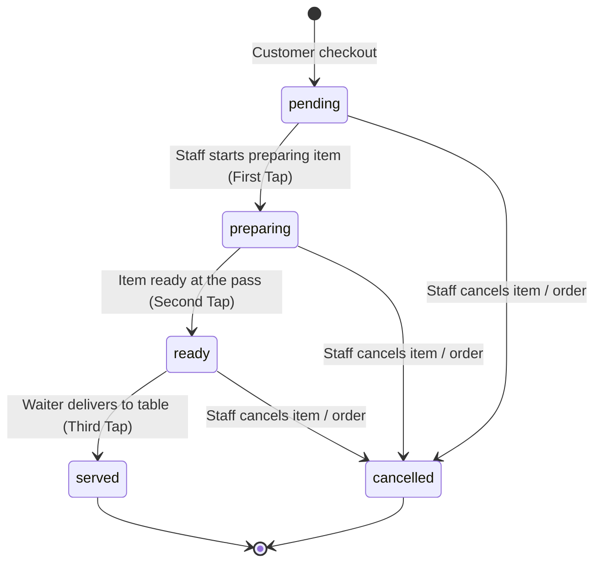
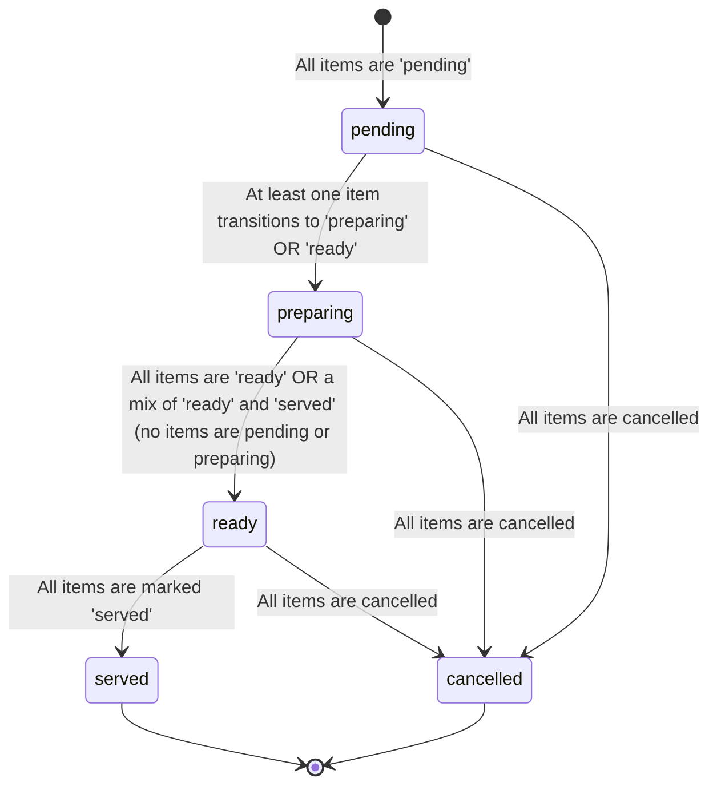

# Sprint U3A: Kitchen Intelligence Architecture & Operational Analysis

This document outlines the operational analysis, product specifications, database designs, and ETA calculations for the **Kitchen Intelligence System** of OrderRail. The goal of this architecture is to model realistic independent café operations and lay a solid technical foundation before executing code implementation.

---

## 1. Table of Contents
1. [Operational Workflow Analysis](#1-operational-workflow-analysis)
2. [Product Requirements Document (PRD)](#2-product-requirements-document-prd)
3. [Database & State Architecture](#3-database--state-architecture)
4. [ETA Engine Design](#4-eta-engine-design)
5. [Customer Experience Design](#5-customer-experience-design)
6. [Alternatives Considered & Trade-Offs](#6-alternatives-considered--trade-offs)
7. [Risk Assessment & Mitigation](#7-risk-assessment--mitigation)
8. [Open Questions & Policy Choices](#8-open-questions--policy-choices)
9. [Implementation Roadmap](#9-implementation-roadmap)

---

## 1. Operational Workflow Analysis

To design a system that works for independent cafés, we must understand their physical constraints, staffing models, and food/beverage preparation dynamics.

### 1.1 Café Staffing & Operations Models
Small and medium cafés typically operate with a lean crew of **2 to 5 staff members** occupying three overlapping physical zones:
1. **The Counter (Front of House):** Staff register customers, take payments, pack bakery items, and serve items to tables.
2. **The Barista Station:** A dedicated zone with espresso machines, grinders, and blenders for beverage preparation.
3. **The Kitchen (Back of House):** A prep area equipped with grills, ovens, and toaster presses for hot food assembly.

In small cafés (2-3 staff), the counter staff acts as both barista and runner. In medium-sized cafés (4-5 staff), specialized roles emerge:
```
[ Customer Table ]  <=================== (Runner/Waiter) ===================+
        │                                                                   │
(Scans QR & Orders)                                                         │
        ▼                                                                   │
[ Counter / Front ] ──(Auto-routes)──► [ Barista Station ] ──(Drinks)──► [ Pass ]
        │                                                                   ▲
        └─────────────(Auto-routes)──► [ Kitchen Prep Area ] ──(Food)───────┘
```

### 1.2 Preparation & Assembly Dynamics
Mixed-item orders (containing both drinks and cooked food) present preparation offsets:
* **Beverages (Espresso/Teas):** Handled sequentially by the barista. Prep time is low (**1 to 3 minutes** per drink).
* **Cold/Bakery Items (Croissants/Muffins):** Grab-and-go items requiring minimal prep (**30 seconds** to plate/bag).
* **Hot Food (Paninis/Wraps/Cooked Breakfast):** Handled by the kitchen cook. Prep time is higher (**5 to 15 minutes**) due to baking, grilling, or cooking cycles.

#### Physical Sequence of Preparation:
1. **Parallel Routing:** The moment a checkout completes, the order items are physically separated. The barista begins steaming milk and pulling espresso shots, while the kitchen prep cook places sandwich items onto the grill.
2. **Timing Disparity:** The coffee is ready in 2 minutes, but the toasted panini requires 7 minutes on the press.
3. **The Staging Dilemma (Cold Coffee):** If the barista holds the ready coffee until the panini finishes, the beverage cools, degrading quality. If the coffee is served immediately, the customer drinks it before their food arrives. 
4. **Café Solution (Partial Serving):** Most cafés prioritize serving drinks as soon as they are ready. Waiters/runners serve the table in waves, marking items as served incrementally.

---

## 2. Product Requirements Document (PRD)

### 2.1 Core Product Objectives
* Provide customers with a realistic, dynamic estimated time of arrival (ETA) for their complete order.
* Expose item-level preparation states to customers to reduce anxiety during long wait times.
* Maintain a lightweight, single-screen dashboard workflow for counter staff without introducing dedicated kitchen hardware or specialized staff views.

### 2.2 Product Decisions & Rationales

| Feature Area | Decision | Product Rationale & Justification |
| :--- | :--- | :--- |
| **ETA Granularity** | **Order-Level ETA** only. Hide per-item ETAs from customers. | Showing "Coffee in 2m, Sandwich in 10m" increases customer interface complexity and customer anxiety if either item misses its specific timer. A combined order-level ETA is easier to read, allows margin bundling, and manages expectations better. |
| **Status Granularity** | **Item-Level status tracking** internally and on customer UI. | Customers want to see that their espresso is "Served" while their panini is "Preparing". This confirms the kitchen has not forgotten their food and provides transparency. |
| **Partial Serving** | Allow orders to be served incrementally. | If a table receives their drinks, the order status remains active (`preparing`), but those specific drinks are marked as `served`. The ETA engine then recalculates based solely on remaining food items. |
| **Counter Interface** | Inline item toggles on the existing **Staff Kanban Cards**. | Staff are busy and cannot manage a complex interface. Tapping an item on the existing order card cycles its status (`pending` -> `preparing` -> `ready` -> `served`). This avoids the need for a separate kitchen monitor or tablet. |

---

## 3. Database & State Architecture

### 3.1 Current Schema Baseline
Currently, `orders` table tracks status via the `order_status` enum (`"pending" | "preparing" | "ready" | "served" | "cancelled"`). The `order_items` table is a flat list without status fields, meaning item progress is not tracked.

### 3.2 Proposed Schema Upgrades
To support item-level tracking and dynamic calculations, we will introduce:

1. **Item Status Enum:** A new Postgres type `order_item_status`.
2. **Order Item Status Column:** A `status` column on `order_items` mapping to the new enum.
3. **Item Prep Setting:** A `prep_time_minutes` column on the `menu_items` table.
4. **Order ETA Columns:** An `eta_timestamp` and `eta_calculated_at` column on the `orders` table.

```sql
-- 1. Create order item status type
CREATE TYPE public.order_item_status AS ENUM ('pending', 'preparing', 'ready', 'served', 'cancelled');

-- 2. Add status to order_items
ALTER TABLE public.order_items 
ADD COLUMN status public.order_item_status NOT NULL DEFAULT 'pending';

-- 3. Add default preparation time to menu_items (in minutes)
ALTER TABLE public.menu_items 
ADD COLUMN prep_time_minutes INTEGER NOT NULL DEFAULT 5;

-- 4. Add ETA tracking fields to orders
ALTER TABLE public.orders 
ADD COLUMN eta_timestamp TIMESTAMP WITH TIME ZONE NULL,
ADD COLUMN eta_calculated_at TIMESTAMP WITH TIME ZONE NULL;
```

> [!NOTE]
> Database indexes should be added to `order_items(status)` and `orders(status, cafe_id)` to speed up active queue aggregations.

### 3.3 State Machine Architecture

#### Order Item Lifecycle (Status Transitions)
Individual items transition through five distinct states based on staff taps or order cancellations:



#### Order Lifecycle (Aggregated Status)
The parent order's status is dynamically derived from the statuses of its constituent items, preserving backward compatibility with the existing Kanban structure:



### 3.4 Timeline Event Logs
To power future analytics and audit trails, we leverage the existing `order_events` table. Every item status update writes an event payload:

* **Event Type:** `item_status_changed`
* **Title:** `"Espresso status changed to Ready"`
* **Metadata Example:**
  ```json
  {
    "order_id": "8f828a2a-...",
    "item_id": "2bc983e3-...",
    "item_name": "Espresso",
    "previous_status": "preparing",
    "new_status": "ready",
    "actor_role": "staff"
  }
  ```

### 3.5 Backward Compatibility Strategy
To ensure that existing café data, settings, and active orders do not break during schema deployment:
* **Default Values:** Existing menu items will get a default `prep_time_minutes` of `5` (or category-based fallbacks during migration).
* **Active Orders migration:** Any active orders in the database during deployment will run a migration query to set item statuses matching the parent order's status. For example, if `orders.status = 'preparing'`, all child `order_items.status` will default to `'preparing'`.
* **Database Views:** Maintain support for existing API endpoints reading `orders.status` by executing a Postgres trigger that automatically updates the parent `orders.status` whenever an `order_items` status change occurs, using the aggregation logic from [Section 3.3](#order-lifecycle-aggregated-status).

---

## 4. ETA Engine Design

The ETA engine uses a deterministic queue simulation model that runs on the server (via a Supabase Edge Function or database triggers) whenever a new order is placed or item statuses change.

### 4.1 Calculation Formula
The estimated preparation time for an incoming order $O_{new}$ is calculated as:

$$ETA_{order} = Wait_{queue} + Prep_{base}(O_{new}) + Buffer_{dynamic}$$

#### 1. Base Prep Time ($Prep_{base}$)
Because food and drink prep happen in parallel (barista vs. kitchen), the base prep time is the maximum prep time of the items in the order:

$$Prep_{base}(O_{new}) = \max_{i \in O_{new}} (i.prep\_time\_minutes)$$

#### 2. Queue Wait Time ($Wait_{queue}$)
To calculate how long the order must wait in the queue before prep starts, we sum the prep times of all active unfinished items in the queue and divide by the café's concurrency capacity ($C$):

$$Wait_{queue} = \frac{\sum_{j \in Q_{active}} j.remaining\_prep\_minutes}{C}$$

* $Q_{active}$ includes all items in the café with status `pending` or `preparing`.
* $C$ represents the café concurrency factor (defaulting to `3`, representing the number of items that can be worked on simultaneously by the kitchen/barista).

#### 3. Dynamic Safety Buffer ($Buffer_{dynamic}$)
To account for physical overhead, peak hours, and order size:
* **Busy Buffer:** If there are more than 5 orders in $Q_{active}$, add $+3$ minutes.
* **Order Size Buffer:** If $O_{new}$ contains more than 5 items, add $+2$ minutes.
* **Peak Hours Buffer:** If current time is during lunch (12:00 PM - 2:00 PM) or breakfast rush (8:00 AM - 10:00 AM), add $+3$ minutes.

### 4.2 Rounding & Formatting Strategy
To prevent customer anxiety caused by fluctuating single-minute countdowns (e.g., "Ready in 11 minutes" shifting to "12 minutes"), we apply a rounding step:
* **Rounding:** Round the calculated $ETA_{order}$ up to the nearest 5-minute increment.
* **Display Range:** Represent the ETA as a range rather than a precise countdown timer.
  * If calculated $ETA \le 5$, display **"5 - 10 mins"**
  * If calculated $ETA = 12$, display **"15 - 20 mins"**
  * If calculated $ETA = 18$, display **"20 - 25 mins"**
* This range gives the kitchen a safety cushion and prevents customers from watching the clock down to the exact second.

### 4.3 Machine Learning / Feedback Loop Opportunities
By archiving logs in the `order_events` and `order_audits` tables, the system can self-calibrate over time:
* **Performance Analysis:** A nightly cron job compares the actual preparation duration (time from `preparing` to `ready`) with the original estimated time.
* **Metadata Tuning:** If "Grilled Panini" consistently takes 9 minutes instead of its default 5-minute configuration, the system flags a recommended setting change to the owner or automatically updates the database metadata.

---

## 5. Customer Experience Design

The customer interface should remain extremely clean, clear, and reassuring, avoiding any visual clutter.

### 5.1 Simple Tracking Page Mockup
The page [OrderStatusView.tsx](file:///C:/Users/17042/Downloads/orderrail-pro-main%20old/orderrail-pro-main/src/components/customer/OrderStatusView.tsx) will be updated to display a unified progress card and an itemized checklist:

```
+-----------------------------------------------------+
|                  ORDER STATUS                       |
|                  Order #0024                        |
+-----------------------------------------------------+
|                                                     |
|   Estimated Wait Time:                              |
|   [  15 - 20 MINS  ]  <-- Unified rounded range     |
|                                                     |
|   Status: Preparing food & beverages                |
|   Progress: 1 of 3 items served                     |
|                                                     |
+-----------------------------------------------------+
|   ITEMS IN PREPARATION                              |
|                                                     |
|   [x] 1 x Double Espresso       (Served ✅)         |
|   [ ] 1 x Avocado Toast         (Preparing 🍳)      |
|   [ ] 1 x Almond Croissant      (Ready at Pass 🛎️)  |
|                                                     |
+-----------------------------------------------------+
|              [ Call Service / Bill ]                |
+-----------------------------------------------------+
```

### 5.2 Dynamic Real-Time Toasts
Instead of hard refreshes, we utilize the open supabase real-time channels:
* When an item status transitions to `ready`, a top-screen toast is pushed to the customer's phone: *"🛎️ Your Almond Croissant is ready at the pickup counter!"*
* When an item is marked `served`, it visualizes with a green strike-through on the item list.

---

## 6. Alternatives Considered & Trade-Offs

During architectural design, several alternative workflows were evaluated. Below is the trade-off matrix:

| Alternative | Pros | Cons | Why Rejected |
| :--- | :--- | :--- | :--- |
| **A: Dedicated Kitchen Screen (KDS)** | Highly optimized for kitchen staff; isolates food preparation from cash registers. | Requires extra tablets/hardware; increases setup costs for small cafés; out of scope. | Small independent cafés operate in tight physical spaces. Adding hardware barriers blocks adoption. The single staff-panel keeps setup costs at zero. |
| **B: Per-Item ETA Timers for Customers** | Offers detailed time precision for complex multi-item orders. | High customer disappointment risk if an item is late; high API polling load; visual clutter. | Preparation times are highly volatile. Giving exact minute counts per item creates friction when kitchen queues bottleneck. Order-level range is friendlier. |
| **C: Hardware Scale / Weight Sensors** | Fully automatic serving detection; zero staff interaction needed. | Expensive hardware components; difficult integration; high fail rate. | Unrealistic and over-engineered for small operations. manual staff clicks are simpler and cheaper. |

---

## 7. Risk Assessment & Mitigation

1. **Risk: Staff Compliance (Forgetting to Tap Items)**
   * *Detail:* Under a heavy rush, staff might forget to update item statuses, leaving the customer tracking screen stuck on "Preparing" even after food is delivered.
   * *Mitigation:* Integrate auto-advancing logic. When staff marks the entire order as `served` or `ready`, any remaining child items automatically inherit that status.
2. **Risk: Real-time Connection Dropouts**
   * *Detail:* In poor basement café seating, real-time WebSockets can drop, causing status updates to lag.
   * *Mitigation:* Implement standard polling fallback in [OrderStatusView.tsx](file:///C:/Users/17042/Downloads/orderrail-pro-main%20old/orderrail-pro-main/src/components/customer/OrderStatusView.tsx) every 30 seconds if the WebSocket channel disconnects.
3. **Risk: ETA Inaccuracy due to Extreme Kitchen Bottlenecks**
   * *Detail:* If a chef burns a batch of bread, the physical queue stops but the ETA calculation engine doesn't know, leading to angry customers.
   * *Mitigation:* Allow the owner/staff to set a manual "Kitchen Delay" modifier (+5m, +10m, +20m) from the dashboard headers, which adds directly to the dynamic safety buffer.

---

## 8. Open Questions & Policy Choices

1. **How should we handle order additions/edits?**
   * *Scenario:* A customer adds a coffee to their active dining session while their panini is still preparing.
   * *Proposed Policy:* The new item inherits a `pending` status. The order-level ETA is recalculated as $ETA_{new} = \max(ETA_{remaining\_items}, ETA_{new\_item})$.
2. **Should customers be able to cancel items that have started preparing?**
   * *Proposed Policy:* No. Once an item's status transitions from `pending` to `preparing`, the "Cancel Item" or "Edit Order" action is disabled on the customer side. Only staff can cancel at that point to avoid food/beverage wastage.

---

## 9. Implementation Roadmap

We propose splitting the development of the Kitchen Intelligence system into four distinct sprints to ensure sanity and incremental verification:

```
┌──────────────────────────────────────────────────────────┐
│ Phase 1: DB Schema & Metadata Admin Config (Sprint U3B)   │
└────────────────────────────┬─────────────────────────────┘
                             ▼
┌──────────────────────────────────────────────────────────┐
│ Phase 2: Staff Kanban Panel Item Actions (Sprint U3C)    │
└────────────────────────────┬─────────────────────────────┘
                             ▼
┌──────────────────────────────────────────────────────────┐
│ Phase 3: ETA Calculation Engine Backend (Sprint U3D)      │
└────────────────────────────┬─────────────────────────────┘
                             ▼
┌──────────────────────────────────────────────────────────┐
│ Phase 4: Customer Tracking Screen & QA (Sprint U3E)      │
└──────────────────────────────────────────────────────────┘
```

### Phase 1: Database Schema & Metadata Settings (Sprint U3B)
* **Goal:** Set up tables, fields, triggers, and the owner settings interface.
* **Deliverables:**
  * Supabase migrations adding columns to `order_items`, `menu_items`, and `orders`.
  * Update [OwnerMenuPage.tsx](file:///C:/Users/17042/Downloads/orderrail-pro-main%20old/orderrail-pro-main/src/pages/owner/OwnerMenuPage.tsx) to allow owners to configure default preparation times per item.
* **Risks:** Migration script lockouts on production tables.

### Phase 2: Live Staff Panel Updates & Item Controls (Sprint U3C)
* **Goal:** Enable staff to update item-level statuses on the Kanban view.
* **Deliverables:**
  * Add interactive, color-coded item tags inside [StaffDashboardPage.tsx](file:///C:/Users/17042/Downloads/orderrail-pro-main%20old/orderrail-pro-main/src/pages/staff/StaffDashboardPage.tsx) order cards.
  * Implement inline tap triggers to advance item states (`pending` -> `preparing` -> `ready` -> `served`).
  * Add automatic state cascading (marking an order as complete marks all sub-items as served).
* **Risks:** UI clutter on smaller mobile/tablet screens.

### Phase 3: ETA Engine Core Logic (Sprint U3D)
* **Goal:** Implement queue calculations and safety buffers.
* **Deliverables:**
  * Postgres functions/triggers to compute and cache dynamic ETAs when orders are created or updated.
  * Integrate peak-hour checks and staff occupancy buffers.
  * Implement manual dashboard "Delay" overrides.
* **Risks:** Real-time query performance bottlenecks if recalculated on every single item tap.

### Phase 4: Customer Experience UI Polish (Sprint U3E)
* **Goal:** Update customer tracking screens to reflect item states and ETA ranges.
* **Deliverables:**
  * Redesign [OrderStatusView.tsx](file:///C:/Users/17042/Downloads/orderrail-pro-main%20old/orderrail-pro-main/src/components/customer/OrderStatusView.tsx) with the progress checklist and unified range badge.
  * Set up sound/visual toasts for pickup-ready events.
  * Conduct manual QA testing using simulated orders on mobile viewports.
* **Risks:** Customer confusion if they do not understand "Ready at Pass" vs. "Served".
